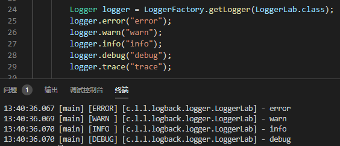
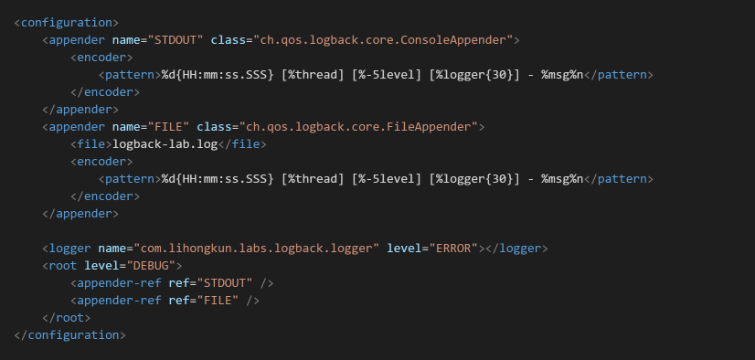

Logback是一个日志实现框架，它实现了SLF4J 。它们二者出自同一作者之手，也是时下比较普及的一个组合。

<!--more-->

### 1 基础示例

使用Logback首先需要引入对应的依赖到pom.xml

```
<dependency>
	<groupId>ch.qos.logback</groupId>
	<artifactId>logback-classic</artifactId>
	<version>1.2.3</version>
</dependency>
```

Logback作为日志实现，它直接实现了SLF4J 的接口，无需进行适配。所以它的实现是依赖SLF4J 的包。使用mvn dependency:tree命令可以看到它的依赖关系。

```
[INFO] \- ch.qos.logback:logback-classic:jar:1.2.3:compile
[INFO]    +- ch.qos.logback:logback-core:jar:1.2.3:compile
[INFO]    \- org.slf4j:slf4j-api:jar:1.7.25:compile
```

在没有任何配置的情况下Logback只有默认的控制台日志输出。如下代码

```
public class Application 
{
    private static final Logger LOGGER = LoggerFactory.getLogger(Application.class);

    public static void main( String[] args ){
        printLoggerContext();
        LOGGER.info("Hello World");
   }

    private static void printLoggerContext(){
        LoggerContext lc = (LoggerContext)LoggerFactory.getILoggerFactory();
        StatusPrinter.print(lc);
    }
}

输出日志为 ：
20:45:00,441 |-INFO in ch.qos.logback.classic.LoggerContext[default] - Could NOT find resource [logback-test.xml]
20:45:00,442 |-INFO in ch.qos.logback.classic.LoggerContext[default] - Could NOT find resource [logback.groovy]
20:45:00,442 |-INFO in ch.qos.logback.classic.LoggerContext[default] - Could NOT find resource [logback.xml]
20:45:00,459 |-INFO in ch.qos.logback.classic.BasicConfigurator@887af79 - Setting up default configuration.

20:45:00.513 [main] INFO com.lihongkun.labs.logback.Application - Hello World
```

从上述日志可以看出，它会按顺序找配置文件，如果都没有找到则使用默认的。业界一般使用logback.xml 来配置。

```
<configuration>
    <appender name="STDOUT" class="ch.qos.logback.core.ConsoleAppender"> 
        <encoder>
            <pattern>%d{HH:mm:ss.SSS} [%thread] [%-5level] [%logger{30}] - %msg%n</pattern>
        </encoder>
    </appender>

    <root level="debug">
        <appender-ref ref="STDOUT" />
    </root>
</configuration>
```

使用了配置文件后logger的日志格式发生了改变。并且LoggerContext输出的组件为配置文件所定义的。

```
11:12:59,348 |-INFO in ch.qos.logback.classic.LoggerContext[default] - Could NOT find resource [logback-test.xml]
11:12:59,348 |-INFO in ch.qos.logback.classic.LoggerContext[default] - Could NOT find resource [logback.groovy]
11:12:59,348 |-INFO in ch.qos.logback.classic.LoggerContext[default] - Found resource [logback.xml] at [file:/E:/daily/logback-lab/target/classes/logback.xml]
11:12:59,489 |-INFO in ch.qos.logback.classic.joran.action.ConfigurationAction - debug attribute not set
11:12:59,489 |-INFO in ch.qos.logback.core.joran.action.AppenderAction - About to instantiate appender of type [ch.qos.logback.core.ConsoleAppender]
11:12:59,498 |-INFO in ch.qos.logback.core.joran.action.AppenderAction - Naming appender as [STDOUT]
11:12:59,504 |-INFO in ch.qos.logback.core.joran.action.NestedComplexPropertyIA - Assuming default type [ch.qos.logback.classic.encoder.PatternLayoutEncoder] for [encoder] property
11:12:59,558 |-INFO in ch.qos.logback.classic.joran.action.RootLoggerAction - Setting level of ROOT logger to DEBUG
11:12:59,558 |-INFO in ch.qos.logback.core.joran.action.AppenderRefAction - Attaching appender named [STDOUT] to Logger[ROOT]
11:12:59,574 |-INFO in ch.qos.logback.classic.joran.action.ConfigurationAction - End of configuration.
11:12:59,574 |-INFO in ch.qos.logback.classic.joran.JoranConfigurator@add0edd - Registering current configuration as safe fallback point

11:12:59.574 [main] [INFO ] [c.l.labs.logback.Application] - Hello World
```

### 2 组件和概念

Logback 的基础功能主要由三大组件组成 Logger、Appender、Layout。

**Logger** ： 日志记录器主要与应用程序交互，记录日志上下文。

**Appender** ：作用是把日志记录写入到所定义的目标。一个日志记录器可以关联多个Appender达到把日志写入多个不同的目标。

**Layout** ：用于格式化日志的格式。

除了和 logger 中的应用程序接口，它们的所有功能均可以使用日志配置文件来配置出来。同时官方提供了默认的实现配置。

### 3 Logger

#### 3.1 日志器获取

日志器的获取可以使用Class类也可以使用类的全局限定名称

```
Logger loggerByClazz = LoggerFactory.getLogger(LoggerLab.class);
Logger loggerByName = LoggerFactory.getLogger("com.lihongkun.labs.logback.logger.LoggerLab");

loggerByClazz.info("this log is print by class");
loggerByName.info("this log is print by name");

System.out.println("loggerByClazz == loggerByName : " + (loggerByClazz == loggerByName));
```

上述代码输出的日志为

```
11:38:51.005 [main] [INFO ] [c.l.l.logback.logger.LoggerLab] - this log is print by class
11:38:51.008 [main] [INFO ] [c.l.l.logback.logger.LoggerLab] - this log is print by name
loggerByClazz == loggerByName : true
```

可以看出两种不同的方式获取到的Logger对象就是同一个。

#### 3.2 日志级别和配置继承

SLF4J定义了5种日志等级 TRACE, DEBUG, INFO, WARN, ERROR

```
package org.slf4j;

public interface Logger { 
	public void trace(String message);
	public void debug(String message);
	public void info(String message); 
	public void warn(String message); 
	public void error(String message); 
}
```

其中各个等级的关系为 **TRACE** < **DEBUG** < **INFO** < **WARN** < **ERROR** ，一行日志是否进行输出， 要看它的级别是否大于等于当前Logger的日志级别。接上面的配置文件的例子，如果我们打印不同日志级别的日志。TRACE是不会被输出的，因为Logger的级别是DEBUG.




为什么Logger的日志级别是DEBUG？因为我们的配置文件配置了ROOT Logger的级别，所有Logger的日志级别均继承自上层的Logger ，如果没有特别去指定，那么最后就是追溯到ROOT Logger的配置。

```
<root level="debug">
	<appender-ref ref="STDOUT" />
</root>
```

如果需要的话可以单独指定某个包名或者某个类名 的 Logger的日志级别，这点和继承有着相似之处。

```
<logger name="com.lihongkun.labs.logback.logger" level="ERROR"></logger>
<root level="DEBUG">
	<appender-ref ref="STDOUT" />
</root>
```

如加上指定Logger的日志等级为ERROR则输出结果只有error一行。

继承关系如何描述可以看个例子

| Logger名称 | 指定等级 | 有效等级 |
| ---------- | -------- | -------- |
| ROOT       | DEBUG    | DEBUG    |
| X          | INFO     | INFO     |
| X.Y        | none     | INFO     |
| X.Y.Z      | TRACE    | TRACE    |

X的等级继承自ROOT ,但是它指定了日志级别 即 INFO。X.Y 继承了X 所以他们的级别是INFO ,而X.Y.Z指定了TRACE那么它的有效等级是TRACE。

原则是指定优先，没有指定则继承，逐级往上追溯。

### 4 Appender

调用日志记录器记录日志 ，其输出操作委托给Appender组件。它实现了ch.qos.logback.core.Appender 接口。

```
package ch.qos.logback.core;

import ch.qos.logback.core.spi.ContextAware;
import ch.qos.logback.core.spi.FilterAttachable;
import ch.qos.logback.core.spi.LifeCycle;


public interface Appender<E> extends LifeCycle, ContextAware, FilterAttachable {

    public String getName();
	public void setName(String name);
	void doAppend(E event);
}
```

其中的doAppend即为日志输出方法，这也是Appender 组件基本职责。Logback提供了一些基本的实现

#### 4.1 OutputStreamAppender

顾名思义 ，这是一个把日志写入输出流的Appender，它的类图如下


我们经常使用的ConsoleAppender和FileAppender，那么logback.xml可以如下。



一个控制台Appender，一个文件Appender并且都指定到ROOT Logger上去，效果是标准输出流和对应的logback-lab.log 文件会写入日志。

直接使用FileAppender有一个弊端，就是日志是无法滚动，也没有自动归档和删除的功能。线上会导致日志文件过大，甚至磁盘被占满。于是就有了RollingFileAppender，从上述类图可以看出，它定义了2个类，RollingPolicy和TriggeringPolicy 分别处理日志滚动策略和触发策略。

```
<appender name="FILE" class="ch.qos.logback.core.rolling.RollingFileAppender">
	<file>rolling-lab.log</file>
	<rollingPolicy class="ch.qos.logback.core.rolling.SizeAndTimeBasedRollingPolicy">
		<fileNamePattern>rolling-lab-%d{yyyy-MM-dd}.%i.log.gz</fileNamePattern>
		<maxFileSize>100MB</maxFileSize>
		<maxHistory>60</maxHistory>
		<totalSizeCap>20GB</totalSizeCap>
	</rollingPolicy>
	<encoder>
		<pattern>%d{HH:mm:ss.SSS} [%thread] [%-5level] [%logger{30}] - %msg%n</pattern>
	</encoder>
</appender>
```

FILE的Appender变成RollingFileAppender并配置了滚动的策略，按天进行滚动或者单个文件大于100MB的时候，其中保留60天的日志，所有日志文件的总大小不超过20GB。rollingPolicy配置的文件里面有占位符号，分别代表日期格式和文件索引。文件后缀为gz，表示归档的日志文件需要进行gz压缩。

这里有一点需要**注意**，压缩是需要占用CPU的，如果单个文件太大，占用的CPU资源会比较久。那么在一些核数比较小的容器机器上面是极有可能影响到应用程序的性能。

#### 4.2 其他

除了输出流的，logback-classic包里面还提供了另外几种，如 SocketAppender、SSLSocketAppender、SMTPAppender、DBAppender、AsyncAppender等。

SocketAppender和SSLSocketAppender 可用于日志服务器收集日志使用。

SMTPAppender 典型的应用场景就是把一些关键的错误日志信息发送给相关的人员，达到触发告警的作用。

DBAppender  可以将日志持久化到数据库中

AsyncAppender 是异步输出日志，它不能独立存在，必须依赖于其他具体的Appender。

假如这些都不能满足你的需求，那么你就可以进行自定义Appender。

### 5 Layout

Layout的配置比较简单，最普遍的使用是PatternLayout ，配置片段如下

```
<encoder>
	<pattern>%d{HH:mm:ss.SSS} [%thread] [%-5level] [%logger{30}] - %msg%n</pattern>
</encoder>
```

pattern 标签的字符串即定义的日志输出格式。

%d{HH:mm:ss.SSS}  ： 日志输出的时间格式，与Java 的时间格式规则是一样的用法

%thread ：当前打印日志的线程

%-5level ： 日志级别，并且格式化成5个字符

%logger{30} ： logger名称 格式化成30字符，与输入日志的类是一致的。

%msg%n ：应用程序里面输出的日志内容

PatternLayout  已经提供了比较全面的功能，但是如果有非常特殊的需求可以进行扩展。


本文介绍了Logback的一些基础使用方式和组件。一般情况下已经够用。在复杂的应用系统中会有各种各样的需求，比如一些日志的过滤功能，多线程环境下如何去解决一个任务周期的内容的日志汇总，它都有对应的设计。

