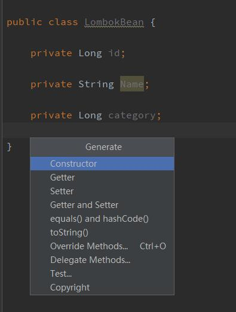
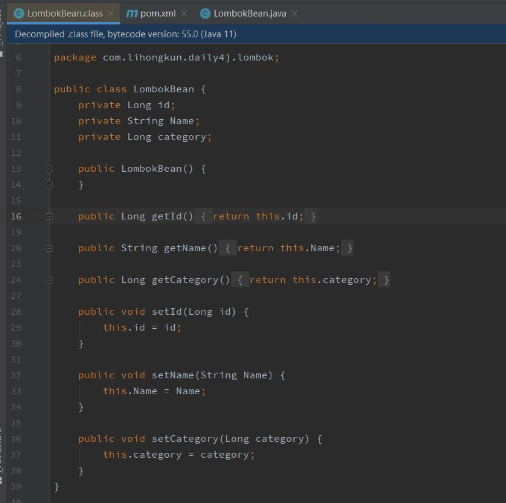
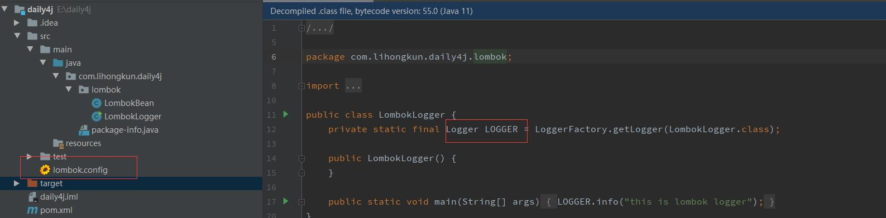

POJO等一系列的java bean最让人诟病的是他们有很多重复的工作存在。比如里面的属性要暴露出去需要写很多的Getter和Setter方法。完全是体力活。Lombok是一个开源库，能够改善这种现状。

<!--more-->

通常Getter和Setter方法我们都会使用IDE进行生成。比如使用Intellij快捷键Alt+Insert调出如下菜单，如选择要生成哪些对应的代码。



虽然生成是非常方便的，但是整个类的源码很臃肿。Lombok提供了另外一种方式来实现，源码比较简洁。

### 使用

首先需要引入对应的包，Maven依赖如下

```
<dependency>
	<groupId>org.projectlombok</groupId>
	<artifactId>lombok</artifactId>
	<version>1.18.8</version>
</dependency>
```

那么原来的Bean上面加两个注解即可替代原来的代码生成。

```
import lombok.Getter;
import lombok.Setter;

@Getter
@Setter
public class LombokBean {

    private Long id;

    private String Name;

    private Long category;

}
```

简单的两个注解就完成了所有的工作 ？ 反编译一下对应的字节码看看



很明显地看到注解没有编译进入到字节码里面，而是增加了对应属性的Getter和Setter方法。很显然，编译期做了上么。此时你在其他地方用到该类的Getter和Setter方法的时候，IDE检查是会报错的。需要安装对应的插件，告知IDE支持Lombok相关的检查。


### 特性

比较常用的几个特性如下：

| 注解               | 描述                                                         |
| ------------------ | ------------------------------------------------------------ |
| @Getter/@Setter    | 生成类属性对应的Getter和Setter方法                           |
| @Cleanup           | 生成对应的资源释放代码。如 try{}catch(){}finnally{释放资源的代码} |
| @ToString          | 生成toString方法                                             |
| @EqualsAndHashCode | 生成equals和 hashCode方法                                    |
| @Builder           | 对类的所有属性生成对应Builder方法。实现Builder模式           |
| @Data              | 集合toString，equals，hashCode和构造函数等注解的功能         |
| @Log               | 根据不同的log注解生成不同的日志log 属性                      |

此外还有其他一些属性，可参见文章末尾的链接。


### 配置

上面讲到日志相关的注解，默认生成的的变量是`log`

```
// 源码
@Slf4j
public class LogExampleOther {
  
  public static void main(String... args) {
    log.error("Something else is wrong here");
  }
}

// 编译后
public class LogExampleOther {
  private static final org.slf4j.Logger log = org.slf4j.LoggerFactory.getLogger(LogExampleOther.class);
  
  public static void main(String... args) {
    log.error("Something else is wrong here");
  }
}
```

`log` 这个变量的命名不太符合规范。该如何去改呢？仔细查阅一下它的configuration页面描述，lombok.config放到对应的package下面则可以通过配置对它的行为做出改变。

```
// lombok.config
lombok.log.fieldName = LOGGER
```

上述配置即是让log的属性名变更为`LOGGER`

```
@Slf4j
public class LombokLogger {

    public static void main(String[] args){
        LOGGER.info("this is lombok logger");
    }

}
```

上述代码编译后，字节码如图




参考

https://projectlombok.org/features/all

https://projectlombok.org/features/configuration