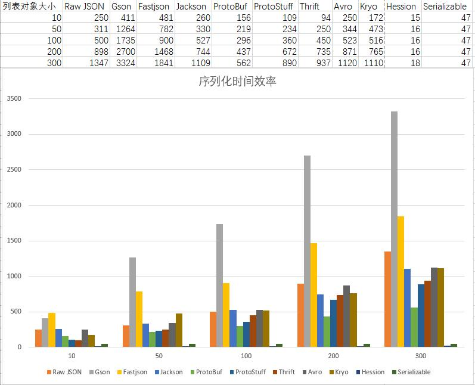
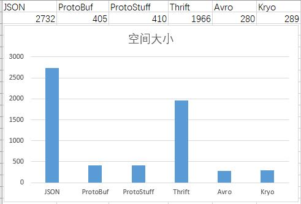

序列化和反序列化在线上系统中是一个绕不开的话题，通常作为RPC框架中的一部分而被很多人所忽略。然而它经常成为系统设计或者性能影响因素的一个重要环节。业界有许许多多的序列化库，我们应该如何进行选型，下面我们来简单探讨一下

### 一些概念

**什么是序列化**

- 序列化： 将数据结构或对象转换成二进制串的过程

- 反序列化：将在序列化过程中所生成的二进制串转换成数据结构或者对象的过程

**使用场景**

- 把内存中的对象及其状态保存到文件或者数据库等存储介质
- 通过网络传输对象及其状态，常见网络传输框架或者RPC框架

### 选型关注点

- 通用性和易用性 ：社区活跃程度、大众对其接受程度，二者相辅相成，简单易用当然有很多人使用，人多了自然也就活跃了。当然在异构系统需要考虑其是否跨语言。
- 可观测性/可调试性/可读性：在序列化里面我通常考评的是可读性，也包括使用了工具辅助的观测。
- 可扩展性：增加字段是否需要升级对应的代码库，特别需要关注平滑过渡。这直接影响到一个系统的迭代更新周期
- 安全性 ：序列化库是否存在安全漏洞，比如 JSON相关的库就经常曝出远程代码执行漏洞。
- 性能 ：性能主要包括两个方面
  - 时间 ：序列化或者反序列化所需要的时间
  - 空间 ：序列化后的二进制串的大小，直接影响到存储空间或者网络传输量

### 常见序列化库

以下面类为例子，使用各种常见框架对其进行序列化

```
public class DemoEntity {
    private int id;
    private String name;
    private String category;
    private Long price;
    private Long appId;
    private Long ctr;
}

public class DemoResponse {
    private int code;
    private List<DemoEntity> data;
}
```

#### JSON

比较常用的JSON库是国内的fastjson和spring mvc默认的jackson，使用的时候只需要引入对应的依赖包。

```
<dependency>
    <groupId>com.alibaba</groupId>
    <artifactId>fastjson</artifactId>
    <version>1.2.50</version>
</dependency>
<dependency>
    <groupId>com.fasterxml.jackson.core</groupId>
    <artifactId>jackson-databind</artifactId>
    <version>2.9.8</version>
</dependency>
```

然后使用对应的方法进行序列化

```
DemoResponse response = initDemoResponse();
// fastjson
JSON.toJSONString(response);
// jackson
ObjectMapper objectMapper = new ObjectMapper();
objectMapper.writeValueAsString(response);
```

在以下场景下特别适合使用JSON：

1. 程序对可读性要求比较高
2. 服务提供的数据是浏览器直接使用的
3. 关联方是用JavaScript编写的
4. 不想把数据给预先绑定到固定的模式上面，也就是预定义和拓展性的需求。

#### Protobuf

Protobuf出自Google，在移动端广泛被应用，使用的时候需要引入依赖包，不仅如此它还需要预定义IDL文件，然后生成对应的代码，这是一个跨语言的序列化库。

```
// pom.xml引入对应的依赖包
<properties>
    <protobuf.version>3.5.1</protobuf.version>
</properties>

<dependency>
    <groupId>com.google.protobuf</groupId>
    <artifactId>protobuf-java</artifactId>
    <version>${protobuf.version}</version>
</dependency>
<dependency>
    <groupId>com.google.protobuf</groupId>
    <artifactId>protobuf-java-util</artifactId>
    <version>${protobuf.version}</version>
</dependency>

// pom.xml引入对应的代码生成插件
<build>
    <extensions>
        <extension>
            <groupId>kr.motd.maven</groupId>
            <artifactId>os-maven-plugin</artifactId>
            <version>1.6.1</version>
        </extension>
    </extensions>
    <plugins>
        <plugin>
            <groupId>org.apache.maven.plugins</groupId>
            <artifactId>maven-compiler-plugin</artifactId>
            <configuration>
                <source>11</source>
                <target>11</target>
            </configuration>
        </plugin>
        <plugin>
            <groupId>org.xolstice.maven.plugins</groupId>
            <artifactId>protobuf-maven-plugin</artifactId>
            <version>0.6.1</version>
            <configuration>
                <protocArtifact>com.google.protobuf:protoc:${protobuf.version}:exe:${os.detected.classifier}</protocArtifact>
            </configuration>
            <executions>
                <execution>
                    <goals>
                        <goal>compile</goal>
                        <goal>test-compile</goal>
                    </goals>
                </execution>
            </executions>
        </plugin>
    </plugins>
</build>
```

针对例子中的数据类型，定义的IDL文件如下

```
syntax = "proto3";

//生成文件所在包名
option java_package = "com.lihongkun.serialize";

message ProtoEntity{
    int64 id = 1;
    string name = 2;
    string category = 3;
    int64 price = 4;
    int64 appId = 5;
    int64 ctr = 6;
}

message ProtoResponse{
    int32 code = 1;
    // 列表结构
    repeated ProtoEntity data = 2;
}
```

那么只要进行maven compile则进行对应的代码生成，使用如下

```
List<ProtoDemo.ProtoEntity> data = new ArrayList<>();

for (long index = 0; index < DATA_SIZE; index++) {
	ProtoDemo.ProtoEntity.Builder builder = ProtoDemo.ProtoEntity.newBuilder();
	builder.setAppId(index);
	builder.setCategory(String.valueOf(index));
	builder.setCtr(index);
	builder.setId((int) index);
	builder.setName(String.valueOf(index));
	builder.setPrice(index);
	data.add(builder.build());
}

ProtoDemo.ProtoResponse.Builder builder = ProtoDemo.ProtoResponse.newBuilder();
builder.setCode((int) DATA_SIZE);
builder.addAllData(data);

ProtoDemo.ProtoResponse response = builder.build();
response.toByteArray();
```

在使用中确实比较繁琐，需要定义IDL文件和生成对应的序列化代码。由于它的广泛使用催生了其变种Protostuff

#### ProtoStuff

Protostuff 序列化协议基本上可以等同于Protobuf，优点是省却了IDL和代码生成的步骤，当然相应地会损失一些性能，不过大部分情况下可以忽略不计。

```
<dependency>
	<groupId>io.protostuff</groupId>
	<artifactId>protostuff-core</artifactId>
	<version>1.6.2</version>
</dependency>
<dependency>
	<groupId>io.protostuff</groupId>
	<artifactId>protostuff-runtime</artifactId>
	<version>1.6.2</version>
</dependency>
```

引入对应的依赖，然后就可以直接使用了

```
DemoResponse demoResponse = InitializeUtils.initDemoResponse();

RuntimeSchema runtimeSchema = RuntimeSchema.createFrom(DemoResponse.class);
LinkedBuffer  linkedBuffer = LinkedBuffer.allocate(LinkedBuffer.DEFAULT_BUFFER_SIZE);

ProtostuffIOUtil.toByteArray(demoResponse,runtimeSchema,linkedBuffer);
```

相比于原生的Protobuf它兼具了性能和易用性

#### Thrift

Thrift来自于Facebook，后捐赠给Apache。它主要是一个RPC框架，序列化协议只是其中的一个小部分，很少被单独使用，此处只是拿出来做做比较。

```
// pom.xml 引入依赖包
<dependency>
    <groupId>org.apache.thrift</groupId>
    <artifactId>libthrift</artifactId>
    <version>0.12.0</version>
</dependency>

// pom.xml 引入对应的 代码生成插件
<!-- thirft plugin -->
<plugin>
    <groupId>org.apache.thrift.tools</groupId>
    <artifactId>maven-thrift-plugin</artifactId>
    <version>0.1.11</version>
    <configuration>
        <thriftExecutable>./thrift-0.12.0.exe</thriftExecutable>
        <generator>java</generator>
    </configuration>
    <executions>
        <execution>
            <id>thrift-sources</id>
            <phase>generate-sources</phase>
            <goals>
                <goal>compile</goal>
            </goals>
        </execution>
    </executions>
</plugin>
```

它的IDL文件名一般是*.thrift ，实体类的定义文件如下

```
namespace java com.lihongkun.serialize

struct ThriftEntity{
    1:i64 id;
    2:string name;
    3:string category;
    4:i64 price;
    5:i64 appId;
    6:i64 ctr;
}

struct ThriftResponse{
    1:i32 code;
    2:list<ThriftEntity> data;
}
```

同样使用maven compile生成对应的代码，使用如下

```
List<ThriftEntity> data = new ArrayList<>();

for (long index = 0; index < DATA_SIZE; index++) {
	ThriftEntity thriftEntity = new ThriftEntity();
	thriftEntity.setAppId(index);
	thriftEntity.setCategory(String.valueOf(index));
	thriftEntity.setCtr(index);
	thriftEntity.setId((int) index);
	thriftEntity.setName(String.valueOf(index));
	thriftEntity.setPrice(index);
	data.add(thriftEntity);
}

ThriftResponse  response = new ThriftResponse();
response.setCode((int) DATA_SIZE);
response.setData(data);

ByteArrayOutputStream out = new ByteArrayOutputStream();
TTransport transport = new TIOStreamTransport(out);
TBinaryProtocol protocol = new TBinaryProtocol(transport);
response.write(protocol);
```

与Protobuf一样它也需要进行IDL文件的编写和代码的生成，然而其性能无论是时间还是空间都不如Protobuf

#### Avro

Apache Avro是一种与编程语言无关的序列化格式。Avro 数据通过与语言无关的 schema 来定义。schema 通过 JSON 来描述，数据被序列化成二进制文件或 JSON 文件，不过一般会使用二进制文件。在大数据体系下，比较注重存储的压缩率，反而对效率并没有要求得很苛刻。

引入依赖和对应的代码生成插件

```
<dependency>
    <groupId>org.apache.avro</groupId>
    <artifactId>avro</artifactId>
    <version>1.9.1</version>
</dependency>

<!-- avro plugin -->
<plugin>
    <groupId>org.apache.avro</groupId>
    <artifactId>avro-maven-plugin</artifactId>
    <version>1.9.1</version>
    <executions>
        <execution>
            <phase>generate-sources</phase>
            <goals>
                <goal>schema</goal>
            </goals>
            <configuration>
                <sourceDirectory>src/main/idl/avro/</sourceDirectory>
            </configuration>
        </execution>
    </executions>
</plugin>
```

编写IDL文件 , 文件名格式为 *.avsc

```
{
  "namespace" : "com.lihongkun.serialize",
  "type": "record",
  "name": "AvroResponse",
  "fields": [
    {"name": "code", "type": "int"},
    {"name": "data", "type" :
        {
            "type" : "array",
            "items" : {
                "namespace" : "com.lihongkun.serialize",
                "type": "record",
                "name": "AvroEntity",
                "fields":[
                    {"name" : "id","type":"int"},
                    {"name" : "name","type":"string"},
                    {"name" : "category","type":"string"},
                    {"name" : "price","type":"long"},
                    {"name" : "appId","type":"long"},
                    {"name" : "ctr","type":"long"}
                ]
            }
        }
    }
  ]
}
```

使用maven compile则生成两个对象AvroEntity 和AvroResponse .使用如下 ：

```
AvroResponse avroResponse = initProtoResponse();

DatumWriter<AvroResponse> recordDatumWriter = new SpecificDatumWriter<>(AvroResponse.class);
DataFileWriter<AvroResponse> dataFileWriter = new DataFileWriter<>(recordDatumWriter);
dataFileWriter.create(AvroResponse.getClassSchema(),new ByteArrayOutputStream());
dataFileWriter.append(avroResponse)
dataFileWriter.flush();
dataFileWriter.close();
```

#### Kryo

Kryo是一个快速高效的的序列化库，它也是被广泛用在大数据领域。对比其他的序列化库，它完全是运行时，无需编写IDL和生成代码，对比Avro易用性上面略胜一筹。

```
 <dependency>
    <groupId>com.esotericsoftware</groupId>
    <artifactId>kryo</artifactId>
    <version>5.0.0-RC4</version>
</dependency>
```

引入了对应的依赖以后则可以直接使用POJO进行序列化

```
DemoResponse response = initDemoResponse();
//注册序列化对象
Kryo kryo = new Kryo();
kryo.register(DemoResponse.class);
kryo.register(DemoEntity.class);
kryo.register(ArrayList.class);

Output output = new Output(new ByteArrayOutputStream());
kryo.writeObject(output, response);
```

#### Serializable

Serializable是Java提供的原生序列化方式，它提供了配套的ObjectOutputStream和ObjectIutputStream来处理Java对象的序列化读写，解析效率性能比较高，但是消耗的存储却捉襟见肘。特点是高效和易用，无需引入依赖直接使用。

```
DemoResponse demoResponse = InitializeUtils.initDemoResponse();

// 执行效率
ObjectOutputStream objectOutputStream = new ObjectOutputStream(new ByteArrayOutputStream());
objectOutputStream.writeObject(demoResponse);
objectOutputStream.flush();
objectOutputStream.close();
```

#### Hession

Serializable虽然在时间性能上比较高效，但是在空间上面确实非常大。在移动互联网未兴起或者是内网之间调用的时候大部分不会使用Serializable来进行数据的传输，而是使用Hession在时间和空间上面做了一些权衡。

```
<dependency>
    <groupId>com.caucho</groupId>
    <artifactId>hessian</artifactId>
    <version>4.0.63</version>
</dependency>
```

引入依赖后直接进行使用

```
DemoResponse demoResponse = InitializeUtils.initDemoResponse();

// 执行效率
HessianOutput hessianOutput = new HessianOutput(new ByteArrayOutputStream());
hessianOutput.writeObject(demoResponse);
hessianOutput.flush();
hessianOutput.close();
```

### 性能指标比较

使用上述的例子进行性能估算，环境不一样或许不太准确，但是量级是不会有太大的差异。

**时间**

DemoResponse的data列表size从10~300进行递增并且进行一万次的序列化操作，性能表现如下单位为ms



**空间**

DemoResponse的data列表size为300，并且进行GZip压缩后所占用的空间大小如下



测试代码地址 https://github.com/lihongkun/serialize