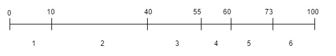

加权重随机是一个比较常见的计算方式，比如 负载均衡算法中的一种、随机抽奖、广告系统流量分配等等。这种算法的实现方式比较成熟。<!--more-->

#### 思路

**场景**  集合{1,2,3,4,5,6} 对应的权重值是 {10,30,15,5,13,27} 。

**思路**  



如上图所示1~6的权重放到一个数轴上面，后面的权重值为前面权重值得累加。如2这个元素的权重期间为[10,10+30)。随机一个100以内的任意数R，R的数值落在哪个范围则表示随机到集合中哪个元素。

此方式需要去遍历集合来确定随机数R落在哪个区间，时间复杂度是O(n)，无额外使用空间。

在一些集合不变又很长的，但是对效率要求比较高的情况下，可以使用额外的数据结构如二叉树来避免集合的遍历。

#### 实现

此处使用TreeMap来实现一个随机值查找区间不需要遍历集合的例子。

```
public class Lottery {

	/**
	 * key为元素的累计权重值,value为集合元素
	 */
    private TreeMap<Integer, Integer> treeMap;

	/**
	 * 命中统计,key为集合元素.value为统计值
	 */
    private ConcurrentHashMap<Integer, AtomicInteger> statMap;

	/**
	 * 集合元素的总权重
	 */
    private int totalWeight;

    /**
     * 随机权重构造函数
     *
     * @param weightMap
     */
    public Lottery(Map<Integer, Integer> weightMap) {
        treeMap = new TreeMap<>();
        statMap = new ConcurrentHashMap<>();

        Set<Map.Entry<Integer, Integer>> entrySet = weightMap.entrySet();
        for (Map.Entry<Integer, Integer> entry : entrySet) {
            totalWeight += entry.getValue();
            treeMap.put(totalWeight, entry.getKey());
            statMap.put(entry.getKey(), new AtomicInteger(0));
        }
    }

    public ConcurrentHashMap<Integer, AtomicInteger> getStatMap() {
        return statMap;
    }

    public int getTotalWeight() {
        return totalWeight;
    }

    public Map.Entry<Integer, Integer> getRandom() {
        ThreadLocalRandom threadLocalRandom = ThreadLocalRandom.current();
        Map.Entry<Integer, Integer> entry = treeMap.tailMap(threadLocalRandom.nextInt(totalWeight), false).firstEntry();
        statMap.get(entry.getValue()).incrementAndGet();
        return entry;
    }
}
```

上述类中只需要传入weightMap ，k是待选集合，v是集合元素的权重。构造函数中计算了一个 treeMap，k是每个集合元素的累计权重，v是对应的集合元素，也就是构造了图中的结构。treeMap加速了累计权重的遍历过程。

使用如下程序进行测试

```
public static void main(String[] args) throws Exception {
	Map<Integer, Integer> lotteryMap = new HashMap<>(10);
	lotteryMap.put(1, 10);
	lotteryMap.put(2, 30);
	lotteryMap.put(3, 15);
	lotteryMap.put(4, 5);
	lotteryMap.put(5, 13);
	lotteryMap.put(6, 27);

	// 构造好加权集合
	Lottery lottery = new Lottery(lotteryMap);

	// 执行随机函数，并统计命中值
	ExecutorService executorService = Executors.newFixedThreadPool(5);
	int threadNum = 5;
	int loopNum = 100000;
	Future[] futures = new Future[threadNum];
	for (int i = 0; i < threadNum; i++) {
		futures[i] = executorService.submit((Callable<Void>) () -> {
			for (int cnt = 0; cnt < loopNum; cnt++) {
				lottery.getRandom();
			}
			return null;
		});
	}

	for (Future future : futures) {
		future.get();
	}

	executorService.shutdown();

	int total = loopNum * threadNum;
	for (Map.Entry<Integer, AtomicInteger> entry : lottery.getStatMap().entrySet()) {
		System.out.println("id : " + entry.getKey() + " --> " + new BigDecimal(entry.getValue().get()).divide(new BigDecimal(total), 6, RoundingMode.HALF_UP));
	}
```

输出多次的结果基本上跟指定的权重是一致的。

```
id : 1 --> 0.100066
id : 2 --> 0.299118
id : 3 --> 0.149764
id : 4 --> 0.050484
id : 5 --> 0.130372
id : 6 --> 0.270196
```

