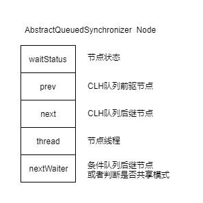
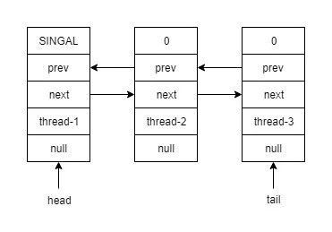
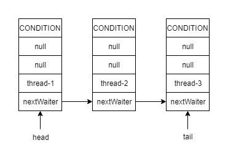

AbstractQueuedSynchronizer是JDK并发包里面很多同步类的基础框架.在简单了解了自旋锁和CLH锁之后再来了解下JDK里面的实现.
<!--more-->

### 队列节点

队列的节点定义代码如下

``` java
static final class Node {
    
    static final Node SHARED = new Node();
    static final Node EXCLUSIVE = null;

    // 线程取消获取锁
    static final int CANCELLED =  1;
    // 后继节点需要被唤醒
    static final int SIGNAL    = -1;
    // 线程在条件队列中
    static final int CONDITION = -2;
    // 后续结点会传播唤醒的操作,共享模式下起作用
    static final int PROPAGATE = -3;

    //节点状态
    volatile int waitStatus;

    //同步队列前驱节点
    volatile Node prev;
    
    //同步后继节点
    volatile Node next;

    // 条件队列后继节点
    Node nextWaiter;
}
```
包含了几个状态相关的常量和节点状态,以及指向其他节点的引用.整理成图比较好理解.



AQS定义了两个队列,一个是普通的CLH锁实现的队列(Sync Queue),一个是条件队列(Condition Queue).


```
// 队列头部指针
private transient volatile Node head;

//队列尾部指针
private transient volatile Node tail;

//锁状态
private volatile int state;

```
AQS 使用了2个成员变量一个指向队头,一个指向队尾.另外使用一个成员变量state来表示锁的当前状态.


### 同步队列

如果线程获取锁失败则进入同步对列,acquire参数为state状态值

```
public final void acquire(int arg) {
    if (!tryAcquire(arg) &&
        acquireQueued(addWaiter(Node.EXCLUSIVE), arg))
        selfInterrupt();
}


final boolean acquireQueued(final Node node, int arg) {
    boolean failed = true;
    try {
        boolean interrupted = false;
        //自旋
        for (;;) {
            //循环获取前驱节点
            final Node p = node.predecessor();
            
            // 如果是队首节点 且获取锁成功则出队并返回
            // 自旋只在队首节点尝试去获取锁
            if (p == head && tryAcquire(arg)) {
                setHead(node);
                p.next = null; // help GC
                failed = false;
                return interrupted;
            }
            // 此处会把队首节点设置为SINGAL
            if (shouldParkAfterFailedAcquire(p, node) &&
                parkAndCheckInterrupt())
                interrupted = true;
        }
    } finally {
        if (failed)
            cancelAcquire(node);
    }
}

// 创建队列节点并入队
private Node addWaiter(Node mode) {
    Node node = new Node(Thread.currentThread(), mode);
    // Try the fast path of enq; backup to full enq on failure
    Node pred = tail;
    if (pred != null) {
        node.prev = pred;
        if (compareAndSetTail(pred, node)) {
            pred.next = node;
            return node;
        }
    }
    enq(node);
    return node;
}

//入队操作
private Node enq(final Node node) {
    for (;;) {
        Node t = tail;
        if (t == null) { // Must initialize
            if (compareAndSetHead(new Node()))
                tail = head;
        } else {
            node.prev = t;
            if (compareAndSetTail(t, node)) {
                t.next = node;
                return t;
            }
        }
    }
}

```

一个完整的同步队列如下图所示,队首的节点会被标记为SINGAL状态.在出队的时候会重新检查其后继节点.



### 条件队列

在使用ReentrantLock的时候有介绍到Condition,它的实现是AQS一个叫ConditionObject的对象.


```
public class ConditionObject implements Condition, java.io.Serializable {
    private static final long serialVersionUID = 1173984872572414699L;
    /** First node of condition queue. */
    private transient Node firstWaiter;
    /** Last node of condition queue. */
    private transient Node lastWaiter;
    ....
}
```

其中的firstWaiter和lastWaiter定义了条件对列的队首引用和队尾引用.在使用的时候lock.newCondition()则创建了一个队列.其中的实现方式和同步队列也比较相似.

