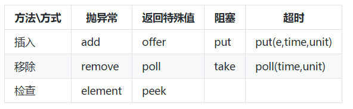

阻塞队列(BlockingQueue)提供了可阻塞的put和take方法,以及支持定时的offer和pull.如果队列已经满了,那么put方法将阻塞到有空间可用;如果队列为空那么take方法将阻塞到有元素可用.
<!--more-->

#### 如何使用

主要关注的方法



主要实现类:

- ArrayBlockingQueue:一个由数组结构组成的有界阻塞队列.
- LinkedBlockingQueue:一个由链表结构组成的有界阻塞队列.
- PriorityBlockingQueue:一个支持优先级排序的无界阻塞队列.
- DelayQueue:一个使用优先级队列实现的无界阻塞队列.
- SynchronousQueue:一个不存储元素的阻塞队列.
- LinkedTransferQueue:一个由链表结构组成的无界阻塞队列.
- LinkedBlockingDeque:一个由链表结构组成的双向阻塞队列.


比较特殊的是PriorityBlockingQueue 和 DelayQueue

**PriorityBlockingQueue** 具备了排序功能.可以实现一个comparator在构造的时候传入,定制其排序规则.

**DelayQueue** 是一个支持延时获取元素的无界阻塞队列.队列使用PriorityQueue来实现.队列中的元素必须实现Delayed接口,在创建元素时可以指定多久才能从队列中获取当前元素.只有在延迟期满时才能从队列中提取元素.我们可以将DelayQueue运用在以下应用场景:

- 缓存系统的设计:可以用DelayQueue保存缓存元素的有效期，使用一个线程循环查询DelayQueue,一旦能从DelayQueue中获取元素时,表示缓存有效期到了.
- 定时任务调度:使用DelayQueue保存当天将会执行的任务和执行时间,一旦从DelayQueue中获取到任务就开始执行,从比如TimerQueue就是使用DelayQueue实现的.

#### 使用场景

阻塞队列常用于生产者和消费者的场景,生产者是往队列里添加元素的线程,消费者是从队列里拿元素的线程.阻塞队列就是生产者存放元素的容器,而消费者也只从容器里拿元素.

它是一个典型的生产者-消费着模式,将生产数据与使用数据的两个过程分开,简化开发过程.消除了生产者和消费者类之间的代码依赖.

举个例子,一个服务不断接收到数据请求,每个请求都需要落地到本地磁盘.你是选择每次请求都执行写入文件还是选择一批请求写一次文件.


```
// 接口类
public interface IAppender<T> extends Closeable {
	
	public abstract void handle(T param);
	
	public abstract void handle(Collection<T> params);
}

// 使用队列实现的积累 --- 示意代码省略异常处理
public abstract class BufferAppender<T> implements IAppender<T> {
	
	private int queueSize;
	private int batchSize;
	private int maxWaitMills;
	private boolean isClosed;
	private LinkedBlockingQueue<T> queue;

	public BufferAppender() {
		this.queueSize = 50000;
		this.batchSize = 500;
		this.maxWaitMills = 3000;
		this.isClosed = false;

		this.queue = new LinkedBlockingQueue<T>(this.queueSize);

		Thread th = new BufferThread(this.batchSize, this.maxWaitMills);
		th.setName(super.getClass().getSimpleName());
		th.start();
	}

	public abstract OutputStream getOutputStream();

	public abstract void closeOutputStream();

	public void close() throws IOException {
		this.isClosed = true;
	}

	public void handle(T bean) {
		this.queue.add(bean);
	}

	public void handle(Collection<T> beans) {
		this.queue.addAll(beans);
	}

	private void internalHandle(List<T> bufferList) {
		try{
			if (bufferList != null) {
				OutputStream os = getOutputStream();
				for (T bean:bufferList) {
					os.write(bean.toString().getBytes());
				}
				os.flush();
			}
		}
		catch (Exception e) {
		}
	}

	private class BufferThread extends Thread {
		private int batchSize;
		private int maxWaitMills;
		private long lastHandle;

		public BufferThread(int batchSize, int maxWaitMills) {
			this.lastHandle = System.currentTimeMillis();
			this.maxWaitMills = batchSize;
			this.batchSize = maxWaitMills;
		}

		public void run() {
			List<T> bufferList = new ArrayList<T>(this.batchSize);
			T bean = null;
			//未关闭时刷入
			while (!isClosed) {
				bean = queue.poll(100L, TimeUnit.MILLISECONDS);
				if (null != bean) {
					bufferList.add(bean);
				}

				long interval = System.currentTimeMillis() - this.lastHandle;
				// 积累一批 或者积累 最大时间后刷入
				if ((interval >= this.maxWaitMills) || (bufferList.size() >= this.batchSize)) {
					this.lastHandle = System.currentTimeMillis();

					if (!(bufferList.isEmpty()))
						try {
							internalHandle(bufferList);
						} finally {
							bufferList.clear();
						}
				}
			}
			
			//关闭前 最后全部刷入
			while ((bean = BufferAppender.this.queue.poll()) != null) {
				bufferList.add(bean);
			}

			internalHandle(bufferList);
		}
	}
}
```
上述示例代码重点在于使用一个有界队列缓存数据.累积batchSize或者maxWaitMills时间后才执行操作.这里面最需要注意的生产和消费的速率.否则有可能会丢弃数据.

我们知道内存的操作耗时比磁盘少了很多.在并发比较高的场景下,直接写磁盘并不可取.累积一定的请求,一次性刷入磁盘能提高不少性能.而且上述例子把接收请求和数据使用(写入磁盘)分开.使操作更加清晰.

#### 实现原理

阻塞方法是如果实现的,怎么保证多线程下的数据安全.很容易想到的就是加锁.曾经在ReentrantLock的时候举过一个例子.

```
public class BoundedBlockingQueue<T> {

	final Lock lock = new ReentrantLock(true);// 锁对象
	final Condition notFull = lock.newCondition();// 写线程条件
	final Condition notEmpty = lock.newCondition();// 读线程条件

	final LinkedList<T> items = new LinkedList<T>();
	final int totalCount = 100;

	public void put(T x) throws InterruptedException {
		lock.lock();
		try {
			while (totalCount == items.size())// 如果队列满了
				notFull.await();// 阻塞写线程 ,释放锁

			items.addLast(x);

			notEmpty.signal();// 唤醒读线程
		} finally {
			lock.unlock();
		}
	}

	public T take() throws InterruptedException {
		lock.lock();
		try {
			while (items.size() == 0)// 如果队列为空
				notEmpty.await();// 阻塞读线程 ，释放锁

			T x = items.removeFirst();
			notFull.signal();// 唤醒写线程
			return x;
		} finally {
			lock.unlock();
		}
	}
}
```

上述代码一个锁2个条件变量巧妙实现,进队和出队的阻塞.实际上以ArrayBlockingQueue的源码来看也是类似的.

加锁意味着有竞争,性能受损.后续可以聊聊JDK之外的内存队列实现.