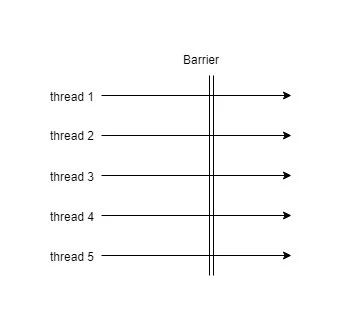

栅栏类似闭锁,它能阻塞一组线程直到到达某个事件发生.栅栏与闭锁的关键区别在于,所有的线程必须同时到达栅栏位置,才能继续执行.闭锁用于等待事件,而栅栏用于等待其他线程.
<!--more-->

### CyclicBarrier

CyclicBarrier可以使一定数量的参与者反复地在栅栏的位置汇聚,它在并行算法迭代算法中非常有用:这种算法通常将一个问题拆分一系列相互独立的子问题.它的主要方法为

```
// 构造函数 
public CyclicBarrier(int parties, Runnable barrierAction);
public CyclicBarrier(int parties);

public int await();
public int await(long timeout, TimeUnit unit);
```



如上图示意,5个线程,执行效率不一样,在必须同时到达某个条件才继续后面的执行否则阻塞.假设一个场景,我们需要把分表的数据库中的内容刷新到同一个redis的key中,等待各自分片刷新后,rename这个key.然后各个分片任务还需要还行其他的业务逻辑.


```
private static ExecutorService ES = Executors.newFixedThreadPool(5);

public static void main(String[] args) throws InterruptedException, ExecutionException {
	
	CyclicBarrier barrier = new CyclicBarrier(5, new Runnable() {
		
		@Override
		public void run() {
			System.out.println("I'm barrier action , rename the cache");
		}
	});
	
	List<Future<Integer>> futureList = new ArrayList<>();
	for(int i=0;i<5;i++){
		futureList.add(ES.submit(new CacheInvoker(String.valueOf(i), barrier)));
	}
	
	for(int i=0;i<5;i++){
		Future<Integer> future = futureList.get(i);
		if(future.isDone())
			System.out.println(future.get());
	}
	
	ES.shutdown();
}

private static class CacheInvoker implements Callable<Integer>{
	
	private String name;
	
	private CyclicBarrier barrier;
	
	public CacheInvoker(String name,CyclicBarrier barrier){
		this.name = name;
		this.barrier = barrier;
	}

	@Override
	public Integer call() throws Exception {
		
		Random rand = new Random();
		int mills = rand.nextInt(1000)*10;
		try{
			Thread.sleep(mills);
			System.out.println("I'm "+name+",will sleep "+mills+" millseconds , simulation refresh cache sharding");
			barrier.await(50000,TimeUnit.MILLISECONDS);
			System.out.println("I'm "+name+", do something !");
		}
		catch (Exception ex) {
			ex.printStackTrace();
		}
		
		return mills;
	}
}

```

CacheInvoker 承担了各自分片的刷新,完成后使用barrier等待所有的线程刷新完成,然后在barrierAction里面进行rename , 接着各个分片任务继续执行其他操作.

### Exchanger

它是一种两方的栅栏,各方在栅栏的位置上交换数据.当两方执行不对等的操作时Exchanger会非常有用.


```
public static void main(String[] args) {
		final Exchanger<List<Integer>> exchanger = new Exchanger<>();
		
	new Producer(exchanger).start();
	new Comsumer(exchanger).start();
}

public static class Producer extends Thread{
	
	private List<Integer> data = new ArrayList<Integer>();
	
	private Exchanger<List<Integer>> exchanger = new Exchanger<>();
	
	public Producer(Exchanger<List<Integer>> exchanger){
		this.exchanger = exchanger;
	}
	
	@Override
	public void run() {
		for(int i=0;i<10000;i++){
			data.add(i);
			if((i+1)%10==0){
				try {
					data = exchanger.exchange(data);
				} catch (InterruptedException e) {
					e.printStackTrace();
				}
			}
		}
	}
}

public static class Comsumer extends Thread{

	private List<Integer> data = new ArrayList<Integer>();
	
	private Exchanger<List<Integer>> exchanger = new Exchanger<>();
	
	public Comsumer(Exchanger<List<Integer>> exchanger){
		this.exchanger = exchanger;
	}
	
	@Override
	public void run() {
		for(int i=0;i<1000;i++){
			if(data.isEmpty()){
				try {
					data = exchanger.exchange(data);
				} catch (InterruptedException e) {
					e.printStackTrace();
				}
			}
			
			for(Integer val:data){
				System.out.println(val);
			}
			data.clear();
		}
	}
}

```

这是一个生产者消费者的实现. 生产者每次生产10个数据以后就请求和消费者交换数据.消费者则消费完数据后将其清空.二者在生产者产生一批数据消费者可消费数据为空的时候到达栅栏.

这种模式可以使用在一些积累一定量请求进行批量处理的场景.