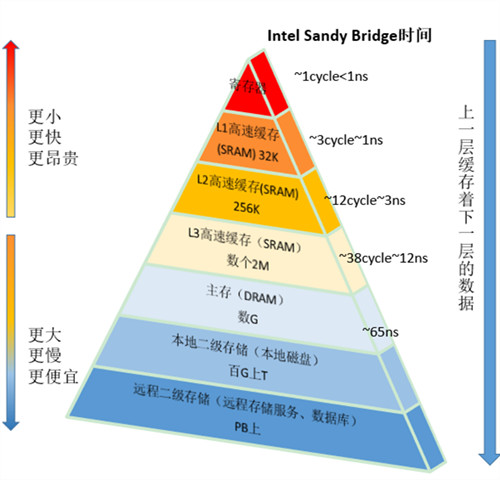

Disruptor是英国外汇交易公司LMAX开发的一个高性能队列，研发的初衷是解决内存队列的延迟问题.2010年在QCon演讲后,获得了业界关注. 2011年，Martin Fowler大神专门撰写长文对其进行介绍.由于熟悉程度问题,只能科普介绍一下,介绍之前可以先了解下ArrayBlockingQueue存在的一些问题.

<!--more-->

### 锁竞争

锁竞争会导致程序性能下降.看下实验代码

```
static int threadNum = 4;		//线程数
static int addTime = 100000000; // 自增次数

static int countWithSync = 0;
static int countWithLock = 0;
static LongAdder countWithAtomic = new LongAdder();

static final Object syncLock = new Object();
static final ReentrantLock reentrantLock = new ReentrantLock();

public static void main(String[] args) throws InterruptedException{
	ExecutorService executor = Executors.newFixedThreadPool(threadNum);
	
	testAtomic(executor);
	testLock(executor);
	testSync(executor);
}

// atomic 自增
private static void testAtomic(ExecutorService executor) throws InterruptedException {
	final CountDownLatch latch = new CountDownLatch(threadNum);
	// Atomic
	long marked = System.currentTimeMillis();
	for (int i = 0; i < threadNum; i++) {
		executor.execute(new Runnable() {
			
			@Override
			public void run() {
				for(int i=0;i<addTime;i++){
					countWithAtomic.increment();
				}
				latch.countDown();
			}
		});
	}
	latch.await();
	System.out.println("times by Atomic: " + (System.currentTimeMillis() - marked));
}

// synchronized 自增
private static void testSync(ExecutorService executor) throws InterruptedException {
	final CountDownLatch latch = new CountDownLatch(threadNum);
	//synchronized
	long marked = System.currentTimeMillis();
	for (int i = 0; i < threadNum; i++) {
		executor.execute(new Runnable() {
			@Override
			public void run() {
				for(int i=0;i<addTime;i++){
					synchronized (syncLock) {
						countWithSync++;
					}
				}
				latch.countDown();
			}
		});
	}
	latch.await();
	System.out.println("times by synchronized: " + (System.currentTimeMillis() - marked));
}

// reentrantLock自增
private static void testLock(ExecutorService executor) throws InterruptedException {
	final CountDownLatch latch = new CountDownLatch(threadNum);
	
	// reentrantLock
	long marked = System.currentTimeMillis();
	for (int i = 0; i < threadNum; i++) {
		executor.execute(new Runnable() {
			@Override
			public void run() {
				for(int i=0;i<addTime;i++){
					reentrantLock.lock();
					countWithLock++;
					reentrantLock.unlock();
				}
				latch.countDown();
			}
		});
	}
	latch.await();
	System.out.println("times by reentrantLock: " + (System.currentTimeMillis() - marked));
}
```

各起4个线程,使用不同的线程安全方式进行自增1亿次,执行结果为

times by Atomic: 1854 . 
times by reentrantLock: 13613 . 
times by synchronized: 19768 .

原子变量(CAS)比显式锁性能好很多,显式锁比同步关键字好.而ArrayBlockingQueue使用的正是显式锁.在我们使用内存队列的时候不得不面临显式锁的性能损耗.

### 缓存行 (CacheLine)

先看段简单的循环代码和它的性能.

```
// 考虑一般缓存行大小是64字节，一个 long 类型占8字节
static long[][] arr;

public static void main(String[] args) {
	// 初始化 n个长度为8的数组
	arr = new long[1024 * 1024][];
	for (int i = 0; i < 1024 * 1024; i++) {
		arr[i] = new long[8];
		for (int j = 0; j < 8; j++) {
			arr[i][j] = 0L;
		}
	}
	long sum = 0L;
	
	// 循环读取每个数组的指定位置
	long marked = System.currentTimeMillis();
	for (int i = 0; i < 8; i += 1) {
		for (int j = 0; j < 1024 * 1024; j++) {
			sum = arr[j][i];
		}
	}
	System.out.println("Loop times:" + (System.currentTimeMillis() - marked) + "ms");

    // 循环读取每个数组的8个元素
	marked = System.currentTimeMillis();
	for (int i = 0; i < 1024 * 1024; i += 1) {
		for (int j = 0; j < 8; j++) {
			sum = arr[i][j];
		}
	}
	System.out.println("Loop times:" + (System.currentTimeMillis() - marked) + "ms");
}
```

第一种循环的方式 66ms 第二种方式16ms .同样是对一个二维数进行读取,性能差距还是比较大.

原因是第二种方式每次读取的是一整个的数组.在读取的时候由于缓存行的原因,当你读取第一个元素的时候.CPU会把连续的内存块一起读入缓存行中,一般是64字节,也就是整个数组都读取到CPU的Cache中.那么从Cache中读取数组后面的值就比从内存中读取快很多.



内存读取约65纳秒,L1 Cache 读取约1ns.从数值上可以直观感受到差距.


### 伪共享

缓存系统中是以缓存行（cache line）为单位存储的。缓存行是2的整数幂个连续字节,一般为32-256个字节.最常见的缓存行大小是64个字节.当多线程修改互相独立的变量时,如果这些变量共享同一个缓存行,就会无意中影响彼此的性能,这就是伪共享.


两个线程往同一个变量或缓存行中写,会导致缓存行不断失效,也就失去了缓存行的好处.在追求极致性能的时候就需要根据Java对象的内存布局,采用填充缓存行以避免伪共享.

> HotSpot 虚拟机中，对象在内存中存储的布局可以分为三块区域：对象头（Header）、实例数据（Instance Data）和对齐填充（Padding）。

**对象头** 第一个字是由24位哈希码和8位标志位（如锁的状态或作为锁对象）组成的Mark Word.第二个字是对象所属类的引用.(字长取决于虚拟机是32位还是64位)

**实例数据** HotSpot 虚拟机默认的分配策略为 longs/doubles(8bytes)、ints(4bytes)、shorts/chars(2bytes)、bytes/booleans(1bytes)、oops（Ordinary Object Pointers,4bits），从分配策略中可以看出，相同宽度的字段总是被分配到一起。在满足这个前提条件的情况下，在父类中定义的变量会出现在子类之前。如果 CompactFields 参数值为 true（默认为 true），那子类之中较窄的变量也可能会插入到父类变量的空隙之中.

**对齐填充** 对齐填充并不是必然存在的,也没有特别的含义,它仅仅起着占位符的作用.由于 HotSpot VM 的自动内存管理系统要求对象起始地址必须是 8 字节的整数倍,因此当对象***实例数据部分***没有对齐的话,就需要通过对齐填充来补全.

因此我们在定义对象字段的时候,实例数据总是8bytes的整数倍,如果需要凑成一个完整的缓存行,只需要填充7个没有使用到的long类型.

```
public final class FalseSharing implements Runnable {
	
	public final static int NUM_THREADS = 4; // change
	public final static long ITERATIONS = 50 * 1000L * 1000L;
	private final int arrayIndex;

	private static VolatileLong[] longs = new VolatileLong[NUM_THREADS];
	static {
		for (int i = 0; i < longs.length; i++) {
			longs[i] = new VolatileLong();
		}
	}

	public FalseSharing(final int arrayIndex) {
		this.arrayIndex = arrayIndex;
	}

	public static void main(final String[] args) throws Exception {
		final long start = System.currentTimeMillis();
		runTest();
		System.out.println("duration = " + (System.currentTimeMillis() - start));
	}

	private static void runTest() throws InterruptedException {
		Thread[] threads = new Thread[NUM_THREADS];

		for (int i = 0; i < threads.length; i++) {
			threads[i] = new Thread(new FalseSharing(i));
		}

		for (Thread t : threads) {
			t.start();
		}

		for (Thread t : threads) {
			t.join();
		}
	}

	public void run() {
		long i = ITERATIONS + 1;
		while (0 != --i) {
			longs[arrayIndex].value = i;
		}
	}

	public final static class VolatileLong {
		public volatile long value = 0L;
		//public long p1, p2, p3, p4, p5, p6; // comment out
	}
}
```


这是并发编程网上的例子.VolatileLong使用额p1-p6来做填充,在没注释掉之前执行时间是数量级是100ms,如果将其注释掉则是1000ms.这是典型的使用空间换时间的方式.浪费了7个8bytes的空间来提升程序的执行速度.

###  如果提升

Disruptor通过以下设计来解决队列速度慢的问题:

- 环形数组结构(RingBuffer组件)

为了避免垃圾回收,采用数组而非链表.同时,数组对处理器的缓存机制更加友好.

数组长度2^n,通过位运算,加快定位的速度.下标采取递增的形式.不用担心index溢出的问题.

- 无锁设计 (MemoryBarrier组件)

每个生产者或者消费者线程,会先申请可以操作的元素在数组中的位置,申请到之后,直接在该位置写入或者读取数据.

鉴于以上特性,在内存队列选型的时候可以考虑此框架.


参考链接:

https://github.com/LMAX-Exchange/disruptor
https://tech.meituan.com/disruptor.html
http://ifeve.com/disruptor/