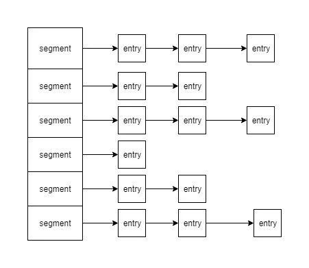

一般的容器如ArrayList,HashSet和HashMap都不是线程安全的.容器在Java中的地位不言而喻,那么它必然也存在线程安全的版本.线程安全的容器从其并发特性上可以简单分为两类:同步容器和并发容器.
<!--more-->

### 同步容器

同步容器类有两类

1. Verctor和Hashtable的公共方法在实现上是使用synchronized关键字装饰起来.非static的synchronized锁的对象在this上面,锁粒度为容器级别.
2. Collections.synchronizedXxx 创建的同步容器封装了一个互斥锁(mutex成员变量),任何一个方法的调用都需要先获得锁,不管是否是同一个方法.锁粒度也是容器级别.

#### 同步容器的问题

虽然同步容器是使用容器锁同步的,但是使用一些复合操作便有可能发生并发安全性问题.需要使用的客户端自行进行加锁.

```
// 复合操作 , size 和 get 不是原子操作
public static Object getLast(Vector list){
    int lastIndex = list.size()-1;
    return list.get(lastIndex);
}

public static Object deleteLast(Vector list){
    int lastIndex = list.size()-1;
    list.remove(lastIndex);
}

//复合操作,客户端加锁
public static Object getLast(Vector list){
    synchronized(list){
		int lastIndex = list.size()-1;
		return list.get(lastIndex);
	}
}

public static Object deleteLast(Vector list){
    synchronized(list){
		int lastIndex = list.size()-1;
		list.remove(lastIndex);
	}
}
```

此外迭代器在并发迭代的时候被修改,则有可能抛出ConcurrentModificationException 

```
public static void main(String[] args) {
		
	List<Integer> vector = new Vector<>();
	for(int i=0;i<100;i++){
		vector.add(i);
	}
	
	ReadTask t1 = new ReadTask(vector);
	RemoveTask t2 = new RemoveTask(vector);
	
	t2.start();
	t1.start();
}

public static final class RemoveTask extends Thread{

	private List<Integer> list;
	
	public RemoveTask(List<Integer> list){
		this.list = list;
	}
	
	@Override
	public void run() {
		for(Integer i:list){
			try{
				Thread.sleep(100);
			}catch (Exception e) {
			}
			list.remove(i);
			System.out.println("remove "+i);
		}
	}
}

public static final class ReadTask extends Thread{

	private List<Integer> list;
	
	public ReadTask(List<Integer> list){
		this.list = list;
	}
	
	@Override
	public void run() {
		for(Integer i:list){
			try{
				Thread.sleep(150);
			}catch (Exception e) {
			}
			System.out.println("read " + i);
		}
	}
}
```

以Vector为例子,有2个线程同时操作,一个增加元素,一个删除元素.两个线程使用迭代器进行操作,抛出java.util.ConcurrentModificationException.避免迭代器问题需要也是需要在客户端加锁或者使用克隆容器.

### 并发容器

同步容器的锁粒度比较大,多线程竞争容器锁时吞吐量将严重降低.于是在JDK1.5的时候开始出现并发容器,为多线程访问而设计.其中最典型的是ConcurrentHashMap的设计.

##### ConcurrentHashMap

首先,先了解下HashMap的结构,它是由一个数组构成hash桶,数组每个元素都指向一个链表.这个链表就是hash值一样的元素.



如上图segment是一个数组,entry就是map的每个元素.

其次我们看下锁粒度的问题.HashMap线程不安全,那么Hashtable和Collections.synchronizedMap都是线程安全的,它们的锁是锁住整个容器,可以类比为锁住的是整个segment数组.而ConcurrentHashMap的设计完全不一样,它针对数据结构的特性,锁住的是单个的segment,也就是单条的链表.这就是导致它们并发度差距的原因.

*ConcurrentHashMap的并发读写功能均比Collections.synchronizedMap好不少*

##### Copy-On-Write容器

CopyOnWriteArrayList和CopyOnWriteArraySet是Java并发包里提供CopyOnWrite机制实现的并发容器.CopyOnWrite即每次在执行写操作的时候,先加锁,复制一个当前镜像,然后进行写操作.然后再将容器的数组引用指向镜像的地址.可以看看它的add方法源码.

```
public boolean add(E e) {
    final ReentrantLock lock = this.lock;
    lock.lock();
    try {
        Object[] elements = getArray();
        int len = elements.length;
        Object[] newElements = Arrays.copyOf(elements, len + 1);
        newElements[len] = e;
        setArray(newElements);
        return true;
    } finally {
        lock.unlock();
    }
}
```

CopyOnWrite并发容器用于读多写少的并发场景.由于它的写操作特性,在写多的场景下会造成比较多的对象复制.容易产生内存使用问题.而且在写多的情况下,性能可能还不如同步容器.