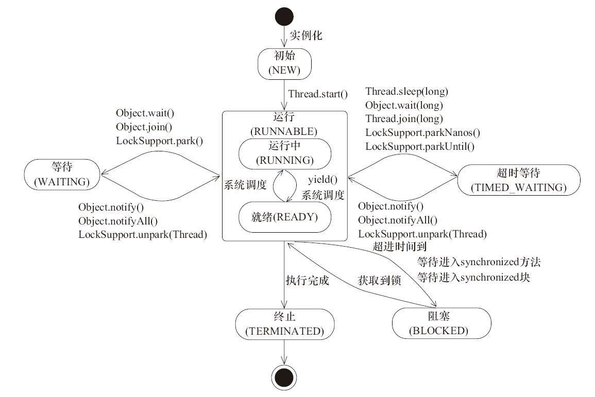

任务通常是一些抽象的离散的工作单元,我们把应用程序的工作分解到多个任务中,可以简化程序的组织结构,提供一种自然的事务边界来优化错误恢复过程,以及提供一种自然的并行工作结构来提升并发性.而并发执行任务在Java体系里面就是线程.
<!--more-->

###  线程的生命周期

从线程创建到线程销毁分为以下六种状态

```
public enum State
	NEW,			// 初始
	RUNNABLE,		// 可执行
	BLOCKED,		// 阻塞
	WAITING,		// 等待
	TIMED_WAITING,	// 超时等待
	TERMINATED;		// 终止
}
```

它们之间的流转可以用一张图来表示




通常在问题排查的时候比较关心的是BLOCKED,WAITING,TIMED_WAITING状态.这些都是可以从线程栈工具中看出来的.

### 显式创建线程的不足

初学者通常喜欢创建一个Thread来显式的指定任务的执行,如

```
while(true) {
	// received data and construct task
	new Thread(task).start();
}
```

这样做存在以下几点缺陷

**线程生命周期开销** : 线程的创建和销毁都需要一定的代价.每次执行一个任务都创建一个线程需要额外销毁计算资源还有线程栈内存的分配.

**上下文切换开销** : 虽然创建线程来执行任务可以提供系统的吞吐,但是过多的线程会程序花在调度和上下文切换的耗时更多.

**稳定性** : 在可创建的线程数量上存在一个限制.随着平台不同,JVM启动参数或者Thread的栈大小,操作系统句柄数限制等等.如果超出了限制,那么则可能抛出OutOfMemoryError.


综上,创建适当数量的线程并发执行任务,可提高程序的执行速度.基本上在任何场景中并不提倡直接使用创建Thread的方式来创建线程并执行任务.

### 线程池使用

Executor是基于生产者-消费者模式,提供了一种标准的方法将任务的提交过程和执行过程解耦,并用Runnable来表示任务.通常我们指的线程池是 ThreadPoolExecutor

```
public ThreadPoolExecutor(int corePoolSize,
                              int maximumPoolSize,
                              long keepAliveTime,
                              TimeUnit unit,
                              BlockingQueue<Runnable> workQueue,
                              ThreadFactory threadFactory,
                              RejectedExecutionHandler handler)
```

**corePoolSize** : 核心线程数,即使是空闲了也不会被回收.

**maximumPoolSize** : 最大线程数

**keepAliveTime** : 线程的最大空闲存活时间,超过该时间且大于corePoolSize就可能被回收.

**unit** : 存活时间单位

**workQueue** : 任务队列,提交后没有被执行的线程,缓存在此队列. 这个队列上可以做很多事情.如有界队列,无界队列,可以控制任务接收的数量.还有有限队列,可以控制等待中的任务提交的顺序.

**threadFactory** : 线程工厂类,用于线程池创建线程.使用者可以定制自己的线程创建工厂

**handler** : 拒绝策略.当线程池满了,且任务队列为有界队列也满了的时候执行.再提交任务则使用此策略.在有明确的响应拒绝行为的时候可以定制策略.如丢弃并记录日志或者告警等等

```
ThreadPoolExecutor executor = new ThreadPoolExecutor(2, 4, 2L, TimeUnit.SECONDS, new LinkedBlockingQueue<Runnable>(10));
for(int i=0;i<10;i++){
	executor.submit(new Runnable() {
		@Override
		public void run() {
			System.out.println(Thread.currentThread().getName());
		}
	});
}
executor.shutdown();
```

上述代码创建了一个线程池,简单执行了一下任务,然后使用shutdown关闭线程池.

#### 线程池大小

线程池过大或者过小都影响执行效率 , 过大会导致线程调度消耗太多,过小则并发度不够.正确的设置需求区分任务的类型.

**计算密集型任务** :  线程数 = CPU数 + 1 , 通常能达到比较好的利用率

**I/O密集型任务** : 这种类型的任务,线程并不会一直执行,会出现等待的情况,因此可以设置大一些 .具体也可以使用一个公式来估算   线程数 = CPU数 * CPU利用率 * (1 +  等待时间/计算时间) . 

上述公式中CPU数 可以使用Runtime.getRuntime().avaliableProcessors()来获得. CPU利用率为单个CPU的值 在 0~1之间.等待事件和计算时间可以使用监控工具得出.实际使用中并不需要非常准确.

某些场景下并发度也并不是越高越好,还需要尽量考虑到机器的其他方面负载,比如一个任务能占用5%的网卡流量.那么起太多线程来处理,可能导致网卡直接被打满,混合部署的情况,就会导致其他应用受到影响.

#### 任务框架

ThreadPoolExecutor的参数繁多,很多时候我们并不需要用到这么灵活的功能.Java类库中提供了静态工厂方法来创建场景的不同类型的线程池.

**newFixedThreadPool** : 创建一个固定长度的线程池,每当提交一个任务就创建一个线程,直到达到线程池的最大数量,线程池的规模将不再变化.

**newCachedThreadPool :** 创建一个可缓存的线程池,如果线程池的当前规模超过了要处理的需求则回收空闲的线程.反之,则创建新的线程.数量没有限制.

**newSingleThreadPool** : 创建当个只有一个线程的线程池.任务串行执行.

**newScheduledThreadPool** : 创建一个延迟任务的线程池,通常处理定时任务类的需求. (此方法创建的是ScheduledThreadPoolExecutor)

#### 任务结果

Runnable作为任务的形式有一定的局限性,它不能返回结果或者抛出异常.实现run如果没有对错误的情况进行处理,那么就有可能得不到任何的反馈和错误.

如果需要在异步任务中拿到结果就需要使用Callable , 任务错误的时候它能够抛出异常,结束的时候能够返回结果.Future就是使用来获得其中的结果.

```
public static void main(String[] args) throws InterruptedException, ExecutionException {
	//创建线程池
	ExecutorService es = Executors.newFixedThreadPool(2);
	int total = 0;
	//任务数
	int taskNum = 10;
	//存储结果对象
	List<Future<Integer>> futures = new ArrayList<>(taskNum);
	
	//提交任务
	for(int i = 0; i < taskNum ; i++){
		futures.add(es.submit(new Task()));
	}
	
	//获取任务结果
	for(int i = 0; i < taskNum ; i++){
		total += futures.get(i).get();
	}
	
	System.out.println(total);
}

//任务类
public static final class Task implements Callable<Integer>{

	@Override
	public Integer call() throws Exception {
		return new Random().nextInt(100);
	}
	
}
```

上述例子中使用Callable来实现任务类,返回一个随机数.提交任务后使用future取的任务的结果.其中future.get将会阻塞主线程,等待任务执行的结果.实现原理和锁类似,使用中是需要注意的.