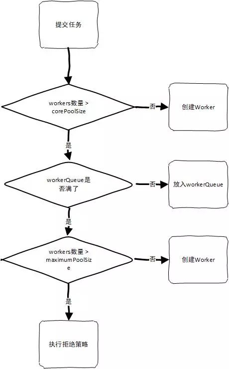

### 线程池状态和数量

ThreadPoolExecutor拥有如下状态 , 它控制着线程是否接收新任务以及当前在队列中或者执行中的任务如何结束.

**RUNNING**:  接收新的任务,新建或者放入任务队列

**SHUTDOWN**: 不接收新的任务,但是会执行任务队列的中任务

**STOP**:     不接收新的任务,不会执行任务队列中的任务,并且停止在执行中的任务

**TIDYING**:  任务执行结束,workerCountOf返回 0 ,线程池状态设置为此状态,并执行钩子函数.

**TERMINATED**: terminated() 结束

<!--more-->

ThreadPoolExecutor使用一个变量来表示线程池的状态和线程池可以使用的worker数量.

```
private final AtomicInteger ctl = new AtomicInteger(ctlOf(RUNNING, 0));
private static final int COUNT_BITS = Integer.SIZE - 3;	// 等于29 
private static final int CAPACITY   = (1 << COUNT_BITS) - 1; // 2^29-1,线程池最大容量

// runState is stored in the high-order bits
private static final int RUNNING    = -1 << COUNT_BITS; // 高三位是 111
private static final int SHUTDOWN   =  0 << COUNT_BITS; // 高三位是 000
private static final int STOP       =  1 << COUNT_BITS; // 高三位是 001
private static final int TIDYING    =  2 << COUNT_BITS; // 高三位是 010
private static final int TERMINATED =  3 << COUNT_BITS; // 高三位是 011

// Packing and unpacking ctl
private static int runStateOf(int c)     { return c & ~CAPACITY; } // 线程池运行状态
private static int workerCountOf(int c)  { return c & CAPACITY; } // 线程池工作线程数
private static int ctlOf(int rs, int wc) { return rs | wc; } 
```

上述代码中ctl就是状态和数量的变量.其中COUNT_BITS为29,RUNNING等状态的值都是做左移29位的运算,结合runStateOf函数的运算可以看出其使用ctl变量的的二进制高三位来表示线程池的运行状态.

### 任务提交

线程池提交任务有几个方法,基本逻辑一致.创建一个FutureTask(RunnableFuture的实现)然后执行任务.

```
// AbstractExecutorService.java
public Future<?> submit(Runnable task) {
	if (task == null) throw new NullPointerException();
	RunnableFuture<Void> ftask = newTaskFor(task, null);
	execute(ftask);
	return ftask;
}
```

上面的execute方法并没有进行直接的实现,而是子类来实现.以ThreadPoolExecutor为例子

```
public void execute(Runnable command) {
	if (command == null)
		throw new NullPointerException();

	int c = ctl.get();
	// worker数量小于核心线程数直接创建新worker并缓存
	if (workerCountOf(c) < corePoolSize) {
		if (addWorker(command, true))
			return;
		c = ctl.get();
	}
	
	// 线程池 执行中 && 任务入队列成功
	if (isRunning(c) && workQueue.offer(command)) {
		int recheck = ctl.get();
		if (! isRunning(recheck) && remove(command))
			// 线程池非执行中 && 执行出队 且执行拒绝策略
			reject(command);
		else if (workerCountOf(recheck) == 0)
        // because existing ones died since last checking
			addWorker(null, false);
	}
	// 上一个if条件入队列失败 , 创建新线程,边界是maximumPoolSize
	else if (!addWorker(command, false))
		// 创建新线程失败执行拒绝策略
		reject(command);
}
```

这个方法的源码有比较清晰的注释,大意是此操作分几个步骤 :

1. 当 workers 数量小于 corePoolSize 的时候, 则创建一个线程来执行当前任务并添加到workers里面. addWorker对当前线程的执行状态和线程数会进行再次校验
2. workers 已经到达 corePoolSize的数量, 尝试将任务放入到workQueue. 如果失败则使用addWorker创建线程,失败则执行拒绝策略.
3. 如果放入workQueue成功 , double-check 线程池的运行状态,如果线程池非运行状态,则出队,并执行拒绝策略.如果线程池在运行状态,则校验worker数量,为0的的话则调用addWorker

```
private boolean addWorker(Runnable firstTask, boolean core) {
	
	// double-check
	...

	boolean workerStarted = false;
	boolean workerAdded = false;
	Worker w = null;
	..
	final ReentrantLock mainLock = this.mainLock;
	mainLock.lock();
	try {
		// Recheck while holding lock.
		// Back out on ThreadFactory failure or if
		// shut down before lock acquired.
		int rs = runStateOf(ctl.get());

		if (rs < SHUTDOWN ||
			(rs == SHUTDOWN && firstTask == null)) {
			if (t.isAlive()) // precheck that t is startable
				throw new IllegalThreadStateException();
			workers.add(w);
			int s = workers.size();
			if (s > largestPoolSize)
				largestPoolSize = s;
			workerAdded = true;
		}
	} finally {
		mainLock.unlock();
	}
	...
	return workerStarted;
}
```

addWorker 有两个参数 , 一个表示任务,一个表示是否使用corePoolSize作为创建线程数的上限, 如果为false的话则可创建的线程数上限是maximumPoolSize.创建线程先要获得显式锁,创建完成后加入到workers中,加入成功则执行该线程的start方法,开始执行线程.

从上面的源码分析中, 提交任务的大致流程如下图所示:



### 任务执行

处理任务的是ThreadPoolExecutor的内部类Worker,提交任务时addWorker方法创建的.

```
private final class Worker
        extends AbstractQueuedSynchronizer
        implements Runnable {

    // 忽略其他方法
    public void run() {
        runWorker(this);
    }

}
```

其中的runWorker 在ThreadPoolExecutor中实现.

```
final void runWorker(Worker w) {
    Thread wt = Thread.currentThread();
    Runnable task = w.firstTask;
    w.firstTask = null;
    w.unlock(); // allow interrupts
    boolean completedAbruptly = true;
    try {
        while (task != null || (task = getTask()) != null) {
            w.lock();
            // If pool is stopping, ensure thread is interrupted;
            // if not, ensure thread is not interrupted.  This
            // requires a recheck in second case to deal with
            // shutdownNow race while clearing interrupt
            if ((runStateAtLeast(ctl.get(), STOP) ||
                 (Thread.interrupted() &&
                  runStateAtLeast(ctl.get(), STOP))) &&
                !wt.isInterrupted())
                wt.interrupt();
            try {
                beforeExecute(wt, task);
                Throwable thrown = null;
                try {
                    task.run();
                } catch (RuntimeException x) {
                    thrown = x; throw x;
                } catch (Error x) {
                    thrown = x; throw x;
                } catch (Throwable x) {
                    thrown = x; throw new Error(x);
                } finally {
                    afterExecute(task, thrown);
                }
            } finally {
                task = null;
                w.completedTasks++;
                w.unlock();
            }
        }
        completedAbruptly = false;
    } finally {
        processWorkerExit(w, completedAbruptly);
    }
}
```

可以看出worker创建并开始执行,会在一个任务执行完成后,使用getTask方法从workQueue取出等待中的任务继续执行,直到没有任务或者线程池关闭.最后执行worker退出操作.

### 任务结果

提交任务的方法中可以看出提交的是RunnableFuture 具体实现是 FutureTask , 对当前提交的Runnable或者Callable进行封装.

```
public FutureTask(Callable<V> callable) {
    if (callable == null)
        throw new NullPointerException();
    this.callable = callable;
    this.state = NEW;       // ensure visibility of callable
}

public FutureTask(Runnable runnable, V result) {
    this.callable = Executors.callable(runnable, result);
    this.state = NEW;       // ensure visibility of callable
}
```

封装后提交到线程池中实际执行的是FutureTask的run方法,该方法的实现如下

```
public void run() {
    if (state != NEW ||
        !UNSAFE.compareAndSwapObject(this, runnerOffset,
                                     null, Thread.currentThread()))
        return;
    try {
        Callable<V> c = callable;
        if (c != null && state == NEW) {
            V result;
            boolean ran;
            try {
                result = c.call();
                ran = true;
            } catch (Throwable ex) {
                result = null;
                ran = false;
                setException(ex);
            }
            if (ran)
                set(result);
        }
    } finally {
        // runner must be non-null until state is settled to
        // prevent concurrent calls to run()
        runner = null;
        // state must be re-read after nulling runner to prevent
        // leaked interrupts
        int s = state;
        if (s >= INTERRUPTING)
            handlePossibleCancellationInterrupt(s);
    }
}

protected void set(V v) {
    if (UNSAFE.compareAndSwapInt(this, stateOffset, NEW, COMPLETING)) {
        outcome = v;
        UNSAFE.putOrderedInt(this, stateOffset, NORMAL); // final state
        finishCompletion();
    }
}
```

任务体执行的是callable的run方法,只是执行成功后,会调用set(result)方法设置线程执行的结果.于是我们可以从FutureTask的get中取的结果.

```
// 阻塞直到任务结束取得结果
public V get() throws InterruptedException, ExecutionException {
    int s = state;
    if (s <= COMPLETING)
        s = awaitDone(false, 0L);
    return report(s);
}

// 阻塞直到任务结束取得结果或者超时
public V get(long timeout, TimeUnit unit)
    throws InterruptedException, ExecutionException, TimeoutException {
    if (unit == null)
        throw new NullPointerException();
    int s = state;
    if (s <= COMPLETING &&
        (s = awaitDone(true, unit.toNanos(timeout))) <= COMPLETING)
        throw new TimeoutException();
    return report(s);
}
```

awaitDone的实现有点类似AQS的条件变量实现Waiter, 它将阻塞调用的线程.取得结果是使用了report方法.

```
private V report(int s) throws ExecutionException {
    Object x = outcome;
    if (s == NORMAL)
        return (V)x;
    if (s >= CANCELLED)
        throw new CancellationException();
    throw new ExecutionException((Throwable)x);
}
```


