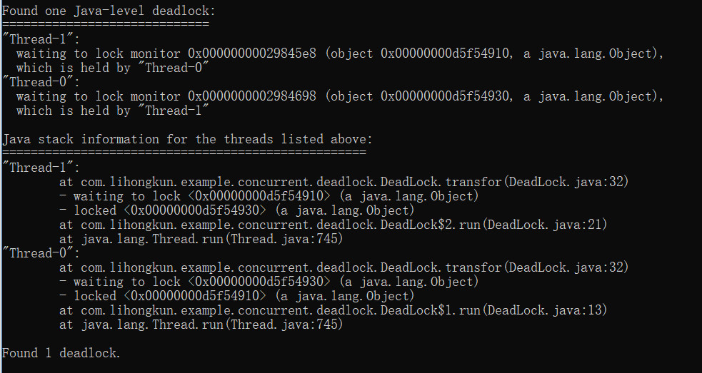

ReentrantLock能做到synchronized得功能，而且在JDK1.6以前性能比后者好很多。之后synchronized性能进行了改进，差距已经不是很大。
<!--more-->

### 性能

在JDK1.8的情况下粗略测试了一下，ReentrantLock性能好25%左右。代码如下，线程数量从20逐渐递增到200，表现基本上很稳定。

```
public static void main(String[] args) {
	final Counter counter = new Counter();
	
	ExecutorService es = Executors.newFixedThreadPool(200);
	long timeWatcher = System.currentTimeMillis();
	for(int i=0;i<200;i++){
		es.execute(new Runnable() {
			@Override
			public void run() {
				for(int i=0;i<1000000;i++)
					counter.incr();
			}
		});
	}
	
	es.shutdown();
	while(true){
		if(es.isTerminated())
			break;
	}
	
	System.out.println("cost : "+(System.currentTimeMillis() - timeWatcher));
}

private static class Counter{
	
	private ReentrantLock lock = new ReentrantLock();
	
	private int cnt = 0;
	
	public synchronized void incr(){
		/*lock.lock();
		try{*/
			cnt++;
		/*}
		finally {
			lock.unlock();
		}*/
	}
}
```

### 避免死锁

看段模拟转账的代码。2个账户转账的时候需要同时获得2个账户的锁才能进行操作。

```
//账户类
public class Account {

	public Object lock = new Object();
	
	public void doSomething(){
		System.out.println(Thread.currentThread().getName());
	}
	
}

public static void main(String[] args) {
	final Account a1 = new Account();
	final Account a2 = new Account();
	
	Thread t1= new Thread(new Runnable() {
		@Override
		public void run() {
			while(true)
				transfor(a1, a2);
		}
	});
	
	Thread t2= new Thread(new Runnable() {
		@Override
		public void run() {
			while(true)
				transfor(a2, a1);
		}
	});
	
	t1.start();
	t2.start();
}

//转账操作
public static void transfor(Account a1,Account a2){
	synchronized (a1.lock) {
		synchronized (a2.lock) {
			a1.doSomething();
			a2.doSomething();
		}
	}
}
```
该段代码运行后会直接卡主。使用jstack看下，检测到死锁。



内置锁避免死锁的方法只有一个，就是在编写代码的时候避免不一致的锁顺序，一旦遇到死锁很致命，应用程序只能重启。上面代码a1->a2和a2->a1的转账同时发生的时候，锁顺序是不一致的。这种情况使用ReentrantLock可以使用轮询的定时锁来解决。


```
public static void transfor(ReentrantAccount a1,ReentrantAccount a2){
	a1.lock.tryLock();
	try{
		a2.lock.tryLock();
		try{
			a1.doSomething();
			a2.doSomething();
		}
		finally {
			a2.lock.unlock();
		}
	}
	finally {
		a1.lock.unlock();
	}
}

```

tryLock失败不会等待，实际使用中可以给出对应的提示，然后进行重试。

此外它的尝试加锁还能指定等待时长。tryLock可以制定timeout的时间，还有lockInterruptibly能够被中断的锁。这些都是synchronized内置锁不能实现的。

### 公平锁及条件变量

传统的线程间协作可以使用Object的wait(),notify(),noiftyAll().

```
public class BoundedBlockingQueue<T> {

	final LinkedList<T> items = new LinkedList<T>();
	final int totalCount = 100;

	public void put(T x) throws InterruptedException {
		synchronized (items) {
			while (totalCount == items.size())// 如果队列满了
				items.wait();
			
			items.addLast(x);
			items.notify();
		}
	}

	public T take() throws InterruptedException {
		synchronized (items) {
			while (items.size() == 0)// 如果队列满了
				items.wait();
			
			T x = items.removeFirst();
			items.notify();
			return x;
		}
	}
}
```
上面是一个有界队列，不管如果是队列满了进行put操作就会wait并释放内置锁,再次获得执行权只能等待notify.同样队列为空的时候进行take操作.notify是非公平的.如果我们需要改成公平的呢.

这里可以改成条件变量的方式.

```
public class BoundedBlockingQueue<T> {

	final Lock lock = new ReentrantLock(true);// 锁对象
	final Condition notFull = lock.newCondition();// 写线程条件
	final Condition notEmpty = lock.newCondition();// 读线程条件

	final LinkedList<T> items = new LinkedList<T>();
	final int totalCount = 100;

	public void put(T x) throws InterruptedException {
		lock.lock();
		try {
			while (totalCount == items.size())// 如果队列满了
				notFull.await();// 阻塞写线程 ,释放锁

			items.addLast(x);

			notEmpty.signal();// 唤醒读线程
		} finally {
			lock.unlock();
		}
	}

	public T take() throws InterruptedException {
		lock.lock();
		try {
			while (items.size() == 0)// 如果队列为空
				notEmpty.await();// 阻塞读线程 ，释放锁

			T x = items.removeFirst();
			notFull.signal();// 唤醒写线程
			return x;
		} finally {
			lock.unlock();
		}
	}
}
```

条件变量可以精准控制读写线程的唤醒,上述的notFull和notEmpty分别对应着队列未满和队列未空的条件.每次唤醒都精准唤醒对应条件的线程.JDK的ArrayBlockingQueue，LinkedBlockingQueue就是类似的实现

如果上面的队列加上一个扩容的方法,条件是容量到达一半才执行,那么用wait,notify就有可能造成空转.因为它不能按条件进行唤醒.


#### 小结

ReentrantLock比synchronized功能性能好,并且提供了公平锁,可中断锁,条件变量等功能,在大部分能使用synchronized的场景下基本上可以都选择ReentrantLock.