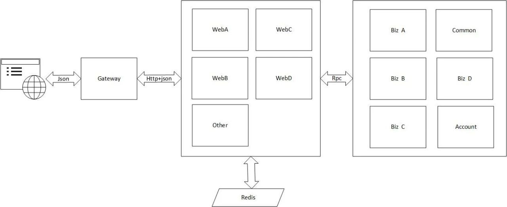
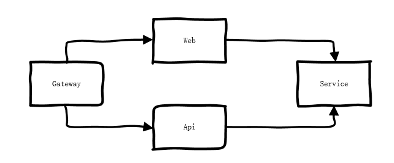
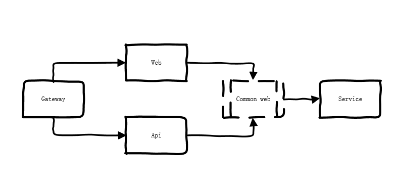
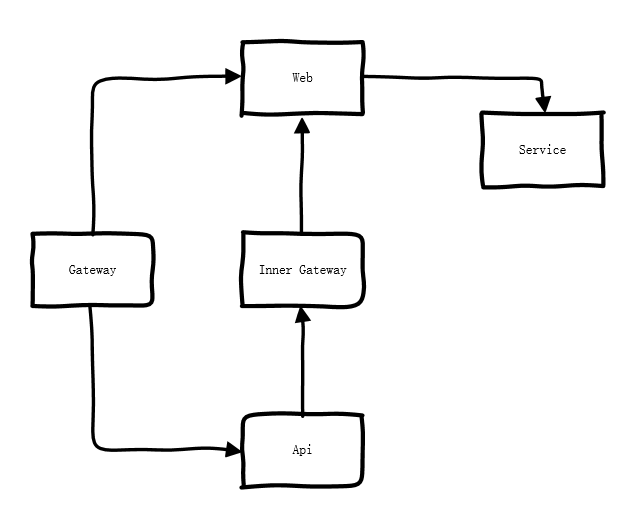
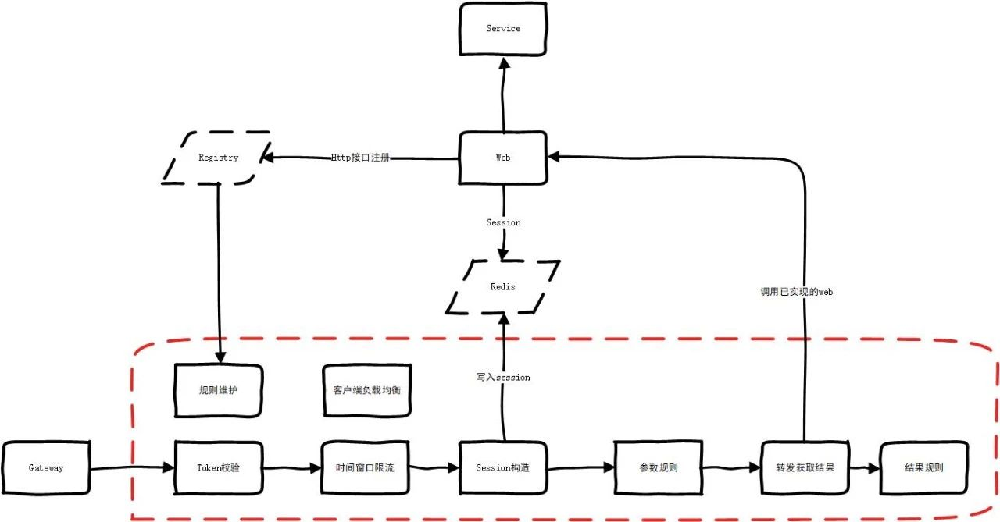
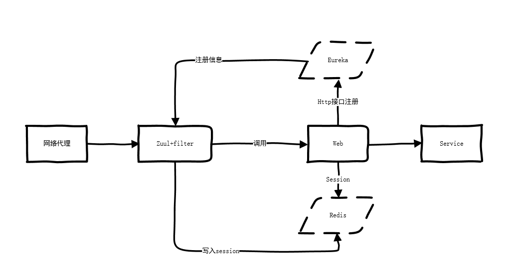
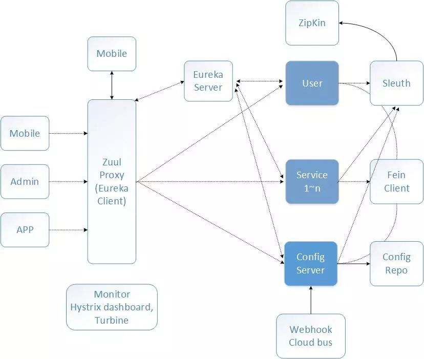

很多时候使用dubbo,gRPC等关注度主要在内部的服务化 , 反而容易忽略了用微服务的思想去设计对外的HTTP接口,导致HTTP接入业务层的边界服务重复且混乱不堪. 最近有一次比较大的重构 , 聊聊一些思路.

<!--more-->

### 现状

核心业务逻辑在service里面实现.客户的操作界面单独的web接入服务通过网关(nginx)暴露出去.实现是动静分离,web有统一的返回结果格式,且是以浏览器session的方式来进行鉴权.

具体业务繁杂,web接入逻辑虽然比较少,但是调用service的重复代码也比较多.

需求是把服务按开放平台的方式提供出去,接入方式使用服务器端的方式来调用.这时候再使用session的方式来鉴权就不太合适.

如何来设计这个方案呢?

###  思考

#### 设计一

最简单也不用设计的方法,就是把web里面的代码全部移植过来.

优点: 不会影响web里面的任何功能,项目隔离

缺点: 工作量巨大,web和api的代码重复度高达90%.后续维护需要两个都维护

#### 设计二

把设计一里面高度重复的代码提出来,放到一个公共jar包.web和api只保留个性化的东西.后续主要也是维护公共逻辑.

优点: 代码逻辑统一

缺点: 工作量很大,需要同时改造web和实现api

#### 设计三

既然逻辑是一致的,主要的差异在鉴权上面,那么我API模拟用户登录内网调用web是否可行.

优点: 只是转发,API项目无具体业务逻辑,节省很大的工作量

缺点: 请求链路复杂

### 细化

权衡复杂度和工作量,自然是会选择设计三.这里需要再细化一下.

##### SESSION

web层是使用redis分布式session的,只需要api构造统一的session写入redis即可实现

##### Inner Gateway 一定需要吗

答案是不需要,这种需要配置的,人工操作风险比较大.web层没有服务发现的机制极其反人类.

自己实现一个支持http的registry或者使用业界开源的.

按照这个思路把限流转发规则等也细化一下

到了这里其实已经没什么问题了,只需要把虚线框内的所有模块好好实现一遍.但是这些通用的功能是不是有现成的开源解决方案的呢?
### 延伸

最终的思路,感觉是有点似曾相识.registry直接使用Eureka,gateway+api工程使用zuul+业务filter 是不是也可以实现.

相比于细化后的设计这个使用上了成熟稳定的中间件.更加节省人力.基本上5人天能从零开始搞定.

对比下Spring Cloud的组件图,本身是遗留项目在方案设计上有诸多缺陷才使用此方案.比如HTTP接入层没有强大的网关功能,也没有配套的注册中心.鉴权耦合到http服务里面.

本质问题是HTTP接入层这块没有按照微服务的思维去实现,才导致了此次设计上的取舍问题.很多时候使用dubbo,gRPC等关注度主要在内部的服务化,反而忽略了接入这块的设计.在实践中值得好好思考.