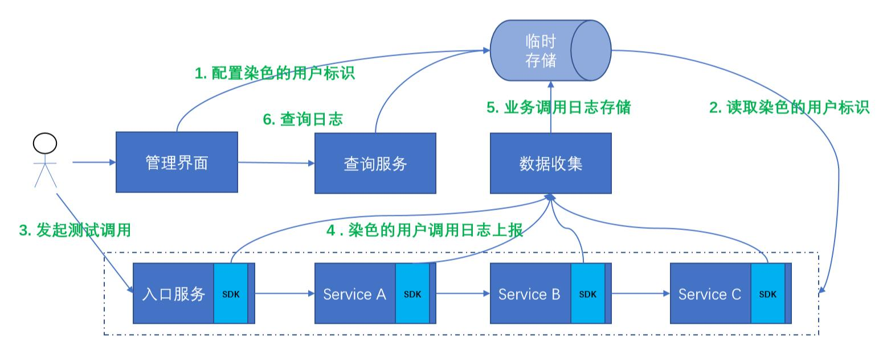
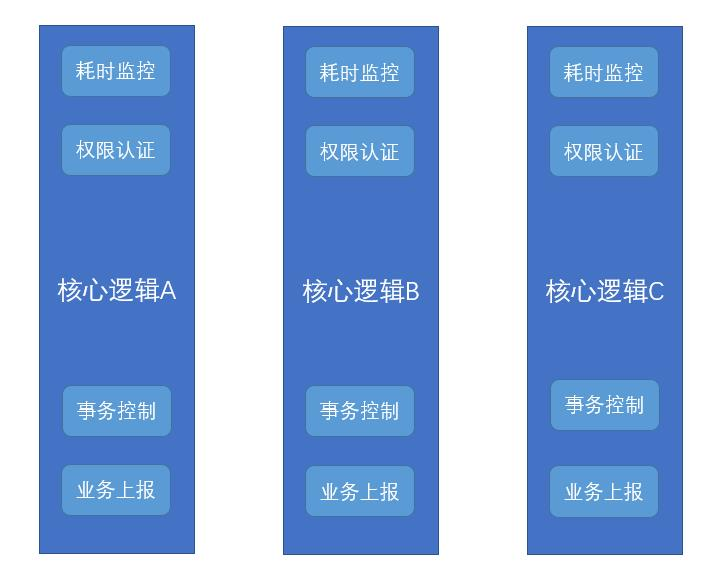
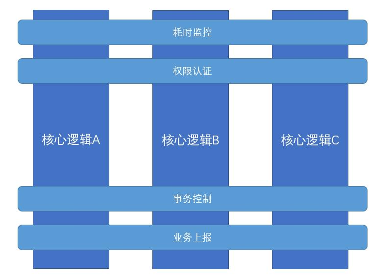

面向切面编程（Aspect Oriented Programming），简称AOP。作为面向对象编程的一个强力补充，在业务系统中很少被关注，却随着Spring的出现而名声鹊起。<!--more-->

### 使用场景

历史文章中有介绍过一个在线调试系统。



图中的ServiceA、ServiceB、ServiceC的内部实现中有很多的逻辑。如果需要在各个业务逻辑中手动进行日志的判断和上报，势必会污染现有的代码，面临在线调试日志的代码分散，冗余，扩展性低等缺点。这时候AOP则可以很好的发挥它的作用。它主要用于横切现有业务逻辑，对其进行增强。

同理在一个大型系统中，总有着很多的基础性功能贯穿着所有的核心逻辑。



如上图，类似的需求。如果在系统初期就明确的需求，可以对核心逻辑设计一些可插拔的前置和后置逻辑进行实现。这需要有一些设计前瞻性，事实是很多系统初期设计并没有提供如此的机制，而很多类似的公共功能是上线后不断堆叠上去的。整体去修改代码，代价有点大，那么公共逻辑对现有逻辑的无侵入增强就变得很迫切了。这正是AOP所产生的原因，也是它最擅长的领域。



使用了AOP之后则不需要在每个逻辑中嵌入代码或者设计之初加入Hook机制。耗时监控、权限认证、事务控制、业务上报等逻辑，可以独立实现，然后通过切面，对核心逻辑进行织入。使做业务的人关注于业务而无需特别去关注一些公共的逻辑。

### 简单实现

展示一个不使用编程框架的例子。有既定的接口和实现类。

```
public interface IBookService {
    public void create(Book book);
    public void update(Book book);
}

public class BookService implements IBookService {

    @Override
    public void create(Book book) {
        System.out.println("create book");
    }
    
    @Override
    public void update(Book book) {
        System.out.println("update book");
    }
    
}
```

对于每一次方法的调用，我们需要对其进行日志输出和耗时统计。这时候需要创建一个代理类。

```
import java.lang.reflect.InvocationHandler;
import java.lang.reflect.InvocationTargetException;
import java.lang.reflect.Method;

public class TimeWatchProxy implements InvocationHandler {

    private Object obj;

    public static Object newInstance(Object obj) {
        return java.lang.reflect.Proxy.newProxyInstance
                (obj.getClass().getClassLoader(), obj
                .getClass().getInterfaces(), new TimeWatchProxy(obj));
    }

    private TimeWatchProxy(Object obj) {
        this.obj = obj;
    }

    @Override
    public Object invoke(Object proxy, Method method, Object[] args) 
    	throws Throwable {
        Object result;
        try {
            System.out.println("before method " + method.getName());
            long start = System.nanoTime();
            result = method.invoke(obj, args);
            long end = System.nanoTime();
            System.out.println(String.format("%s took %d ns", method.getName(), (end-start)) );
        } catch (InvocationTargetException e) {
            throw e.getTargetException();
        } catch (Exception e) {
            throw new RuntimeException("unexpected invocation exception: " + e.getMessage());
        } finally {
            System.out.println("after method " + method.getName());
        }
        return result;
    }
}

```

在需要使用到IBookService的地方都使用TimeWatchProxy来包装一下。

```
public class TimeWatchProxyApp {
    public static void main(String[] args) {
        IBookService bookService = (IBookService) TimeWatchProxy.newInstance(new BookService());
        bookService.create(new Book());
        bookService.update(new Book());
    }
}
```

运行后的执行结果是

```
before method create
create book
create took 141900 ns
after method create

before method update
update book
update took 93400 ns
after method update
```

这里使用了JDK的动态代理直接实现了对IBookService的任何方法的横切。虽然这样的实现跟现有的AOP框架原理一致，但是非常简陋的，也不是很具备普适性，在需要实现多种增强功能的时候需要**多次进行代理**，且**需要改动使用者的代码**。现行的框架会引入一些区分比较明显的概念和术语。

### 概念和术语

**连接点（Join Point）**：表示程序执行中的一个点如方法的执行或者异常的处理。即上述图中，核心逻辑的4个需要进行织入增强的地方。它表示了核心逻辑中的一个方法或者整个类。

**通知（Advice）**：一个作用在连接点上的动作。也就是上述图中的耗时监控、权限认证、事务控制、业务上报的实现。具体类型包含了前置、后置、环绕通知、返回通知、异常通知。

**切入点（Pointcut）**：匹配连接点的谓词，用来表示一类连接点。它表示了通知需要作用的连接点。

**切面（Aspect）**：组合了通知和切入点。表示哪些通知作用到哪些连接点。

**织入（Weaving）**：把切面加入到对象，并创建出代理对象的过程。可分为静态织入和运行时织入。

### 框架实现

简单实现里面，通知的代码是在代理类实现的。以Spring AOP为例，这里需要单独抽象出来。

首先引入对应的依赖。

```
<dependency>
	<groupId>org.springframework</groupId>
	<artifactId>spring-aop</artifactId>
</dependency>
<dependency>
	<groupId>org.aspectj</groupId>
	<artifactId>aspectjrt</artifactId>
	<version>1.9.2</version>
</dependency>
<dependency>
	<groupId>org.aspectj</groupId>
	<artifactId>aspectjweaver</artifactId>
	<version>1.9.2</version>
</dependency>
```

然后定义一个通知类

```
import org.aspectj.lang.JoinPoint;
import org.aspectj.lang.ProceedingJoinPoint;

public class TimeWatchAdvice {

    public void beforeMethod(JoinPoint joinPoint) {
        System.out.println("before method "+joinPoint.getSignature().getName());
    }

    public void afterMethod(JoinPoint joinPoint) {
        System.out.println("after method "+joinPoint.getSignature().getName());
    }

    public Object aroundMethod(ProceedingJoinPoint joinPoint) {
        try {
            long start = System.nanoTime();
            Object result = joinPoint.proceed();
            long end = System.nanoTime();
            System.out.println(String.format("%s took %d ns", joinPoint.getSignature().getName(), (end - start)));
            return result;
        } catch (Throwable e) {
            throw new RuntimeException(e);
        }
    }
}
```

接着是配置一个切面吧，切入点和通知类组合起来。

```
<?xml version="1.0" encoding="UTF-8"?>
<beans xmlns="http://www.springframework.org/schema/beans"
       xmlns:aop="http://www.springframework.org/schema/aop"
       xmlns:xsi="http://www.w3.org/2001/XMLSchema-instance"
       xsi:schemaLocation="http://www.springframework.org/schema/beans
        https://www.springframework.org/schema/beans/spring-beans.xsd
        
        
        http://www.springframework.org/schema/aop
        https://www.springframework.org/schema/aop/spring-aop.xsd">

    <bean id="bookService" 
    	class="com.lihongkun.labs.spring.container.aop.BookService"></bean>

    <bean id="timeWatchAdvice"
    	class="com.lihongkun.labs.spring.container.aop.TimeWatchAdvice" />

    <aop:config>
        <aop:aspect ref="timeWatchAdvice">
            <aop:pointcut id="serviceMethods" 
            	expression="execution(* com.lihongkun.labs.spring.container.aop.*Service.*(..))" />

            <aop:before pointcut-ref="serviceMethods" method="beforeMethod" />
            <aop:around pointcut-ref="serviceMethods" method="aroundMethod" />
            <aop:after-returning pointcut-ref="serviceMethods" method="afterMethod" />
        </aop:aspect>
    </aop:config>
</beans>
```

aop:aspect 定义一个切面，它指向了timeWatchAdvice，其包含的标签定义了pointcut，使用表达式对aop下的Service后缀的类进行横切，分别实现了前置、环绕和后置通知。运行结果跟简单实现一致，如果需要多个通知，则可以定义多个切换来实现，更具备灵活性。

#### 小结

面向切面编程，旨在通过对现有的功能进行切入，对其进行公共功能的增强，而不进行代码的侵入。它引入了切面、切入点和通知等定义。Spring AOP框架的使用可以在无需改动使用者的情况下，只需要进行配置则对现有的Bean的功能进行增强。