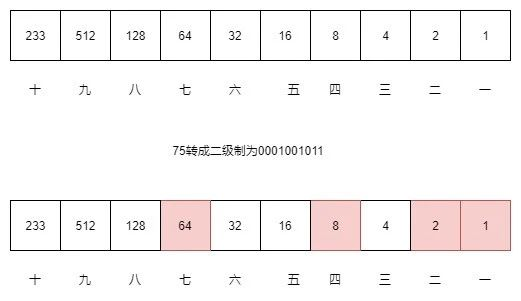
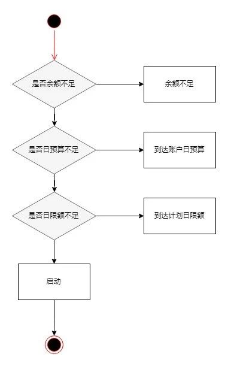
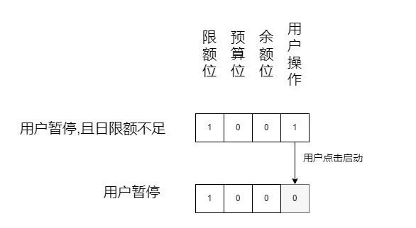

有1000个苹果10个盒子,要求把1000个苹果分装到10个盒子里.如果有人来买苹果随便说出一个数,直接拿这些盒子组装一下就可以给他,不用拆分盒子.请问这10个盒子应该分别装多少苹果.

<!--more-->

### 存储

有时候面试这种问题,并不是智力题或者是算法题.而是计算机基础考察题.想想计算机是如何存储数据的?

我们经常记的数值的范围,比如int 是 32 bit的二进制位来表示 ,如果是无符号的话,它能表示0 ~ 2^32之间的任何数值.类比一下10个盒子是bit位的话能表示的是0 ~ 2^10的任何数值,也就是0 ~1024.如下图



说出其中一个数值就是选择该数值转换成二进制后,哪一位是1的盒子.例如拿出75个苹果,75转二进制是 0001001011 拿出其中的一,二,四,七这4个盒子


### 传输

举个场景,如果你在socket直接使用二进制传输一段文本.在文本的头部加上一段bit位来表示文本的长度.这一段如何设计.

同样使用字符串?例如"5000",如果用字符串来表示的话,那么是4 bytes = 32 bit .如果这个数值变成20000000 那么他需要 8 bytes = 64 bit.表示下来比直接使用数值存储的方式传输大小差距很大.而且还有一个很不好的地方就是头部的长度不固定.接收方根本不知道头部的长度,无所适从.

正常的做法就是头部使用二进制来传输正常的数值而不是使用字符串表示数值.

int 使用 4 bytes 表示,转二进制就是一个byte[4]的数组,那么就是一个字节一个字节转换

```
//byte 数组与 int 的相互转换
public static int byteArrayToInt(byte[] b) {
    return   b[3] & 0xFF |
            (b[2] & 0xFF) << 8 |
            (b[1] & 0xFF) << 16 |
            (b[0] & 0xFF) << 24;
}

public static byte[] intToByteArray(int a) {
    return new byte[] {
        (byte) ((a >> 24) & 0xFF),
        (byte) ((a >> 16) & 0xFF),   
        (byte) ((a >> 8) & 0xFF),   
        (byte) (a & 0xFF)
    };
}
```

### 状态位设计

看个场景,假设用户投放广告,建立推广计划进行广告的投放和消耗,一般会进行限额,时段等等的限制.那么推广计划的暂停状态有很多种情况,每一种情况对应着一个状态.如账户余额不足,到达账户日预算,到达计划日限额,用户暂停.

**状态位通用设计**

很多人喜欢用连续的数值来表示状态,如 0:启动、1:用户暂停、2:账户余额不足、3:到达账户日预算、4:到达计划日限额.

一个计划从用户暂停需要修改为启动的话,就需要通过调用其他子系统来判断它自己是属于什么状态.增加了业务代码的复杂度.




**二进制状态位**

上述4个会导致推广计划暂停的状态我使用4个二级制位来表示.如果是到达异常条件则对应的位置设置成1.那么如果是状态位是0的话则表示推广计划是启动中.

这样对应的异常状态只由自己的条件满足和不满足的到达的时候来进行修改而不是每一次变更去判断所有的条件十分满足.



如上图,一个状态条件的变更只是改变自己状态位的变化.这样无需某个状态的条件变更还需要去判断其他状态.大大解耦了系统.在一个复杂的大型系统里面状态的流转设计可能是这个例子的好几倍.

通用的设计里面同时只能存在一种状态,二进制能满足状态共存的需求.


**小结**

二进制思维在平时编码中善用能解决很多问题.合适的场景用到设计上能解耦系统,降低复杂度.