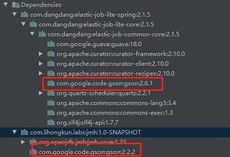
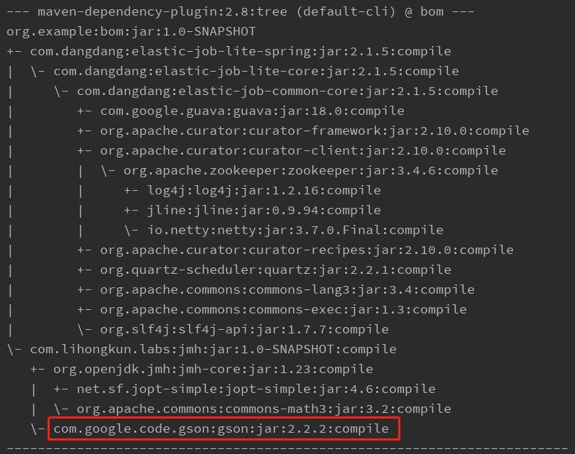

Java的世界里，几乎所有项目的包管理都是使用了Maven，或者在其之上演进的组件。大型项目比如有成百上千个工程，依赖的包比较多，如果没有统一的版本管理，很容易就失控了。<!--more-->

### 依赖包版本冲突

项目中pom.xml来管理依赖包，会遵循一个最短路径依赖。先看一个Case

```
<dependencies>
	<dependency>
		<groupId>com.dangdang</groupId>
		<artifactId>elastic-job-lite-spring</artifactId>
		<version>2.1.5</version>
	</dependency>
	<dependency>
		<groupId>com.lihongkun.labs</groupId>
		<artifactId>jmh</artifactId>
		<version>1.0-SNAPSHOT</version>
	</dependency>
</dependencies>
```

如上代码，项目中依赖了两个jar包，他们各自的依赖如下图



可以看到这两个包的依赖树如图，其中的gson包版本是不一致的。按照最短路径原则的化2.2.2版本的包它的路径是比较短的。所以选择了2.2.2版本。我们可以使用 mvn dependency:tree命令来看最后选择的依赖。



这种情况下，会导致应用无法启动。因为elasticjob的使用强依赖于2.6.1，而其中使用的功能在2.2.2不存在。解决这种版本冲突比较简单，直接使用更短的路径依赖去覆盖，即在本项目中显式指定依赖和版本。但是当项目比较多的时候，坏处就显而易见了。

### 依赖包版本管理

BOM（Bill of Materials）是由Maven提供的功能,它通过定义一整套相互兼容的jar包版本集合，使用时只需要依赖该BOM文件，即可放心的使用需要的依赖jar包，且无需再指定版本号。BOM的维护方负责版本升级，并保证BOM中定义的jar包版本之间的兼容性。

#### 如何使用

典型的应用如 使用Spring框架时，直接引入其bom进行包依赖管理。在使用具体的包时则不需要再进行包版本的声明。

```
<dependencyManagement>
   <dependencies>
     <dependency>
        <groupId>org.springframework</groupId>
        <artifactId>spring-framework-bom</artifactId>
        <version>4.3.1.RELEASE</version>
        <type>pom</type>
        <scope>import</scope>
     </dependency>
   </dependencies>
</dependencyManagement>

<dependencies>
    <dependency>
        <groupId>org.springframework</groupId>
        <artifactId>spring-context</artifactId>
    </dependency>
    <dependency>
        <groupId>org.springframework</groupId>
        <artifactId>spring-web</artifactId>
    </dependency>
<dependencies>
```

#### 如何自定义

既然有这样好处，那么我们在平时项目的管理中如何编写BOM。建议是整个部门或者大的项目由一个统一的BOM进行管理。

```
<groupId>com.lihongkun.labs</groupId>
<artifactId>bom</artifactId>
<version>1.0</version>
<packaging>pom</packaging>

<dependencyManagement>
	<!--声明依赖和版本-->
	<dependencies>
		<dependency>
			<groupId>com.alibaba</groupId>
			<artifactId>druid</artifactId>
			<version>1.1.12</version>
		</dependency>
		<dependency>
			<groupId>com.alibaba</groupId>
			<artifactId>fastjson</artifactId>
			<version>1.2.29</version>
		</dependency>
	<dependencies>
</dependencyManagement>
```

编写方式同平时进行包依赖引入的时候没什么差别。只是所有的依赖都是使用dependencyManagement整个包含起来。

```
<!--引入bom进行依赖管理-->
<dependencyManagement>
   <dependencies>
     <dependency>
        <groupId>com.lihongkun.labs</groupId>
		<artifactId>bom</artifactId>
		<version>1.0</version>
        <type>pom</type>
        <scope>import</scope>
     </dependency>
   </dependencies>
</dependencyManagement>

<!--声明本项目所需要的依赖-->
<dependencies>
	<dependency>
		<groupId>com.alibaba</groupId>
		<artifactId>druid</artifactId>
	</dependency>
	<dependency>
		<groupId>com.alibaba</groupId>
		<artifactId>fastjson</artifactId>
		<!--指定版本号进行覆盖-->
		<version>1.2.66</version>
	</dependency>
<dependencies>
```

使用了上述方式即可直接对其中声明的包进行统一的版本管理。如上述代码，fastjson在本项目中需要进行一个单独升级，那么可以直接指定版本号进行覆盖。框架虽然留下了这种灵活性，但是实际使用中最好是进行统一管理。

