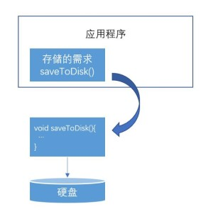
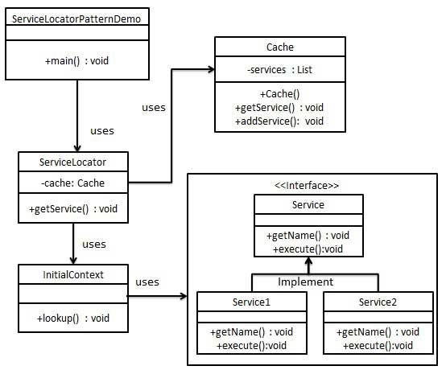
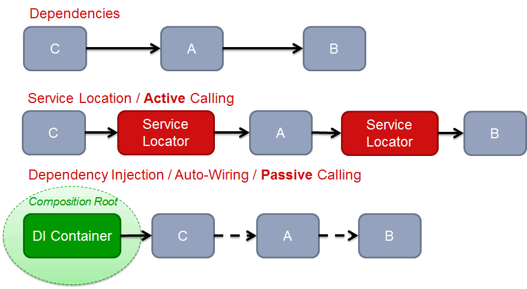

控制反转是Spring框架的核心内容，也是因为Spring的关系这个模式为大众所知晓。当然很多人对他并不是有比较系统的了解。<!--more-->

#### 依赖抽象

先看一个比较经典的例子，代码和示意图如下

```
public class Application{
	
	pivate  DiskWriter writer = new DiskWriter();
	
	public void save(){
		writer.saveToDisk();
	}
}
```



应用程序在需要存储时，直接执行了saveToDisk()，导致了高层应用程序直接依赖低层模块的API 。假设应用程序需要移植到其他平台上，而平台使用的存储介质是SSD，则应用程序无法直接重用，必须要修改代码才可以。这里由于低层的模块存储介质发生了变化，造成了高层模块也必须跟着变化，这不是一个好的设计方式。在设计上希望模块都依赖于模块的抽象，这样才能够重用高层的应用程序。

```
public interface IDeviceWriter{
	void saveToDevice();
}

public class DiskWriter implements IDeviceWriter{
	public void saveToDevice(){
		System.out.println("save to disk")
	}
}

public class SsdWriter implements IDeviceWriter{
	public void saveToDevice(){
		System.out.println("save to ssd")
	}
}

public class Application{
	
	private IDeviceWriter deviceWriter;
	
	public void setDeviceWriter(IDeviceWriter deviceWriter){
		this.deviceWriter = deviceWriter;
	}
	
	public void save(){
		if(deviceWriter == null){
			throw new RuntimeException("deviceWriter needed ...");
		}
		deviceWriter.saveToDevice();
	}
}
```

如上述代码把Application与具体的DeviceWriter实现解耦，在存储介质变化的时候并不需要重新修改Application的实现。应用程序不依赖于实现，但是应用程序与实现都要依赖于接口。

#### 控制反转

IoC（Inversion of Control ）的Control是控制的意思，其背后是一种依赖关系的转移。如果A依赖于B，其意义即B拥有控制权。如果转移这种关系（依赖关系的反转即控制关系的反转），将控制权由实现的一份转移至抽象的一方，让抽象方拥有控制权，可以获得组件的可重用性。IoC的实现方式有2种  1.  Service Locator  2. Dependency Injection

##### 服务定位器

服务定位器模式的目的是按需返回服务实例，将服务使用者与具体类分离。



它的实现包含了以下组件

- Client – 服务的使用者. 它在需要使用到服务的时候从服务定位器获取服务，并调用。

- Service Locator – 服务定位器从服务工程创建并注册服务到缓存。

- Service  Cache – 用来存储 Service Locator 已经获取过的Service。

- Initial Context – 负责创建服务，是一个service 工厂的角色。当Service Locator在Cache中没有找到service的时候则调用它进行服务的创建。

- Service – 服务抽象或者服务的实现

核心的逻辑是 Client 需要服务的具体实现的时候调用 Service Locator 来进行创建，使Client与ServiceImpl解耦。

##### 依赖注入

依赖注入一般是由一个依赖注入容器来负责类的实例化，在实例化的过程中把该类所依赖的抽象的实现给创建好并注入到该类的实例。注入的方式可以总结为三种

- 构造函数注入 - 实例化的过程中将依赖传入，进行对象的实例化
- Setter函数注入 - 实例化后容器将依赖通过setter函数设置进去
- 实现接口注入 - 实例化后， 容器对其中实现了某个接口的类对象进行该接口的调用。最典型的是Spring的各种Aware接口

这个模式因为Spring的普及而被广泛使用。

##### 对比



Service Locator模式虽然是解耦了应用和依赖的关系，却引入了Service Locator，应用本身依赖了Service Locator。

依赖注入模式，其中的类是没有任何跟自己的实现无关的内容，可以进行单独的测试和使用。对于依赖的实现，它既不知道，也不在乎它们来自何方，有容器给它们注入。就算你换了一个依赖注入容器也是不需要去更改相关类的代码。

#### 延伸

SOLID编程原则里面的 D代表Dependency  Inversion Principle 即依赖倒置原则，说的就是控制反转。而控制反转的实现即是Service Locator和Dependency Injection两种模式。


致敬一下经典。

https://martinfowler.com/articles/injection.html

https://java-design-patterns.com/patterns/service-locator/

https://java-design-patterns.com/patterns/dependency-injection/

https://book.douban.com/subject/1830509/