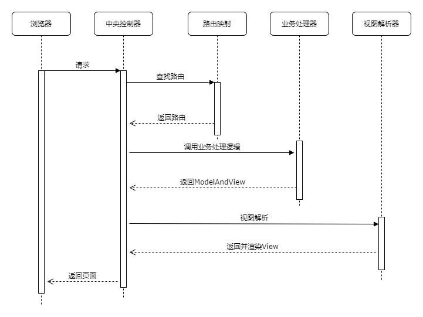
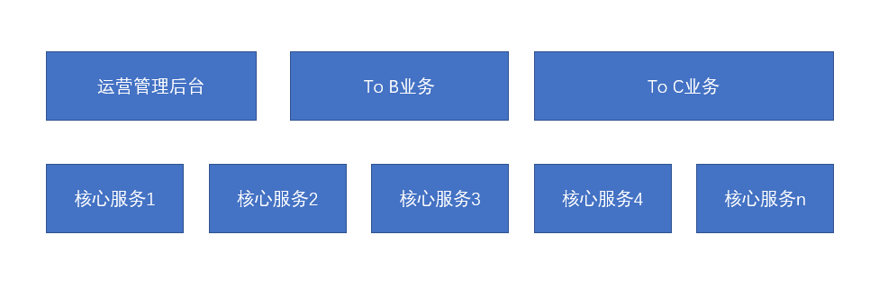

Model-View-Controller模式最开始出现于Client-Server流行的时代，它很好地解决了视图展示代码和模型及其业务逻辑代码的耦合。<!--more-->

从更广的角度去看，它对软件进行了分层，视图层负责进行展示，模型层负责业务逻辑的处理。而控制层则是衔接二者，它控制数据流向模型对象，并在数据变化时更新视图。随着Browser-Server应用的普及，它也跟着进入了服务端编程领域。常见的框架如Spring MVC，目前是事实上的Web MVC框架的工业标准。

View层的实现从服务端的脚本语言如JSP，到服务端渲染的模板引擎如FreeMarker，进而到目前的动静分离。通常一次MVC的请求，在框架里面流程如下。

由于视图存在多种多样，视图解析器ViewResolver通常是可以有很强的定制性。也就是说Web MVC框架大部分工作就是在 报文解析、路由寻址 和视图解析。而JavaScript越来越强大，RESTful 风格服务的普及。view层趋向于简单化，也就是JSON 为主。甚至，边界的web服务使用NodeJS来实现。导致现有的MVC框架渐渐只是变成了一个HTTP服务，在有的技术栈里面MVC框架就被直接给替换了。

这就催生了以上的分层架构，核心服务层以微服务的形式存在。为上层具体应用提供实现。而边界服务的To B业务和运营管理后台 通常是View（vue.js + html） 和 Controller (nodejs) 由前端团队实现。To C 由于其并发比较高，Spring MVC在一些极限场景下并不是很合适。故而会用Netty直接进行实现，或者Spring WebFlux。

未来，纯粹的Web MVC框架可能会直接消失了，而其思想将在软件设计分层中体现。