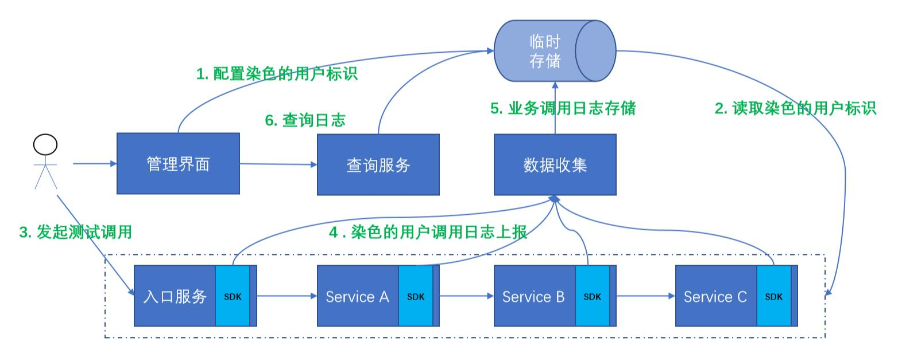

线上日志是工程师诊断业务问题的主要依据。在并发量比较小的情况下，关键日志都是全量打印。在QPS到达十万甚至百万量级的服务里面，打印全量业务日志是不现实的。那么在这种情况下，我们如何去跟踪和重现偶发性的业务问题 ？<!--more-->

首先全量打印日志已经被否定了，大量的写磁盘操作对应用本身是一种极大的压力，且存储成本也很高。很容易想到只打印部分日志 ， 维度则是某一次具体的调用。那么就需要一个能够简单进行配置答应某一次调用，且能够将这次调用的日志收集并查询的系统。思路如下图：



整个过程分为6个步骤

1. 通过运营管理平台配置要跟踪的用户的标识比如IMEI或者用户ID，依据系统特性而定。存储到临时存储当中。
2. 要调试的各个服务嵌入了在线调试的SDK，从临时存储从拉取对应的标识。
3. 如果配置的测试用户则进行主动调用。
4. 调用链路上的服务把各个服务所产生的业务日志，包含调用链的标识上报到数据收集服务。
5. 数据服务将日志聚合写入到临时存储
6. 开发或者运营人员通过运营管理平台查询调用链路上的信息。

存储的选型使用Redis，因为可以设置过期时间。不用额外的工作去处理过期的策略。如果简化一点实现的化，那么上述的数据收集服务是可以直接忽略的。我们直接扩展Logback的Appender。

```
<configuration>
	other config about 
	<appender name="REDIS" class="com.cwbase.logback.RedisAppender">
		config about redis and log level filter
	</appender>
	<appender name="ASYNC" class="ch.qos.logback.classic.AsyncAppender">
		<appender-ref ref="LOGSTASH" />
	</appender>
	<root level="INFO">
		<appender-ref ref="ASYNC" />
	</root>
</configuration>
```

整个系统需要依赖在调用链系统之上，每个环节通过调用链ID串连起来，同时可以知道每个环节的耗时。如果没有调用链系统，那么每个环节则需要透传从入口服务生成的请求标识。


