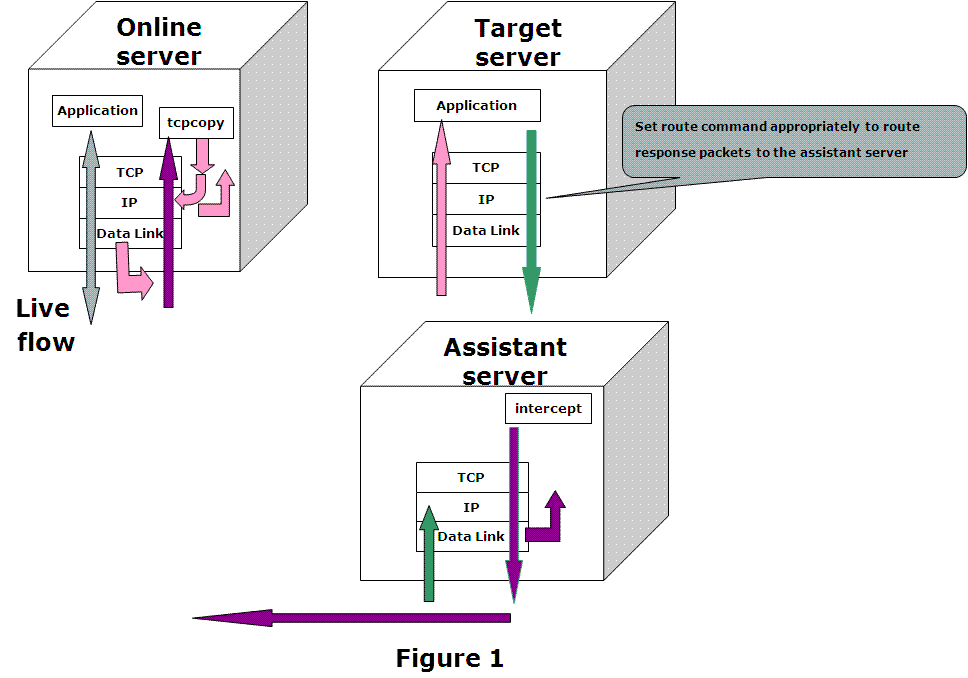
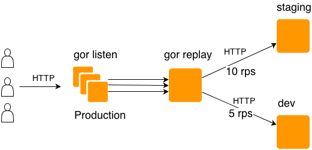

近日，一个进行了大半年的大型项目重构接近尾声。这种重构无异于飞机在天上直接换引擎。慢慢进行灰度是必然的。但是灰度之前，有更好的方式提前发现问题，那就是流量复制，使用线上真实的流量对即将上线的应用进行测试。<!--more-->

流量复制通常可以使用在以下场景 

1、预发布环境需要真实流量做功能的回归与验证；对于一些可用性和业务容错性要求比较高的应用，会使用真实流量进行测试。

2、压力测试 。例如需要验证网络带宽流量阈值，系统全链路的承受能力。当系统链路和数据都比较复杂的时候。测试环境有时候非常难以模拟。或者需要进行线上几倍流量的压力测试时，流量复制会相对科学一点。

**TCPCopy**

这是一个比较老牌的工具，也是最广为人知的一个工具。不过很多公司没有实践的机会，再加上其使用比较繁琐，基本上用的好的也不多。

github 地址是 https://github.com/session-replay-tools/tcpcopy/ 可以到上面直接下载一个编译好的包进行使用。



如图所示，TCPCopy由两部分组成：TCPCopy和intercept。TCPCopy在线上服务器上运行并捕获在线请求，intercept运行在辅助服务器上并执行一些辅助工作，例如将响应信息传递给TCPCopy。测试应用程序则在目标服务器上运行。也就是使用上其实还需要一个辅助服务器。

虽然它的功能非常强大，从网络层直接进行复制，可以无视应用层的协议。但是大部分的应用确实用不到这么高级的功能。比如90%场景下确实是使用HTTP协议，杀鸡用牛刀也是需要成本的。

#### GoReplay

官网地址 https://goreplay.org/ 特点是简单易用，支持HTTP。



直接在目标服务器上部署，然后敲下命令，即可进行流量复制。无需理解复杂的概念。同样支持在线直接转发。存储到文件进行重放，N倍重放。

```
sudo ./gor --input-raw :8000 --output-http="http://localhost:8001"
sudo ./gor --input-raw :8000 --output-file=requests.gor
```

**jvm-sandbox**

java语言的世界里面也有一些比较特殊的协议，使用TCPCopy可以解决问题。这里提出另外的思路就是使用阿里巴巴的 jvm-sandbox https://github.com/alibaba/jvm-sandbox 需要代码的编写，可适用于一些比较定制化的场景。

沙箱有两种启动方式

1、使用jvm的attach机制，线上随时可进行attach

2、java agent启动，需要在命令行增加参数，故需要重启。

流量复制的场景下基本就是选择attach了。提供的脚本非常简单易用，直接在安装目录下敲入命令即可。

```
# 假设目标JVM进程号为'2343'
./sandbox.sh -p 2343
```

其他的就是编写AOP相关代码然后编译成 jar 包放入到安装目录。官网的例子非常详细，有兴趣可以了解了解。

