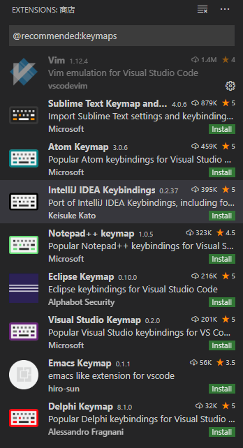
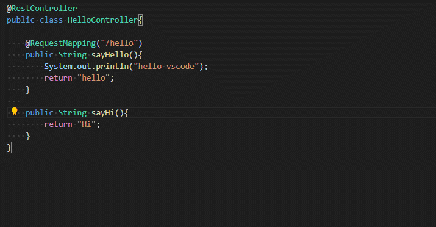
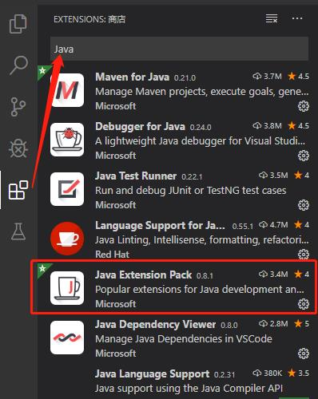
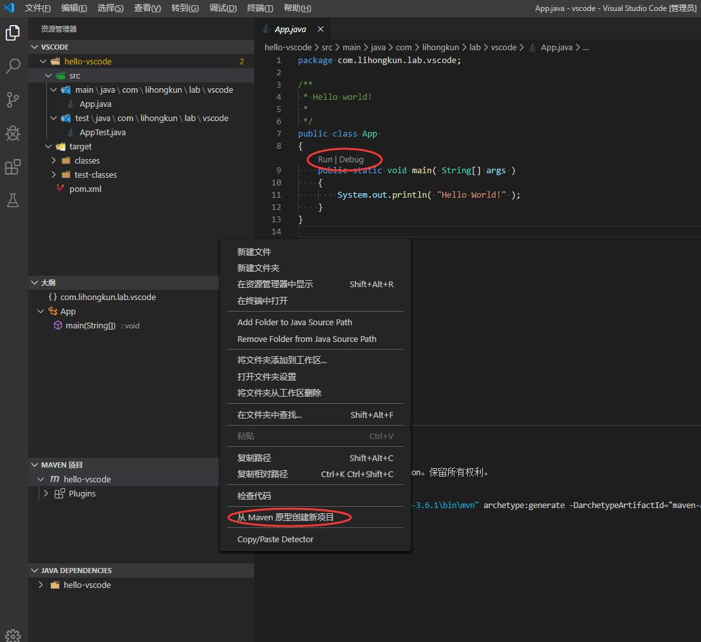
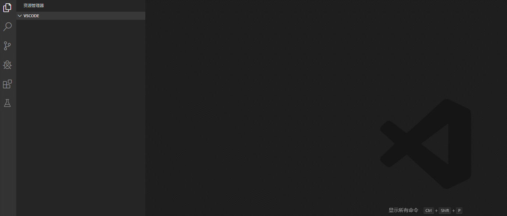
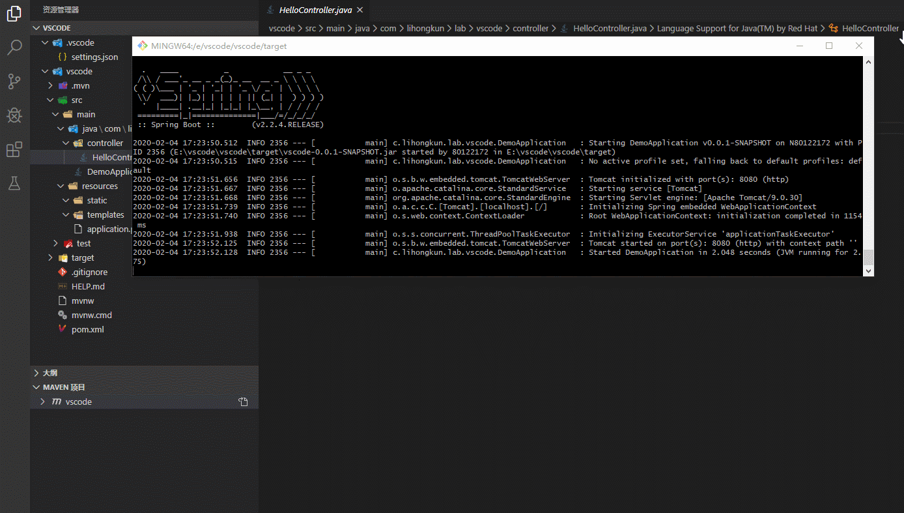

Visual Studio Code (简称 VS Code) 是一款免费开源的现代化轻量级代码编辑器，支持几乎所有主流的开发语言的语法高亮、智能代码补全、自定义热键、括号匹配、代码片段、代码对比 Diff、Git 等特性，支持插件扩展，并针对网页开发和云端应用开发做了优化。轻量、免费、开源和扩展机制为它赢得了很多用户，同时社区和官方对他的维护和扩展是非常活跃的。

<!--more-->

### 安装和使用

官网（[https://code.visualstudio.com/](https://code.visualstudio.com/)）提供了安装包的下载

#### 用户界面

安装完成以后首先要熟悉一下界面的构成和作用。


**活动栏（Activity Bar）**：位于最左边，它的主要作用是切换边栏的内容。默认从上倒下依次是 资源管理器、搜索、源代码管理、调试运行、扩展。

**边栏（Side Bar）**：展示不同的视图来管理不同的内容，主要通过活动栏来切换。如资源管理器，帮助你管理工作空间中的项目和文件。源代码管理则是源代码版本管理。

**编辑器（Editor）**：编辑文件的主区域。能够打开多个文件进行编辑，且能横向、纵向分组。

**面板（Panels）**：可以在编辑器区域下显示不同的面板，用于输出或调试信息、错误和警告，或集成终端。面板也可以向右移动以获得更大的垂直空间。

**状态栏（Status Bar）**：有关打开的项目和编辑的文件的信息。

#### 快捷键

vscode为了让使用者尽量在键盘上完成工作，设置了一些快捷键，并且可以定制。基础的快捷键表可以通过官方的表进行速查 [https://code.visualstudio.com/shortcuts/keyboard-shortcuts-windows.pdf](https://code.visualstudio.com/shortcuts/keyboard-shortcuts-windows.pdf) 。

##### 自定义

当然它也提供自定义的功能，可以从【文件】-> 【首选项】-> 【键盘快捷方式】进入，或者使用快捷键【Ctrl+S & Ctrl + K】调起快捷键定制界面。

##### 扩展

可能很多人都有自己习惯的编辑器，这个可以通过扩展的方式来实现，比如个人比较喜欢Vim则可以安装一个Vim插件。目前主流编辑器的快捷键映射插件基本都有，切换相当方便。



#### 命令界面

快捷键 F1或者Ctrl + Shift + P 可以会直接调出命令界面。这个功能跟IDEA的Double Shift 类似。在vscode里面可以直接选择搜索出所有的命令。任何菜单、任何快捷键和任何扩展的功能都能做上面搜索出来，非常方便。

命令行框里面的首字符 可以实现其他的功能。比如默认是【>】则是执行命令，【空】则是查找当前工作空间的文件，【#】查找类型，【?】列出可用的操作分类，类似一个菜单逐层去选择。

#### 代码片段

微软官方有推荐安装扩展Visual Studio IntelliCode，可达到代码智能代码目的。效果如以下动图所示


不同的语言或者框架代码都有对应的智能代码提示实现。例如安装了java和spring的扩展包以后则能对Java常见的功能进行代码提示。



如果扩展无法支持的，比如自己项目的公共方法静态类或者其他没有扩展的库，均可以使用代码片段的功能来实现。官方给出的效果


配置可以通过【文件】-> 【首选项】-> 【用户代码片段】调出配置选项。

### java环境搭建

#### 扩展安装

机器上的 JDK 和 Maven 需要自行安装。 完成后则可进行vscode的扩展安装，需要安装两个插件 Java Extension Pack 和 Spring Boot Extension Pack ，其中后者是Spring专用的，如果没有用到Spring可以不用安装。

安装方式如下



安装完成后需要配置JDK和Maven的位置。直接使用命令打开 setting.json 进行编辑，配置JDK的路径和Maven路径。

```
{
    "java.home": "D:\\jdk-11.0.2",
    "java.configuration.maven.userSettings": "D:\\apache-maven-3.6.1\\conf\\settings.xml"
    "maven.terminal.useJavaHome": true,
    "maven.view": "hierarchical",
    "maven.pomfile.autoUpdateEffectivePOM": true,
    "maven.executable.path": "D:\\apache-maven-3.6.1\\bin\\mvn",
}
```

 #### Maven项目



在【资源管理器】右键菜单上可以选择【从Maven原型创建新项目】，则进入选择maven 原型的界面，选择后如命令行创建Maven项目一样，填入一些项目的信息则进行创建。

初始化后的项目如上图，**边栏**从上到下依次是，代码目录结构、当前编辑文件的大纲、Maven项目的概况和相关操作（右键菜单）、以及依赖树。

**编辑区域**的main方法上有Run|Debug 标识 ，可以直接点击运行或者是启动。

至此使用它来开发java项目基本没什么大的硬伤。

#### Spring 项目

对比单纯Maven项目的创建 直接使用了命令行，spring boot 插件集成得让人比较舒服。



#### 远程调试

远程调试在日常开发中是一个必备的功能。首先以例子程序启动一个服务。启动命令如下，服务端口是8080，调试端口是8081 

```
/d/jdk-11.0.2/bin/java -agentlib:jdwp=transport=dt_socket,server=y,suspend=n,address=*:8081 -jar vscode-0.0.1-SNAPSHOT.jar
```

vscode配置远程调试需要配置工作空间.vscode/launch.json文件 ，亦可直接使用界面进行配置来生成，操作演示如下图：




### 其他插件推荐

- vscode-icons  - 图标主题
- Polacode-2019 - 代码截图
- Copy/Paste Detector - 重复代码检测


**题外话**

本来一直使用eclipse ，后续由于其太过臃肿耗性能以及功能上的一些原因，2019年直接就换成了IntelliJ IDEA 。正式版本虽然好用，无奈收费，还比较贵。破解反复，比较消耗耐性。业余写一些Vue代码的时候有使用了vscode ，除了快捷键不适应之外，作为纯文本编辑器觉得还是不错。所以趁着假期好好玩了一下，准备全面使用在工作中。