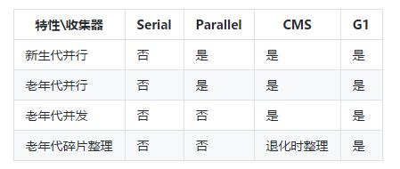

 经过多年的发展Java的垃圾收集器也在不断地进步 , 截止目前存在五种垃圾收集器, 分别适用在不同的场景 . 不同版本的JDK默认的垃圾收集器和所支持的垃圾收集器可能会不一致

<!--more-->

### GC术语

先了解一些术语。最基本的垃圾收集涉及识别不再使用的内存并使其可重用。现代收集器在几个阶段进行这一过程，对于这些阶段我们往往有如下描述：

- 并行- 在JVM运行时，同时存在应用程序线程和垃圾收集器线程。 并行阶段是由多个gc线程执行，即gc工作在它们之间分配。 不涉及GC线程是否需要暂停应用程序线程。
- 串行- 串行阶段仅在单个gc线程上执行。与之前一样，它也没有说明GC线程是否需要暂停应用程序线程。
- STW - STW阶段，应用程序线程被暂停，以便gc执行其工作。 当应用程序因为GC暂停时，这通常是由于Stop The World阶段。
- 并发 -如果一个阶段是并发的，那么GC线程可以和应用程序线程同时进行。 并发阶段很复杂，因为它们需要在阶段完成之前处理可能使工作无效（译者注：因为是并发进行的，GC线程在完成一阶段的同时，应用线程也在工作产生操作内存，所以需要额外处理）的应用程序线程。
- 增量 -如果一个阶段是增量的，那么它可以运行一段时间之后由于某些条件提前终止，例如需要执行更高优先级的gc阶段，同时仍然完成生产性工作。 增量阶段与需要完全完成的阶段形成鲜明对比。

### 五种垃圾收集器

#### Serial收集器

Serial收集器是四种垃圾收集其中最简单的一种.应用运行在client JVM上面的默认收集器.

它使用单线程进行垃圾回收.无论是进行Miror GC还是 Full GC,应用线程都将被停顿.只有等垃圾回收结束后应用程序才可以继续执行.进行Full GC时对老年代进行压缩整理.

通过-XX:UseSerialGC标记来启用,如果需要覆盖此收集器,需要指定另外一种垃圾收集器.

#### Throughout垃圾收集器

Throughout垃圾收集器是Server级(运行中多CPU的Unix机器及64为Java虚拟机)JVM的垃圾收集器.

它使用多线程进行Miror GC,在JDK 7u4版本之后Full GC也默认是多线程进行.无论是进行Miror GC还是 Full GC,应用线程都将被停顿.Full GC 同样对老年代空间进行压缩整理.

通过 -XX:UseParallelGC , -XX:UseParallelOldGC启用

#### CMS垃圾收集器

CMS垃圾收集器全称是Concurrent Mark-Sweep GC,并发标记垃圾收集器.为了消除Serial收集器和Throughout垃圾收集器在Full GC周期中的长时间停顿而设计

它以多线程的形式进行Mirror GC,不再使用Throughout回收算法,而是改用新的新生代回收算法.也是会停止应用线程.

与Throughout显著的不同是Full GC不一定是会整个过程都暂停应用线程.它是使用若干后台线程定期对老年代空间进行扫描,及时回收其中不再使用的对象.这种算法帮助CMS成为一个低延迟的收集器:应用线程只有在Miror GC和老年代标记的时候发生短暂的停顿.应用线程的总停顿时长比Throughout低.

有个特殊的点就是CMS后台进行回收的时候需要额外消耗CPU资源,且Full GC不再对内存进行压缩整理,也就意味着它可能存在很多内存碎片.如果CMS的后台线程没有得到所需要的CPU资源,或者内存碎片过于严重,导致找不到连续的内存空间分配.CMS就蜕化到Serial收集器.它将暂停所有应用线程,并且进行单线程的垃圾回收以及老年代的压缩整理.

通过-XX:UseParNewGC,-XX:UseConcMarkSweepGC来启用

#### G1收集器

G1收集器设计初衷是为了尽量缩短大于4G的超大堆垃圾收集时候所产生的长时间停顿.

G1收集器工作原理与CMS类似,只不过是它在分代的基础上把堆内存划分为若干区域(Region).这些区域中属于新生代的垃圾回收依然是跟CMS类似.老年代由于是划分了区域,垃圾收集的时候是从一个区域被复制到另外一个区域,然后对原有的区域进行压缩整理.从而部分避免了CMS的碎片化.

通过-XX:UseG1GC启用

#### ZGC收集器

目前处于实验性状态 , 基准测试的性能比CMS和G1好很多.

通过-XX:+UnlockExperimentalVMOptions  -XX:+UseZGC 启用

#### 对比

此处应该有一张对比图(ZGC目前材料比较少) , 可见垃圾收集器 也是不断进行迭代的.

### 选择

1. 运行时数据大小最高只有100M , 那么直接使用Serial垃圾收集器
2. 运行在单核的机器上且对停顿时间没有很高的要求 , 也使用Serial垃圾收集器
3. 性能(吞吐量)是最高优先级且停顿时间没有要求可以高达1秒以上那么可以选择Parallel垃圾收集器
4. 响应时间的要求大于吞吐量,必须保持停顿时间在1秒以内 , 那么需要选择 尽量并行的垃圾回收器 , CMS 或G1
5. 如果响应时间要求苛刻 , 且有比较大的堆空间 , 那么使用ZGC

参考 :

https://mp.weixin.qq.com/s/nAjPKSj6rqB_eaqWtoJsgw

https://docs.oracle.com/en/java/javase/11/gctuning/index.html