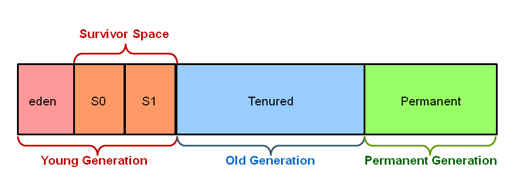
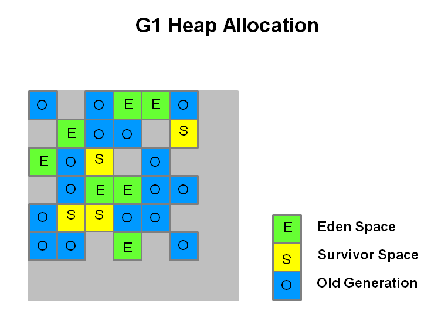
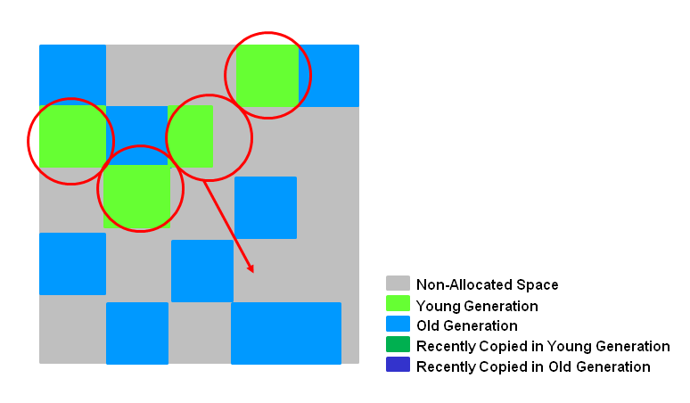
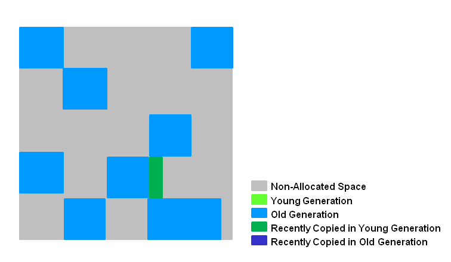
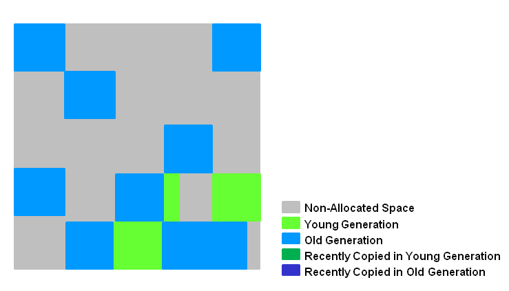
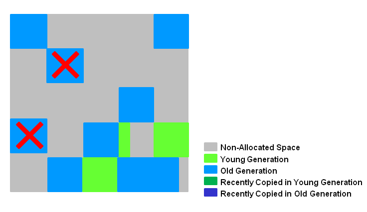
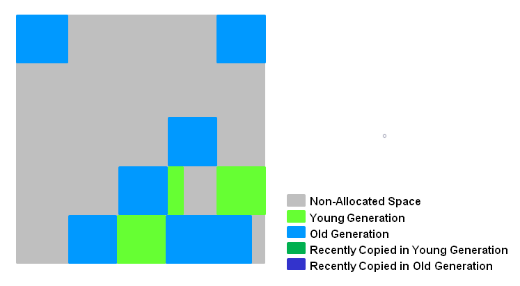
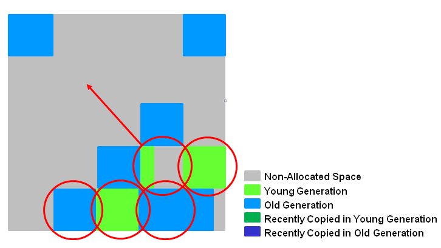

G1 (Garbage-First)是一款面向服务器的垃圾收集器,主要针对处理器并且使用大容量堆内存的应用。它尽可能满足GC停顿时间要求的同时，还具备高吞吐量性能特征。<!--more--> 在Oracle JDK 7 update 40 及以上版本中得到支持，JDK8后得到稳定，专门为以下应用设计：

1. 可以像CMS收集器一样，GC操作与应用的线程一起并发执行
2. 紧凑的空闲内存区间且没有很长的GC停顿时间
3. 需要可预测的GC暂停耗时
4. 不想牺牲太多吞吐量性能
5. 启动后不需要请求更大的Java堆

它长期目标是取代CMS， 因为特性的不同使G1成为比CMS更好的解决方案。一个区别是，G1是一款压缩型的收集器。G1得益于regions的划分，通过有效的压缩完全避免了对细微空闲内存空间的分配，这不仅大大简化了收集器，而且还消除了潜在的内存碎片问题。除压缩以外，G1的垃圾收集停顿也比CMS容易估计，也允许用户自定义所希望的停顿时间。

### Region和堆内存划分

在G1出现之前所有的分代垃圾收集器，在每个分代的内存区域上均是使用连续的虚拟内存地址。垃圾过程中也是针对整个逻辑区域进行操作。



G1使用另外一种方式对堆内存进行划分。它的各代内存地址是不连续的，每一代都使用了n个不连续的大小相同的Region，每个Region占有一块连续的虚拟内存地址。



如上图， 每个角色都是不连续的地址，Region的大小在JVM启动时就确定了。 JVM 通常生成 2000 个左右的Region区, 根据堆内存的总大小，Region区的size范围允许为 1Mb 到 32Mb，且是2的指数。通过参数-XX:G1HeapRegionSize设定。


### 年轻代垃圾回收

G1的年期代回收被称为Young GC ，选定所有年轻代里的Region。通过控制年轻代的region个数，即年轻代内存大小，来控制Young GC的时间开销。它会导致应用程序停顿。



如上图， 存活的对象被转移到一个或者多个存活区。如果存活时间达到阀值，这部分对象就会被提升到老年代。此时会有一次应用程序停顿。会计算出 Eden大小和 Survivor 大小，给下一次年轻代GC使用。



年轻代垃圾收集具备以下特点：

- 堆内存被划分成多个Region，且是不连续的。方便进行容量的调整
- 垃圾收集时会产生应用程序停顿，过程是通过多线程进行的
- 存活的对象被拷贝到Survivor或者老年代

### 老年代垃圾回收

G1的老年代GC也被称为Mixed GC ，分为以下六个阶段，大部分也是并发进行的。

#### 初始标记




本阶段需要标记所有从GC Roots中可达的对象。在CMS中它需要比较长的应用程序停顿来标记，而G1是使用了Young GC 的结果，因此它的开销是非常小的。日志如下

```
1.631: [GC pause (G1 Evacuation Pause) (young) (initial-mark), 0.0062656 secs]
```

#### 根区域扫描

本阶段主要工作是扫描Survivor区中的Region，找到其中引用了老年代对象的引用。因为Survivor区中的对象可能会在下一次Young GC中被回收，所有本阶段必须在下一次Young GC前完成。如果没有完成，Young GC会请求终止本阶段的工作。对应的GC日志如下

```
1.362: [GC concurrent-root-region-scan-start]
1.364: [GC concurrent-root-region-scan-end, 0.0028513 secs]
```

#### 并发标记



本阶段的主要工作跟CMS的同阶段类似，通过前面环节的结果继续向下标记老年代存活对象。不同的是它在遇到完全不用的Region时则直接进行清除。与根区域扫描一样，它可能被Young GC打断，也是并发进行的。对应的GC日志如下

```
1.364: [GC concurrent-mark-start]
1.645: [GC concurrent-mark-end, 0.2803470 secs]
```

#### 再次标记



本阶段主要工作是停顿应用程序，来标记前面阶段并未能完全标记的内存区域。作用可以类比CMS的同阶段，只不过他使用的是 snapshot-at-the-beginning （SATB）算法，比CMS的快很多

```
1.645: [GC remark 1.645: [Finalize Marking, 0.0009461 secs] 
1.646: [GC ref-proc, 0.0000417 secs] 
1.646: [Unloading, 0.0011301 secs], 0.0074056 secs][Times: user=0.01 sys=0.00, real=0.01 secs]
```


#### 清理阶段和拷贝阶段



本阶段的主要工作是计算出前面阶段已经标记的Region中，存活对象比较少的区域。并且进行回收。也就是说它并不是对全部内存区域进行垃圾回收，而是优先选择回收效益比较高的Region进行回收。并将存活的对象拷贝到对应的目标区域。

此阶段包含4项工作

- 计算Region的对象存活度（STW事件）
- 选择要回收的Region并释放其Remembered Sets（STW事件）
- 释放对应的Region内存，并加入到空闲列表中
- 把要释放的Region中还存活的对象移动到指定的存活区域（STW事件）

此阶段的日志标示如下

```
1.652: [GC cleanup 1213M->1213M(1885M), 0.0030492 secs][Times: user=0.01 sys=0.00, real=0.00 secs]
```

如果是完全没有存活对象的Region则直接进行并发清除

```
1.872: [GC cleanup 1357M->173M(1996M), 0.0015664 secs]
[Times: user=0.01 sys=0.00, real=0.01 secs]
1.874: [GC concurrent-cleanup-start]
1.876: [GC concurrent-cleanup-end, 0.0014846 secs]
```

进行一轮Mixed GC后内存区域如图所示


### 命令行选项

G1的虚拟机选项同以往的垃圾收集器有着比较大的区别。

#### 基础选项

**-XX:+UseG1GC** 启用G1垃圾收集器

**-XX:MaxGCPauseMillis=200** 设定最大的应用程序停顿目标毫秒数，并不是硬性值，JVM会尽量满足此目标需求。未设置时时200ms

**-XX:InitiatingHeapOccupancyPercent=45** 启动并发垃圾收集周期的契机，当内存占用超过总内存百分比值。默认是45%。

#### 注意事项

**不要设置Young区的大小**

原因是为了尽量满足目标停顿时间，逻辑上的Young区会进行动态调整。如果设置的绝对值，则MaxGCPauseMillis会失去效果。

**响应时间度量**

使用应用的平均响应时间作为参考来设置MaxGCPauseMillis，JVM会尽量去满足该条件，可能是90%的请求或者更多的响应时间在这之内， 但是并不代表是所有的请求都能满足。

**晋升失败**

当老年代没有足够的空间的时候，就会发生晋升失败的情况。它的代价是很昂贵的，Mixed GC就会像CMS一样退化。避免这种情况的发生，可以尝试配置以下选项：

- 增大保留内存 -XX:G1ReservePercent=n ，默认值是10%
- 尽量早启动并发垃圾收集周期
- 增加并发垃圾收集线程数，-XX:ConcGCThreads=n

#### 完整选项

| 选项                                 | 描述                                                 |
| ------------------------------------ | ---------------------------------------------------- |
| -XX:+UseG1GC                         | 启用G1垃圾收集器                                     |
| -XX:MaxGCPauseMillis=n               | 目标停顿时间，尽量满足，并非硬性条件                 |
| -XX:InitiatingHeapOccupancyPercent=n | 当内存占用到达总内存的n%时，开始进行并发垃圾收集周期 |
| -XX:NewRatio=n                       | 年轻代/老年代的值,默认是2                            |
| -XX:SurvivorRatio=n                  | Eden/Survivor的值,默认是8                            |
| -XX:MaxTenuringThreshold=n           | 最大晋升代数阈值,默认15                              |
| -XX:ParallelGCThreads=n              | 并行阶段线程数                                       |
| -XX:ConcGCThreads=n                  | 并发阶段线程数                                       |
| -XX:G1ReservePercent=n               | 堆空间保留比例，防止晋升失败的情况，默认是10         |
| -XX:G1HeapRegionSize=n               | Region大小，默认值依赖于堆大小的划分                 |


参考

https://www.oracle.com/technetwork/tutorials/tutorials-1876574.html

https://www.redhat.com/en/blog/part-1-introduction-g1-garbage-collector

https://plumbr.io/handbook/garbage-collection-algorithms-implementations#g1

http://citeseerx.ist.psu.edu/viewdoc/download?doi=10.1.1.63.6386&rep=rep1&type=pdf