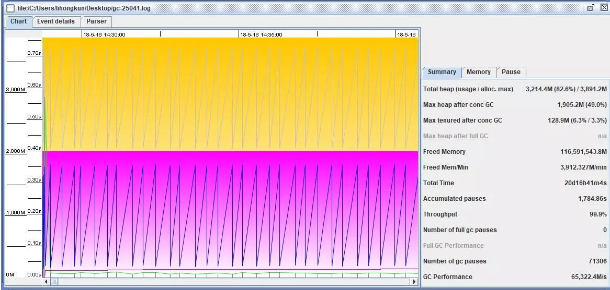
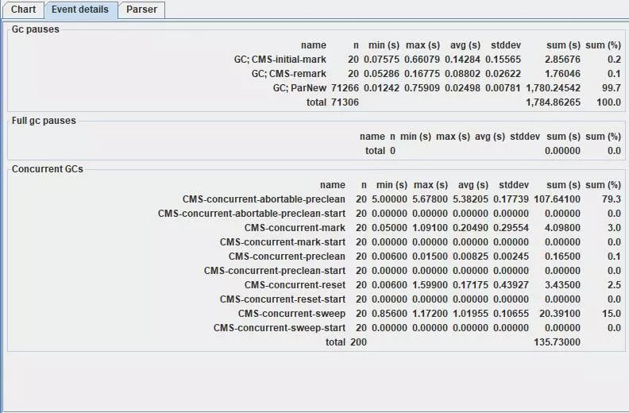
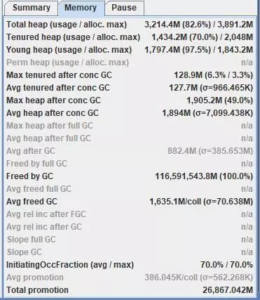
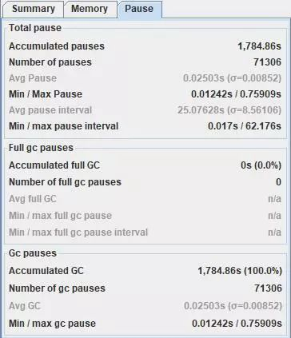

之前介绍的jstat和jmap只能使用输入命令的方式来进行GC和内存方面的监控.应用程序的GC情况可能是一个需要持续观察的过程,JVM提供了命令行选项来保存这些GC相关的日志.

<!--more-->

#### GC日志命令行选项


```
-XX:+PrintGCDetails 

-XX:+PrintGCDateStamps 

-XX:+UseGCLogFileRotation 

-XX:NumberOfGClogFiles=1

-XX:GCLogFileSize=1M

-Xloggc:/tmp/gc-25041.log

```

从上到下的意义依次是打印GC详情、打印对应的时间戳、日志文件进行滚动、日志文件保留个数、日志文件大小、指定日志文件位置。

保留这些日志的好处是备查，假如凌晨出现接口响应时间抖动的情况，需要排查下GC的情况，那么日志文件将保留GC相关完整的日志。当然有监控系统采集的是不需要这样来操作的。

#### 如何看日志文件

首先日志文件会有头部三行，分别是JDK版本信息，物理内存情况，命令行选项。接着才是GC日志。


```
2018-06-06T07:09:49.504+0800: 1788068.264: [GC2018-06-06T07:09:49.504+0800: 1788068.265: [ParNew: 1814842K->128139K(1887488K), 0.0241460 secs] 2577729K->891505K(3984640K), 0.0252650 secs] [Times: user=0.47 sys=0.00, real=0.02 secs] 
```

第一段是时间，接着是年轻代和整个heap的情况，然后是消耗的时间。

*ParNew: 1814842K->128139K(1887488K), 0.0241460 secs* 

表示年轻代使用ParNew收集算法，GC前是1814842K，GC后是128139K，年轻代总大小是1887488K，年轻代GC所消耗的时间是0.0241460s。即年轻代消耗24ms从1772MB的内存释放到125MB，也就是当前最Survivor保留了125MB的对象。

*2577729K->891505K(3984640K), 0.0252650 secs* 

表示整个堆的使用情况从GC前的2577729KB变为GC后的891505KB，总大小是3984640KB，耗费的时间是0.0252650 s。即从2458MB的使用量释放到870MB。

上述2段可以算出：

GC前老年代使用量 = 2458-1772 = 686MB

GC后老年代使用量 = 870-125 = 745MB

本次晋升到老年代量 = 745-686 = 59MB

计算的思路是很清晰的。每行日志都包含了GC前后的信息以及对应的时间。在应用程序预热一段时间以后，可以估算内存分代区域大小和GC停顿时间以及频率的正相关系数，辅助调优。

#### GC View

GC日志都是逐行的日志，记录了每次GC的全貌，我们可以挑时间点或者一行一行地分析。但是有时候我们希望能够看到一个统计的情况。介绍个开源工具GCViewer，可以到Github上搜索一下。运行后可以直接选择打开某个GC日志文件

##### overview



解析完成以后是主要是一个图表，很直观显示GC情况，横轴是时间，纵轴是内存使用量，下面的线是年轻代，上面的折线是整个堆。右边有一个summary是一些统计数值，图中total heap项，表示内存最大基本上只使用到79.6%，total time 总的统计时间是20天16小时。Number of gc pause GC停顿次数是 71306 ，GC performance 即GC效率，每秒能释放65322.4MB的内存。


##### event detail



详细记录了GC的停顿原因和停顿时间。如上图，大部分停顿都是在年轻代的垃圾收集。还有少量的CMS标记阶段。Concurrent GCs 还记录了并发垃圾收集器异步清理老年代的各个阶段和耗费的时间，这里面有的阶段是不造成业务线程停顿的。

##### memory & pause





summary旁边2个选项卡统计了内存和GC停顿的相关情况和比例，调优的时候值得参考。


#### 总结

JVM提供了命令行选项，能够记录下每次GC事件的相关情况。我们可以对日志文件进行分析，统计数值使用GCViewer查看，能够直观看出一些规律性的问题。