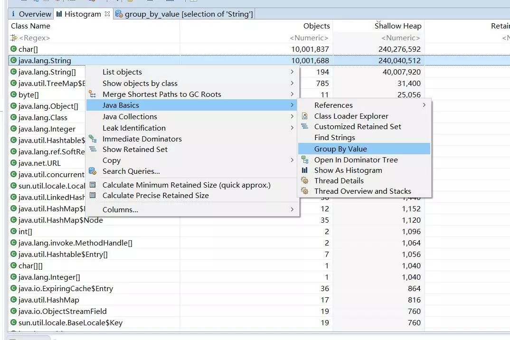
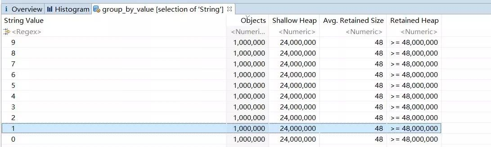

Java中的常量池,实际上分为两种形态:静态常量池和运行时常量池.

**静态常量池**,即*.class文件中的常量池,class文件中的常量池不仅仅包含字符串(数字)字面量，还包含类、方法的信息，占用class文件绝大部分空间.

**运行时常量池**,则是jvm虚拟机在完成类装载操作后,将class文件中的常量池载入到内存中,并保存在方法区中,我们常说的常量池,就是指方法区中的运行时常量池.

运行时常量池相对于Class文件常量池的另外一个重要特征是具备动态性,Java语言并不要求常量一定只有编译期才能产生,也就是并非预置入Class文件中常量池的内容才能进入方法区运行时常量池,运行期间也可能将新的常量放入池中,这种特性被开发人员利用比较多的就是String类的intern()方法.

<!--more-->

看个例子
```
public static void main(String[] args) {

	Integer aa = 127, bb = 127;
	System.out.println(aa == bb); // true

	String s1 = "abc";
	String s2 = "abc";

	String s3 = new String("abc");
	String s4 = new String("abc");

	String s5 = s4.intern();

	System.out.println(s1 == s2); //true
	System.out.println(s2 == s3); // false
	System.out.println(s3 == s4); // false
	System.out.println(s4 == s5); // false
	System.out.println(s1 == s5); // true

}
```
其中aa和bb都是指向了常量池中的127.s1和s2指向的是常量池中的abc,而s3,s4指向的是堆中不同的值为abc字符串对象.而s4.intern()是返回指向常量池中值为abc的字符串对象.所以结果如代码中注释所示.


在实际的编程中,常量池似乎是没什么用.其实不尽然.应用的堆中到处都是字符串.如果有大部分的字符串都是相同的,那很大一部分空间都是浪费的.因为字符串是不可变,所以对于同样的字符序列,我们没有理由存储多个字符串.

#### intern 内存对比
我们先做一个内存对比.

```
public static void main(String[] args) throws Exception {
		
	Object lock = new Object();
	
	int total = 10000000;
	String[] s = new String[total];
	
	long timeWatcher = System.currentTimeMillis();
	
	for(int i = 0 ;i < total ; i++){
		//s[i] = new String(String.valueOf(i%10)).intern();
		s[i] = new String(String.valueOf(i%10));
	}
	
	System.out.println(System.currentTimeMillis() - timeWatcher);
	
	
	synchronized (lock) {
		 while (true)
			 lock.wait();
	}
}
```

动态创建一千万个字符串,字符串是0-9的个位数值,重复度比较高.不使用intern和使用intern分别使用 jmap dump出full gc后的内存镜像.



使用MAT分析一下字符串的内容,直接group by value 能够看到各个字符串值的对象数和占用的内存



不使用intern [0-9]的字符串占用了很多的内存.因为数组里面引用的是堆里面新增的字符串.那么也就是1000w个字符串每个值占用了48M的内存.


而使用了intern后的则是很少,[0-9]的字符串分别都是只有一个对象,每个值只占用了48 bytes.

至于时间性能上的损耗,使用了intern比不使用多出了500ms,我们可以大致理解为是1000w次intern所消耗的时间.

#### intern 性能对比

intern额外的时间性能并不是在都是这么好的.上面的例子是只有10个字符串值.我们来看一个极端的情况,假设所有字符串都不是重复的.那么intern会有什么样的效果.测试代码改成如下


```
public static void main(String[] args) throws Exception {
		
	Object lock = new Object();
	
	int total = 10000000;
	String[] s = new String[total];
	
	long timeWatcher = System.currentTimeMillis();
	
	for(int i = 0 ;i < total ; i++){
		s[i] = new String(String.valueOf(i)).intern();
	}
	
	System.out.println(System.currentTimeMillis() - timeWatcher);
	
	
	synchronized (lock) {
		 while (true)
			 lock.wait();
	}
}
```

我们使用同样的方法进行分析,full gc 后,s数组占用的内存其实和没有使用intern的情况是一样的.因为字符串的值没有重复.所以即使把字符串从堆移动到常量池.它还是一样多.但是它所使用的时间却多达42秒.性能急剧下降.这是由于常量池的存储结构决定的.

#### 常量池结构

字符串常量池是固定大小的Hashtable组成的,它本质上是一个固定长度的数组上面挂着链表,数组是固定长度,保留的常量字符串越多,可能hash冲突就越多.访问某个元素的时间就越高.增加JVM参数 -XX:+PrintStringTableStatistics 可以在程序结束时打印出相关的统计.

```
SymbolTable statistics:
Number of buckets       :     20011 =    160088 bytes, avg   8.000
Number of entries       :     11274 =    270576 bytes, avg  24.000
Number of literals      :     11274 =    496136 bytes, avg  44.007
Total footprint         :           =    926800 bytes
Average bucket size     :     0.563
Variance of bucket size :     0.565
Std. dev. of bucket size:     0.752
Maximum bucket size     :         5
StringTable statistics:
Number of buckets       :     60013 =    480104 bytes, avg   8.000
Number of entries       :  10001467 = 240035208 bytes, avg  24.000
Number of literals      :  10001467 = 560059224 bytes, avg  55.998
Total footprint         :           = 800574536 bytes
Average bucket size     :   166.655
Variance of bucket size :    55.348
Std. dev. of bucket size:     7.440
Maximum bucket size     :       196
```
上面意味着有60013 个hash桶. 平均每个hash桶上面有166.655个元素,也就是链表的长度.在保留字符串比较多的情况下,如果需要提升时间性能可以适当调高hash桶的个数.同样是上面的例子,启动参数增加 -XX:StringTableSize=1000000 把hash桶的个数调高到100w,时间从42秒降低到3.7秒.


终上,intern方法能够有效地减少**重复**字符串的内存占用,重复度比较低的情况下收效甚微.intern方法的性能取决于字符串常量池的Hashtable大小的调优程度.