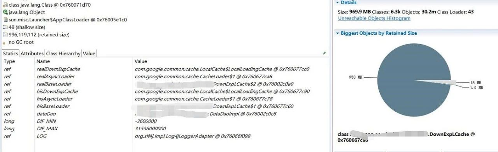
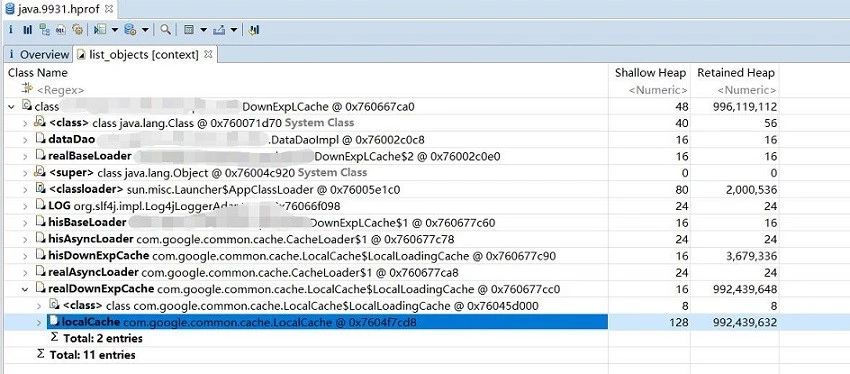

jmap主要用于打印指定Java进程的共享对象内存映射或堆内存细节.

<!--more-->

### jmap 使用帮助

jmap自带使用帮助 jmap -h 直接输出各个参数选项的使用方式.主要包含-heap,-histo,-dump,其中的-histo和-dump都都可以跟着live子选项,使用live去执行的话会先进行一次full gc,然后再输出gc后结果,所以在线上环境慎用.

```
Usage:
    jmap [option] <pid>
        (to connect to running process)
    jmap [option] <executable <core>
        (to connect to a core file)
    jmap [option] [server_id@]<remote server IP or hostname>
        (to connect to remote debug server)

where <option> is one of:
    <none>               to print same info as Solaris pmap
    -heap                to print java heap summary
    -histo[:live]        to print histogram of java object heap; if the "live"
                         suboption is specified, only count live objects
    -permstat            to print permanent generation statistics
    -finalizerinfo       to print information on objects awaiting finalization
    -dump:<dump-options> to dump java heap in hprof binary format
                         dump-options:
                           live         dump only live objects; if not specified,
                                        all objects in the heap are dumped.
                           format=b     binary format
                           file=<file>  dump heap to <file>
                         Example: jmap -dump:live,format=b,file=heap.bin <pid>
    -F                   force. Use with -dump:<dump-options> <pid> or -histo
                         to force a heap dump or histogram when <pid> does not
                         respond. The "live" suboption is not supported
                         in this mode.
    -h | -help           to print this help message
    -J<flag>             to pass <flag> directly to the runtime system
```


### jmap -heap

输出的内容包括两部分
1. Heap Configuration : JVM启动堆大小的配置,为启动中配置的参数或者是根据系统内容默认出来的
2. Heap Usage : 堆各个分代或者内存区块的总大小和使用情况

例如我有个25477进程,输入 jmap -heap 25477 则输入如下 

```
Attaching to process ID 25477, please wait...
Debugger attached successfully.
Server compiler detected.
JVM version is 24.80-b11

using parallel threads in the new generation.
using thread-local object allocation.
Concurrent Mark-Sweep GC

Heap Configuration:
   MinHeapFreeRatio = 40
   MaxHeapFreeRatio = 70
   MaxHeapSize      = 1073741824 (1024.0MB)
   NewSize          = 536870912 (512.0MB)
   MaxNewSize       = 536870912 (512.0MB)
   OldSize          = 5439488 (5.1875MB)
   NewRatio         = 2
   SurvivorRatio    = 8
   PermSize         = 134217728 (128.0MB)
   MaxPermSize      = 134217728 (128.0MB)
   G1HeapRegionSize = 0 (0.0MB)

Heap Usage:
New Generation (Eden + 1 Survivor Space):
   capacity = 483196928 (460.8125MB)
   used     = 212745000 (202.88944244384766MB)
   free     = 270451928 (257.92305755615234MB)
   44.02863256614082% used
Eden Space:
   capacity = 429522944 (409.625MB)
   used     = 203633784 (194.20030975341797MB)
   free     = 225889160 (215.42469024658203MB)
   47.409291364886904% used
From Space:
   capacity = 53673984 (51.1875MB)
   used     = 9111216 (8.689132690429688MB)
   free     = 44562768 (42.49836730957031MB)
   16.975106599130036% used
To Space:
   capacity = 53673984 (51.1875MB)
   used     = 0 (0.0MB)
   free     = 53673984 (51.1875MB)
   0.0% used
concurrent mark-sweep generation:
   capacity = 536870912 (512.0MB)
   used     = 277557408 (264.6993713378906MB)
   free     = 259313504 (247.30062866210938MB)
   51.69909596443176% used
Perm Generation:
   capacity = 134217728 (128.0MB)
   used     = 48057608 (45.83130645751953MB)
   free     = 86160120 (82.16869354248047MB)
   35.805708169937134% used

17927 interned Strings occupying 1892528 bytes.
```

虽然能够看出堆内存的情况,但是它只是瞬时的状态,没办法观测到持续的情况,对比下之前的jstat -gcutil 在持续观测gc上面是没什么优势的.


### jmap -histo

使用来观察类实例数和内存占用

jmap -histo 9931 | head -13 输出如下

```
 num     #instances         #bytes  class name
----------------------------------------------
   1:      14814780      699191240  [C
   2:      14335720      344057280  java.lang.String
   3:       4398584      211132032  xxx.xxx.HistoryDownExp
   4:        257644      184529576  [B
   5:        604994       80461232  [I
   6:        593514       28488672  sun.misc.FloatingDecimal
   7:         30586       26224032  [Ljava.lang.Object;
   8:        828080       19873920  com.google.gson.reflect.TypeToken
   9:         69164        9988392  <constMethodKlass>
  10:         69164        8864912  <methodKlass>
```

从上面的输出可以看出HistoryDownExp 有4398584 个实例,总共占用了211132032 bytes (211.35M),每个对象占用48bytes

上面的数据可以用来估算某些对象的内存占用情况,结合QPS等其他因素推算出应用每秒在Eden区所申请的内存大小,进而估算出Eden区大小和GC频率的关系,这在调整分代大小是很有帮助的.

还有如果你觉得内存消耗有点大或者怀疑内存泄露可以使用histo选项来查看当前实例的创建情况,特别是用来看一些业务头部类的创建情况.可准确地看到去优化哪块代码的对象创建.

### jmap -dump

-histo只能看到实例数和大小,偏于简单,需要更详细的信息我们可以把整个JVM的堆dump出来然后使用工具进行分析,如下面的命令,dump出来的是一个二进制的文件

```
jmap -dump:format=b,file=/tmp/java.9931.hprof 9931
```

一般情况是我比较喜欢使用MAT来看,VisualVM也可以,当然VisualVM的功能远非如此,我们可以后续探讨.


MAT 全称 MemoryAnalyzer tools 下载地址 https://www.eclipse.org/mat/

打开工具后可以通过File-> Open Heap Dump 来加载dump文件,如上面命令dump出来的 java.9931.hprof



开始是一个overview,很清楚地列出了占用内存最多的类,以及相关引用的实例.可以点击饼图区域调出菜单,选list objects 能看到该类的实例的引用情况.



功能还有很多,可以看看官方文档.

##### HeapDumpOnOutOfMemoryError

上面介绍的方法都是人为在排查问题的时候主动输入命令去分析的,但是如果是夜深人静的时候发生了内存溢出,这时候我们没有提前发现,现场没有保留.

JVM有个选项 -XX:+HeapDumpOnOutOfMemoryError 加上后,发生 OutOfMemoryError 的时候会在运行目录下dump出JVM内存的情况.然后就可以使用MAT进行分析了