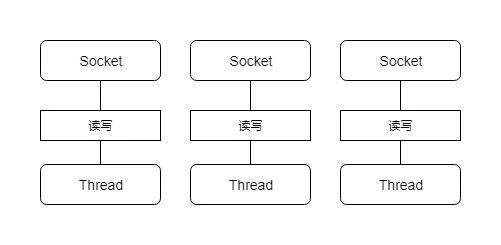

在JDK1.4出来之前,建立网络连接的时候采用BIO模式,下面以EchoServer为例子聊聊Java的阻塞IO.

<!--more-->

#### BIO读写处理

先看一个BIO公共的处理类,用来处理已经建立好的客户端连接 , 接收exit,shutdown命令或者其他字符串.exit是断开当前客户端,shutdown是关闭当前服务,其他则进行回显.直接使用了socket连接的输入输出流.

```
/**
 * 处理已经建立好的连接
 */
public class EchoSocketUtil {

    public static boolean processSocket(Socket socket) throws IOException {
		
		// 获得socket的输入输出流
        BufferedReader bufferedReader = new BufferedReader(new InputStreamReader(socket.getInputStream()));
        BufferedWriter bufferedWriter = new BufferedWriter(new OutputStreamWriter(socket.getOutputStream()));

        String request;
        while ((request = bufferedReader.readLine()) != null) {
        	// 读取数据是阻塞的
            if ("exit".equals(request)) {
            	//输入是exit的时候关闭当前连接 ,提示主线程非关闭服务
                socket.close();
                return false;
            } else if ("shutdown".equals(request)) {
            	// 输入时shutdown的时候关闭当前连接 , 提示主线程关闭服务
                socket.close();
                return true;
            } else {
            	// 其他则回显当前输入的字符串
                bufferedWriter.write(request);
                bufferedWriter.flush();
            }
        }
        return false;
    }
}
```


#### 单连接服务器

假设EchoServer的代码如下 , 创建一个ServerSocket,并调用accept接收连接. **读取数据是阻塞的** , 在连接未释放之前当前线程一直在处理该连接的IO事件 , 可以翻阅下阻塞式IO模型的图. 所以EchoServer只能同时接收一个客户端,在业务处理完成后才能接受其他客户端的连接. 

```
public class EchoServer {

    public static void main(String[] args) throws IOException {
        //创建一个ServerSocket监听端口12345上的连接
        ServerSocket serverSocket = new ServerSocket(12345);
        boolean isShutdown = false;
        while (!isShutdown){
            try{
            	// 接收客户端的连接 , 如果没有连接建立则阻塞到连接建立
                Socket socket = serverSocket.accept();
                isShutdown = EchoSocketUtil.processSocket(socket);
            }
            catch (Exception ex){
                ex.printStackTrace();
            }
        }
    }
}
```


#### 并发服务器

如果需要并发管理多个客户端 , 则需要对每个连接进行异步化处理.比如对每个连接都创建一个线程 . EchoServer代码修改为

```
public class EchoServer {

    private volatile boolean isShutDown = false;

    private ServerSocket serverSocket;

    /**
     * 创建服务 
     * @param port 端口
     */
    public EchoServer(int port) {
        try {
            serverSocket = new ServerSocket(port);
        } catch (Exception ex) {
            ex.printStackTrace();
        }
    }

    /**
     * 关闭服务
     */
    private void shutdown() {
        this.isShutDown = true;
    }

    /**
     * 启动服务
     */
    public void run() {
        while (!isShutDown) {
            try {
                Socket socket = serverSocket.accept();
                // 每次接收一个连接, 创建一个线程进行处理
                (new SocketProcessor(socket)).start();
            } catch (Exception ex) {
                ex.printStackTrace();
            }
        }
    }

    /**
     * socket处理线程
     */
    private class SocketProcessor extends Thread {

        private Socket socket;

        SocketThread(Socket socket) {
            this.socket = socket;
        }

        @Override
        public void run() {
            try {
                if (EchoSocketUtil.processSocket(socket)) {
                    shutdown();
                }
            } catch (Exception ex) {
                ex.printStackTrace();
            }
        }
    }
}
```

服务器模型示意如图



缺点也很显而易见 :

1. 很多时候, 处理的线程都是处于休眠状态,只是等待输入输出数据就绪.
2. 每个连接都需要创建一个线程来处理 , 需要分配线程栈 .消耗内存
3. 大量连接时,线程上下文切换


这种服务器模型比较典型的有Tomcat的BIO Connector ,同样也是由于上述缺点在并发增大后性能急剧下降, 版本7.5以后以及改写为NIO