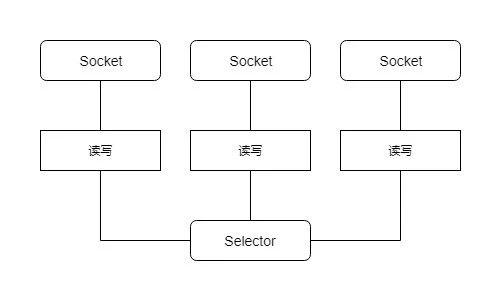

Java NIO 是 IO复用模型在Java平台的实现 , 针对Java BIO在高并发情况下的缺点 1.4之后提供了NIO的实现. 还是以EchoServer为例子.

<!--more-->

首选 , 需要创建一个 选择器Selector和一个ServerSocketChannel来侦听端口, 接受连接. 并使用register方法注册accept事件.

```
// 创建选择器
selector = Selector.open();

// 创建 Channel
serverSocketChannel = ServerSocketChannel.open();
serverSocketChannel.configureBlocking(false);
serverSocketChannel.bind(new InetSocketAddress("127.0.0.1", port));

// ServerSocketChannel 注册accept 事件
serverSocketChannel.register(selector, SelectionKey.OP_ACCEPT);
```

其次 , 调用selector的select 等待事件就绪 , 并进行对应的处理 . 如果是accept事件则在接收的连接上注册读事件.这边使用了一个讨巧的方式, 每个连接attach了一个字符串, 用于缓存用户输入的一行数据.

```
while (true) {
	try {
		selector.select();
		Set<SelectionKey> selectedKeys = selector.selectedKeys();
		Iterator<SelectionKey> iterator = selectedKeys.iterator();
		while (iterator.hasNext()) {
			//
			SelectionKey key = iterator.next();
			if (key.isAcceptable()) {
				// 连接就绪事件
				// 接收连接产生的socketChannel
				SocketChannel socketChannel = serverSocketChannel.accept();
				socketChannel.configureBlocking(false);
				socketChannel.register(selector, SelectionKey.OP_READ,new StringBuffer());
			}
			if (key.isReadable()) {
				// 数据就绪事件 - accept时候注册在SocketChannel上面的
				socketProcess(key);
			}
			iterator.remove();
		}
	} catch (Exception ex) {
		ex.printStackTrace();
	}
}
```

注册好已接受的连接后 ,它便关心数据就绪事件. select 的时候 ,如果事件就绪则进行处理 . 以下是完整的EchoServer代码 , 接收到用户输入则进行回显.

```
public class NIOEchoServer {

    private static final byte CR = (byte) '\r';

    private static final byte LF = (byte) '\n';

    private ServerSocketChannel serverSocketChannel;

    private Selector selector;

    public NIOEchoServer(int port) {
        try {
            selector = Selector.open();
            serverSocketChannel = ServerSocketChannel.open();
            serverSocketChannel.configureBlocking(false);
            serverSocketChannel.bind(new InetSocketAddress("127.0.0.1", port));

            serverSocketChannel.register(selector, SelectionKey.OP_ACCEPT);
        } catch (Exception ex) {
            ex.printStackTrace();
        }
    }

    public void run() {
        while (true) {
            try {
                selector.select();
                Set<SelectionKey> selectedKeys = selector.selectedKeys();
                Iterator<SelectionKey> iterator = selectedKeys.iterator();
                while (iterator.hasNext()) {
                    SelectionKey key = iterator.next();
                    if (key.isAcceptable()) {
                        SocketChannel socketChannel = serverSocketChannel.accept();
                        socketChannel.configureBlocking(false);
                        socketChannel.register(selector, SelectionKey.OP_READ, new StringBuffer());
                    }
                    if (key.isReadable()) {
                        socketProcess(key);
                    }
                    iterator.remove();
                }
            } catch (Exception ex) {
                ex.printStackTrace();
            }
        }
    }

    private void socketProcess(SelectionKey selectionKey) {
        try {
            SocketChannel socketChannel = (SocketChannel) selectionKey.channel();
            StringBuffer readBuffer = (StringBuffer) selectionKey.attachment();
            ByteBuffer byteBuffer = ByteBuffer.allocate(1024);
            while (socketChannel.read(byteBuffer) > 0) {
                byteBuffer.flip();
                while (byteBuffer.hasRemaining()) {
                    byte readByte = byteBuffer.get();
                    readBuffer.append((char) readByte);
                    if (CR == readByte || LF == readByte) {
                        socketChannel.write(ByteBuffer.wrap(readBuffer.toString().getBytes()));
                        readBuffer.delete(0, readBuffer.length());
                    }

                }
            }
        } catch (Exception ex) {
            ex.printStackTrace();
        }
    }
    
    public static void main(String[] args) {
        NIOEchoServer nioEchoServer = new NIOEchoServer(12345);
        nioEchoServer.run();
    }

}
```

从示例中可以清楚看到 ,  接受连接和业务处理并不需要创建多个线程. 使用一个selector管理多个连接.



对比BIO,虽然它的ByteBuffer操作上增加了很大的复杂度 , 但是它使用了较少的线程便可以处理较多的连接, 因此减少了内存管理和线程上下文切换所带来的开销.

然而 , 示例代码的模型也有着比较明显的缺点 , 纯粹使用单线程处理, 无法使用多核机器的优势. 通常使用NIO的时候使用Reactor模式来实现服务器的模型,把IO事件的处理和业务线程隔离开.

