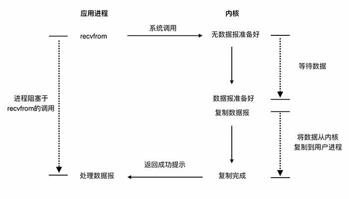
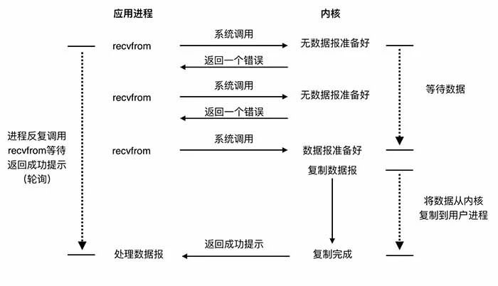
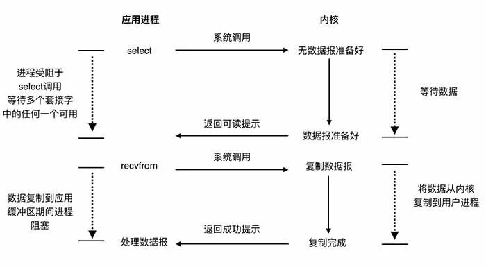
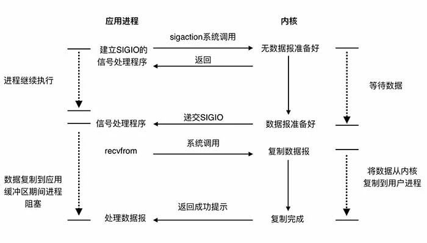
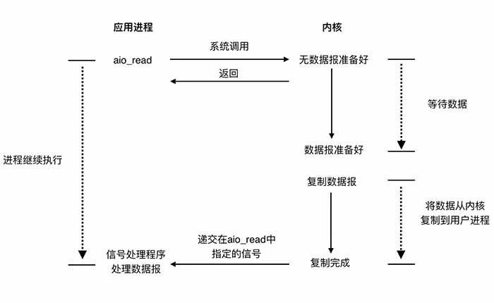
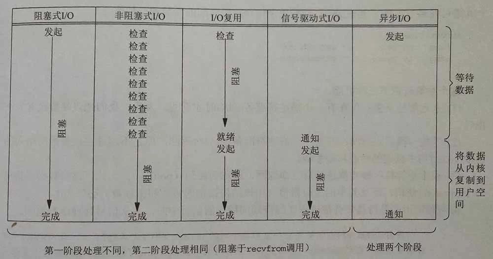

一次网络IO 的调用涉及到用户进程和系统内核对象 , 以读为例. 

1. 等待网络上的数据分组到达,并复制到内核的缓冲区
2. 内核缓冲区数据复制到用户进程中,也就是调用网络IO进程的缓冲区.

常见的IO模型有五种, 不同的IO模型在这两个阶段的处理上各不相同.

<!--more-->

###  阻塞式IO模型

 阻塞IO是一种比较常见的模型, 使用此模型,应用进程在IO执行的两个阶段中都将被阻塞.Java里面的ServerSocket默认默认就是此实现.这种模型在因为操作都是阻塞的,所以在处理每个连接的时候都需要独立启动一个线程来进行处理.

### 非阻塞式IO模型

非阻塞式IO模型采用的是轮询的机制,当用户进程发出read操作时,如果内核中的数据还没有准备好,那么它并不会阻塞用户进程,而是立刻返回一个error. 

从用户进程角度讲 ,它发起一个读操作后,并不需要等待,而是马上就得到了一个结果.用户进程判断结果是一个error时,它就知道数据还没有准备好,于是它可以再次发送读操作.一旦系统内核中的数据准备好了,并且又再次收到了用户进程的系统调用,那么它马上就将数据拷贝到了用户内存,然后返回.

这一点上跟自旋锁的处理方式非常像 . 应用进程不断轮询系统内核 , 耗费了大量的CPU . 这种模型非常少见.

### IO复用模型

IO复用即select,poll或者epoll系统调用 , 它们管理着多个网络连接 , 一次调用轮询它们所管理的所有连接,如果有至少一个连接数据就绪 , 则进行IO操作. 与阻塞IO模型对比的, 它多使用了一个系统调用select来等待数据 , 但是此调用能同时处理多个连接 , 本质上是两个阶段都是阻塞. 性能方面上如果需要处理大量网络连接的话此种模型优于阻塞式IO模型 , 但是处理少量连接的情况下阻塞式IO模型较优,因为它一次系统调用便能完成.

此模型在Java语言中的实现是ServerSocketChannel和Selector . 在互联网的高并发和大规模服务中 , 通常使用IO复用模型结合多线程使用Reactor模式提高并发和性能.

### 信号驱动式IO

信号驱动式IO是指进程预先告知内核,使得当某个描述符上发生某事时,内核使用信号通知相关进程.它的第一阶段是异步的 , 第二阶段是依然是同步的.

### 异步IO

它的工作机制是告知内核启动某个操作,并让内核完成后,通知自己.这个模型在两个阶段都是异步的.只存在理论中,目前还未有操作系统对其进行实现.

### 差异

五种模型中 , 前四种的第一阶段各自有不同的实现,第二阶段都是阻塞在数据的读取. 而第五种是两个阶段都是异步的.因此前四种被称为同步IO模型,第五种被称为异步IO模型.

 这些在实践中有什么用 ? 虽然大部分人做业务很少用到网络库去直接编码 , 但是很多基础的框架都是构建在这上面 , 调优的场景也建立在上面的 , 后面会继续总结如何使用 . 