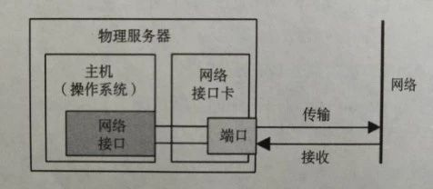
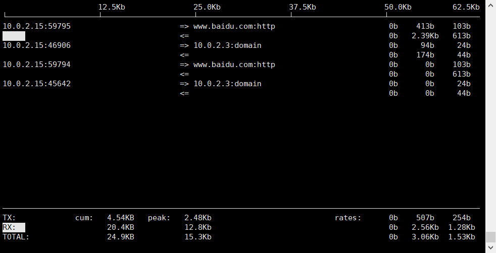

网卡是工作在链路层的网络组件,是局域网中连接计算机和传输介质的接口,不仅能实现与局域网传输介质之间的物理连接和电信号匹配,还涉及帧的发送与接收、帧的封装与拆封、介质访问控制、数据的编码与解码以及数据缓存的功能等.又称为通信适配器或网络适配器或网络接口卡(Network Interface Card)

<!--more-->




我们通常说的千兆网卡,万兆网卡形容的是网卡的传输效率,也可以粗略理解为容量. 可以使用一下命令查看网卡的基本信息. 

```
[vagrant@localhost ~]$ sudo ethtool eth0
Settings for eth0:
	Supported ports: [ TP ]
	Supported link modes:   10baseT/Half 10baseT/Full 
	                        100baseT/Half 100baseT/Full 
	                        1000baseT/Full 
	Supported pause frame use: No
	Supports auto-negotiation: Yes
	Advertised link modes:  10baseT/Half 10baseT/Full 
	                        100baseT/Half 100baseT/Full 
	                        1000baseT/Full 
	Advertised pause frame use: No
	Advertised auto-negotiation: Yes
	Speed: 1000Mb/s
	Duplex: Full
	Port: Twisted Pair
	PHYAD: 0
	Transceiver: internal
	Auto-negotiation: on
	MDI-X: off (auto)
	Supports Wake-on: umbg
	Wake-on: d
	Current message level: 0x00000007 (7)
			       drv probe link
	Link detected: yes
```


### 容量问题

线上环境不止一次出现过机器的网卡接近被打满的情况 . 例如服务混合部署的时候有一个进程没有限制消费数据的速率, 从数据采集的机器消费了很多的数据. 或者是一些集中式的存储 如 redis 当很多业务都使用它的时候,有一个进程写入或者读取了大量的数据,导致其他进程经常性被阻塞 . 这种相互影响的情况下 , 很难直接找出消耗网卡性能的进程.

那么如何找到这类进程呢,trouble shooting 的时候比较习惯使用两个命令.

#### iftop 

这是一个看网卡实时流量的命令 , Cent OS上本身可能没有安装 , 需要使用一下命令

```
yum install iftop
```

安装完成后只需要在网卡被打满的机器上运行就能发现消耗网卡容量比较大的连接.

```
[vagrant@localhost ~]$ sudo iftop -P
```

            

很明显的看出各个端口的网络传输速率,已经整个机器的网络传输速率. 其中包含了TX 和 RX 分别代表发送和接收.

当然也很容易看到当前机器和哪个机器和端口的连接消耗了很多的带宽.于是可以到目标机器上找到该端口的进程.

#### netstat 

通常用来看网络连接的状态, 在上一步看出 , 假如需要查出使用25091端口的进程.

```
[vagrant@localhost ~]$ sudo netstat -anp | grep 25091
tcp      0      0 :::25091                    :::*                        LISTEN      80983                                      
tcp      0      0 ::ffff:10.12.78.11:25091    ::ffff:10.12.29.99:43874    ESTABLISHED 80983         
```

很容易就定位到了进程号,然后就可以进行后续的处理了. 

通常在定位此类问题的时候除了网卡, 程序 还有一个是网线的传输效率 , 因为网线的老化可能影响网线本身的传输效率.