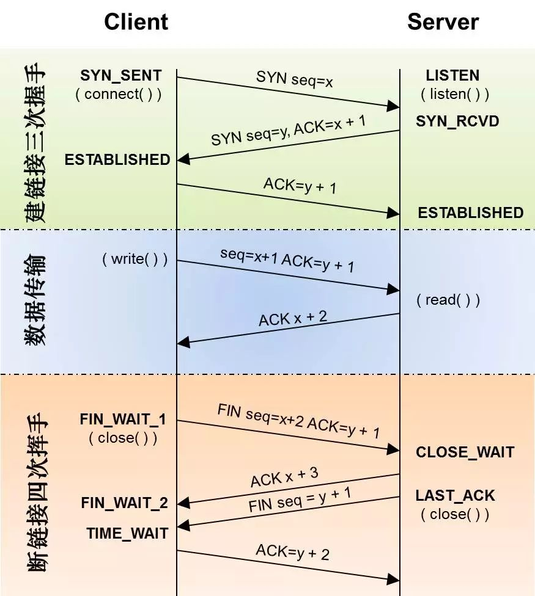
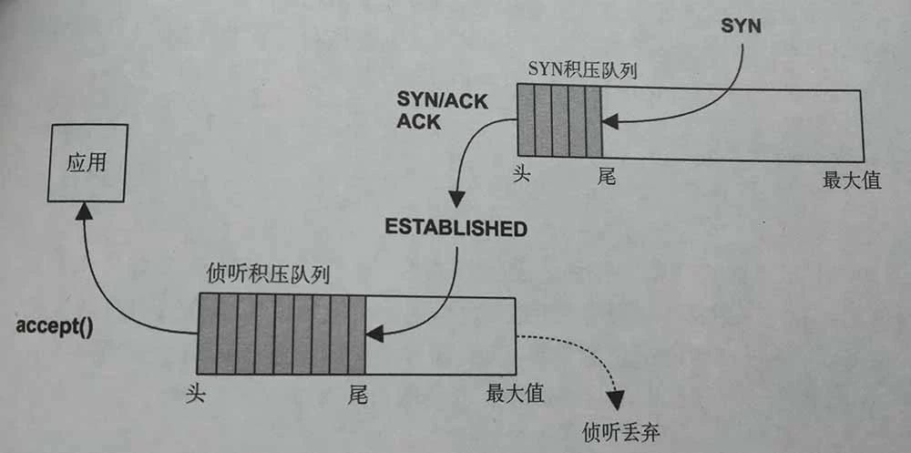
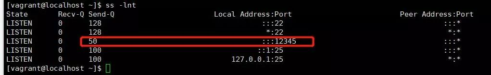
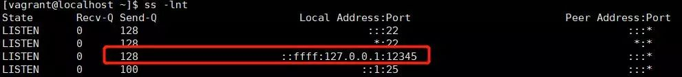

虽然高级语言或者网络库对于网络连接的细节进行了屏蔽, 但是在遇到瓶颈的时候难免要深入其中,才能对其进行调优. 那么连接建立和终止的时候发生了什么?

<!--more-->

### 三次握手和四次挥手

两个机器需要传输数据,首先要通过三次握手建立连接,然后再进行数据传输 , 断开后通过四次挥手确认断开连接.流程如下图



TCP连接建立的时候至少在客服端和服务器经过三次数据分节的交换,因此也被称之为三次握手.

1. 首先服务器端 创建socket对象并绑定和侦听端口
2. 客户端开启socket连接 调用connect , 发送 SYN 分节数据  seq = x
3. 服务器端接收到SYN分节数据后 , 回复  SYN seq=y 和 ACK x+1 
4. 客户端在收到服务器端数据后 , 回复ACK y+1 , 连接建立成功

连接建立后即可传输数据, 当数据传输完毕后.需要终止连接. 终止一个连接需要4个分节的数据交换.图中假设是客户端主动进行关闭的.

1. 客户端调用 close以后, 发送FIN分节数据 , Fin seq=x+2 ACK=y+1
2. 服务器端接收到FIN分节数据, 称为被动关闭 ,此时服务器端同意关闭发送 ACK x+3
3. 过一段时间后 , 服务器端已无在发送到客户端的数据 , 则调用close来关闭套接字,此时它发送给客户端FIN分节数据 FIN seq=y+1
4. 客户端接收到FIN分节数据后, 确认这个FIN , 发送 ACK=y+2

### 连接队列

三次握手环节比较关注的SYN_RCVD和ESTABLISHED.服务器端维护SYN_RCVD的半连接队列和ESTABLISHED的全连接队列.在被accept之前的连接都是存放在这连个队列里面.




#### 队列大小

SYN队列大小可以使用使用以下命令来查看, 线上的机器一般会调整得比较大

```
// 我的虚拟机
[vagrant@localhost ~]$ cat /proc/sys/net/ipv4/tcp_max_syn_backlog
512

// 线上的机器
[xxx@xxx ~]$ cat /proc/sys/net/ipv4/tcp_max_syn_backlog
262144
```

全连接队列大小等于 min(backlog, somaxconn) . backlog是在socket创建的时候传入的，somaxconn是os的一个参数

```
[vagrant@localhost ~]$ cat /proc/sys/net/core/somaxconn
128

[xxx@xxx ~]$ cat /proc/sys/net/core/somaxconn
262144
```

所以在创建Socket的时候需要根据场景调整下backlog的参数的大小.Java ServerSocket 默认的backlog参数是50.如下代码 , 启动程序后使用命令看到 Send-Q 为50

```
public class ServerSocketTest {

    public static void main(String[] args) throws IOException, InterruptedException {
        newServerSocket(12345);
        Thread.sleep(100000);
    }

    private static void newServerSocket(int port) throws IOException {
        new ServerSocket(port);
    }
}
```



如果调整下参数,指定backlog大小,则会是另外一种现象

```
public class ServerSocketTest {

    public static void main(String[] args) throws IOException, InterruptedException {
        newServerSocket(12345);
        Thread.sleep(100000);
    }

    private static void newServerSocket(int port) throws IOException {
        ServerSocket serverSocket = new ServerSocket();
        serverSocket.bind(new InetSocketAddress(InetAddress.getLocalHost(),12345),500);
    }
}
```




#### 队列溢出

backlog设置比较小的时候导致的溢出,这种情况从机器负载的监控或者观察中很难看出来.如果其他方面没有问题而吞吐一直上不去则可以使用如下命令查看是否是队列溢出了.

```
[xxx@xxx ~]$ date;netstat -s | egrep "listen|LISTEN"
Sun Jan 27 20:19:19 CST 2019
    60687 times the listen queue of a socket overflowed
    60687 SYNs to LISTEN sockets ignored

[xxx@xxx ~]$ date;netstat -s | egrep "listen|LISTEN"
Sun Jan 27 21:01:19 CST 2019
    60708 times the listen queue of a socket overflowed
    60708 SYNs to LISTEN sockets ignored
```

短时间内溢出的数量有比较大的增长的情况下 , 调大backlog的值可以提升吞吐.

### TIME_WAIT状态

四次挥手中, 比较关心的是TIME_WAIT状态 . 这个状态在高并发短连接的场景上也比较容易出问题. 原因是在于与客户端通信完成后,服务器端主动关闭连接 , TIME_WAIT状态要在2MSL的时间后才能转变成CLOSED状态,此时端口才能被回收. 而网络端口范围在0~65535的范围 .  高并发下 业务处理+传输数据的时间 远远小于 TIME_WAIT超时的时间,端口很快就会被消耗完.从这个角度看长连接可以比较少考虑这个状态的问题.

这是在一个http 服务器上跑出的结果,几个并发比较高的程序都占用了几千的端口

```
[xxx@xxx ~]$ netstat -nat|grep TIME_WAIT|awk '{print $4}'|sort|uniq -c|sort -nr|head -3
   3118 ::ffff:10.12.24.119:26201
   2254 ::ffff:10.12.24.119:26215
    572 ::ffff:10.12.24.119:26030

```

#### 如何避免

后端之间尽量使用 长连接 , 如在nginx反向代理的情况下可以增加keepalive的时间和长连接请求次数 

```
http {

	// nginx 开启对 客户端的长连接支持
    keepalive_timeout  120s 120s;
    keepalive_requests 10000;
    
    // nginx 开启对 后端服务的长连接支持
    upstream  xxxxx {
        //server list
        keepalive 300;
    }
    
    server {
        listen 8080 default_server;
        server_name "";

        location /  {
            // something 
            // HTTP1.1 后的版本才支持长连接
            proxy_http_version 1.1;
            proxy_set_header Connection "";
			
        }
    }
}
```

如果无法解决可以调整系统参数 , 尽量快地回收TIME_WAIT状态下的端口

```
//表示开启重用。允许将TIME_WAIT socket 重新用于新的TCP连接,默认为0,表示关闭
net.ipv4.tcp_tw_reuse=1

//表示开启TCP连接中TIME_WAIT socket的快速回收,默认为0 ,表示关闭；
net.ipv4.tcp_tw_recycle=1  
```

