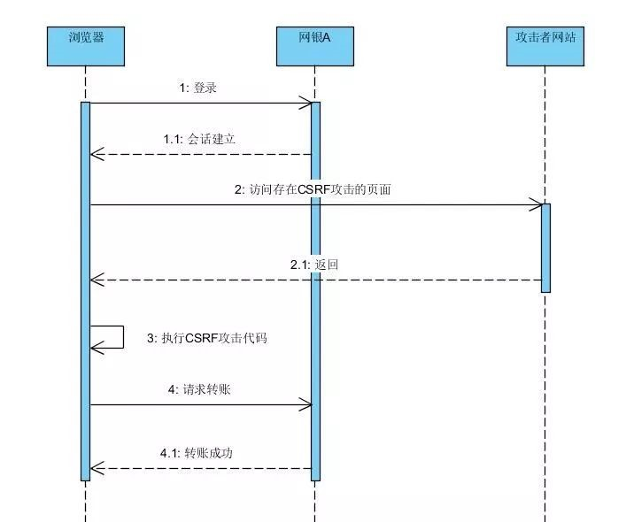

CSRF（Cross-site request forgery）跨站请求伪造，也被称为“One Click Attack”或者Session Riding，通常缩写为CSRF或者XSRF，是一种对网站的恶意利用.

<!--more-->

### CSRF攻击原理

举一个简单的场景,你登录了一个存在CSRF漏洞的网银A,只是进行查询余额操作.由于你已经登录,你的浏览器的操作都会被网银A的服务器信任.这时候有人发送给你一个网站B链接,内容介绍你很感兴趣,于是你点开了.然后你看完了内容,回过头来看自己的余额,发现钱都被转走了.怎么做到的?

在你查看链接内容的网页上面包含了该网银的CSRF攻击代码,攻击者仔细研究了网银转账的请求方式.当你点开网站B的时候,他会自动去请求对某个账号进行转账.由于你已经登录网银A,这时候浏览器请求是被信任的,你的钱就被转走了,而且悄无声息,请求是在网站B上执行的.

当然,一般情况的网银的敏感操作都是会增加验证码或者密码操作,就是防范CSRF漏洞的方法之一.也就是上述时序图中,4和4.1之间的服务器端操作都会进行验证码或者密码的校验.

### CSRF防范

**二次确认**

进行敏感操作的时候需要用户进行确认,输入验证码或者密码.二次确认校验通过后才进行真正的操作.这个方式在银行的转账中基本上都是如此设计的,也就是在上述时序图中的4和4.1之间有一个验证码的输入和验证才真正进行转账.这样当用户受攻击后,也不会在不知情的情况下转账出去.

这种方式的缺点也很显而易见,如果我不是转账,只是发微博,评论,点赞等简单的社交操作.每次输入验证码非常影响用户体验.所以这种方式只适合在极其敏感,需要用户再三确认的场景下使用.

**Referer校验**

HTTP协议头有个Referer字段,记录的是请求的来源.攻击者网站上发出的CSRF请求一般情况是不会携带Referer为网站A网址的.所以服务器端可以简单以Referer来判断请求是否是来源于自己的网站.从而拒绝掉CSRF的请求.

由于Referer 在 http和https间跳转, img 标签引用了一个非图片网址或者其他情况可能存在为空抑或服务器端代码不严谨等情况.故此方法也不推荐被使用

**Token校验**

一次性token是比较常用的方式,每次用户请求返回后,下发一个token,在下次表单提交或者HTTP GET的方式请求敏感数据时都携带该Token,服务器端对token进行校验并刷新Token的值,重新下发.由于是随机的,攻击者无法伪造,也就是提交CSRF攻击请求的时候会被拒绝.

此方法的关键点在于,token不能被攻击者的代码获取.倘若网站存在XSS漏洞,那么攻击者是可以结合XSS获取到Token从而进行CSRF攻击.

所以要解决CSRF要先解决XSS,否则也是枉然.