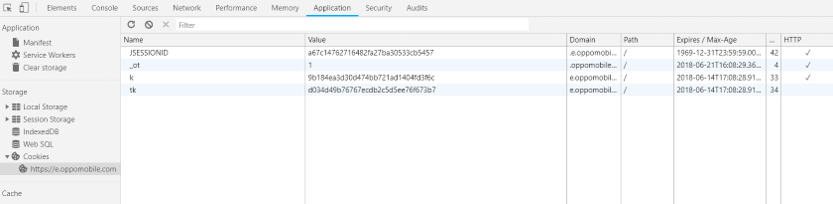
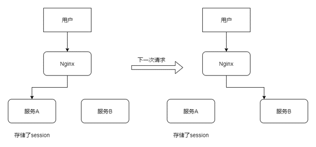
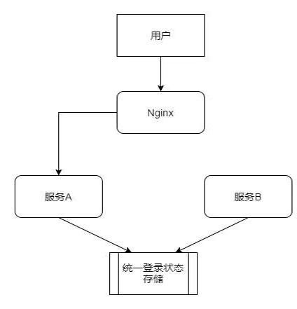
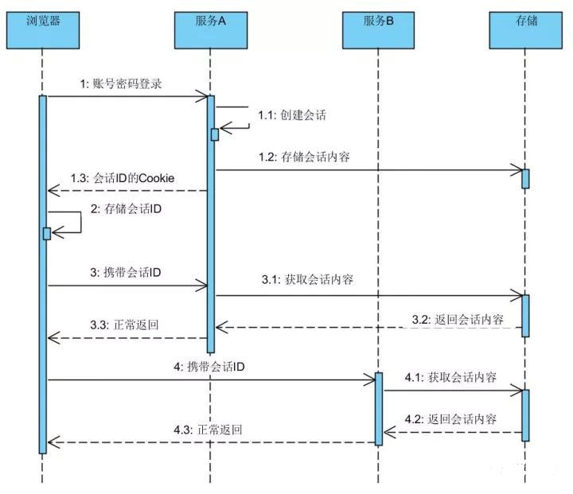

无状态的HTTP协议如何来保持用户的信息？分布式环境下的登录态是如何存储和使用的？ 本文给你详细的答案。<!--more-->

HTTP是一种不保存状态的协议,即无状态(stateless)协议。HTTP自身不对请求和响应之间的通信状态进行保存。也就是说在HTTP这个级别，协议对于发送过的请求和响应不做持久化。

使用HTTP协议，每当有新的请求发送时，就会有对应的新响应产生，协议本身并不保留之前一切的请求和响应报文的信息。这是为了更快地处理大量的事务，确保协议的可伸缩性，而把HTTP协议设计成如此简单的。

### Cookie

HTTP/1.1虽然是无状态协议，但是为了实现期望的保持状态的功能，于是引入的Cookie技术。有了Cookie再用HTTP协议通信,就可以管理状态了。

简单地说，Cookie就是浏览器储存在用户电脑上的一小段文本文件。Cookie是纯文本格式，不包含任何可执行的代码。

### Session

Cookie会根据服务器端发送的响应报文内的一个叫做Set-Cookie的首部字段信息,通知客户端保存Cookie。当下次客户端再往服务器发送请求的时候,客户端就会自动在请求报文中加入Cookie值后发送出去。

服务器发现客户端发送过来的Cookie后,回去检查究竟是从哪一个客户端发送过来的连接请求，然后对比服务器上的记录.最后得到之前的状态信息.这个状态信息就是通常所说的Session。

### 登录状态

使用Cookie来管理Session，弥补HTTP协议中不存在的状态管理功能。登录校验后服务器将sessionid与登录状态信息进行关联并保存起来，然后发送给客户端带sessionid的Cookie。客户端进行保存后，每次请求携带该cookie则服务器能找到其对应的登录状态。

### 分布式登录

登录状态的维持与服务器端的实现有着密切的关系，通常的服务器实现都是将Session状态一类的存储在本地内存。这就造成了服务节点之间的不对等，扩展性差等缺点。当后端节点存在多个时，前后的请求落到不同的后端节点状态不能维持，如下图所示：

避免这种情况的方案有以下几种

- 尽量让请求落到同一个节点上，比如nginx的ip hash配置，缺点是后端请求分布不均匀。不能解决同一个应用不同服务的问题。
- 后端节点之间相互同步session内容。缺点是后端节点之间的网络成本和存储成本增加。
- 后端不存储用户状态，将存储转移到统一的分布式缓存。

最佳的方式是使用状态转移的方式，示意如下：

登录的时序图如下：

### 分布式登录实现案例

以Tomcat为例子，本身session同步的方式官方是提供的，可直接配置server.xml来实现，详见https://tomcat.apache.org/tomcat-7.0-doc/cluster-howto.html

分布式缓存的方式，目前业界大部分使用Redis来存储。

- 独立容器扩展 如https://github.com/jcoleman/tomcat-redis-session-manager/ 

- 应用层扩展 如 Spring社区提供了一种比较好的方式，可以无缝集成到Spring 的项目中，且对容器没有侵入性。那就是Spring Session项目 http://spring.io/projects/spring-session

- 自己实现 ， 也是在应用层进行扩展。如果上面的方式还不能满足的话可以自己扩展HttpServletRequestWrapper，Spring Session就是在它上面扩展的。

### Cookie的局限性

如果边界服务A和边界服务B不是在同一个顶级域下，那么步骤 4 携带会话ID进行访问是无法实现的。这是由Cookie的局限性决定的，使用session共享的方式来解决登录状态一致性的问题,应用必须在一个顶级域名下面才能实现。

随着系统复杂度的增加,很多场景下我们可能遇到需要跨应用保持登录。比如一个大型公司,存在供应链系统,客户营销系统，人力资源管理系统等等，由于历史原因,他们并不是统一规划部署。登录也是各自为政，那么用户就必须进入一个系统就输入一次账号密码。随着应用群内的应用数量增加，用户在账号密码记忆和验证的负担也不断增加。如何应对这样的场景呢？
