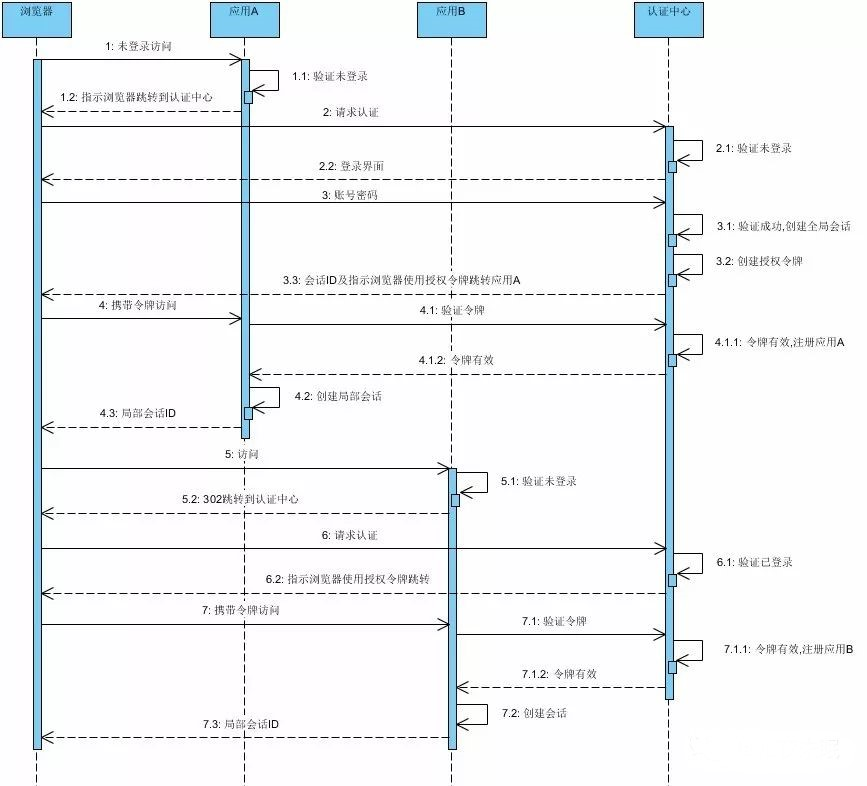

 [分布式登录状态一致性](https://www.lihongkun.com/security/sign_in/) 解决的是同一个域名下的状态，如果一个企业内部存储多个领域的系统，且他们具备不同的特性和域名，又必须提供统一的登录方式。那么这时候单点登录就派上用场了。<!--more-->

### 概念

单点登录（Single Sign On），简称为 SSO，是目前比较流行的企业业务整合的解决方案之一。SSO的定义是在多个应用系统中，用户只需要登录一次就可以访问所有相互信任的应用系统。

CAS（Central Authentication Service）是实现SSO单点登录最常用的方案,它的主要功能如下

**所有应用系统共享一个身份认证系统。**

统一的认证系统是SSO的前提之一。认证系统的主要功能是将用户的登录信息和用户信息库相比较，对用户进行登录认证；认证成功后，认证系统应该生成统一的认证标志（ticket），返还给用户。另外，认证系统还应该对ticket进行效验，判断其有效性。

**所有应用系统能够识别和提取ticket信息**

要实现SSO的功能，让用户只登录一次，就必须让应用系统能够识别已经登录过的用户。应用系统应该能对ticket进行识别和提取，通过与认证系统的通讯，能自动判断当前用户是否登录过，从而完成单点登录的功能。

### 认证流程

- 步骤 1 : 未登录访问时,应用A 返回302,通知浏览器跳转到认证中心进行认证
- 步骤 2 : 浏览器直接跳转到认证中心请求认证,认证中心发现用户未登录则返回登录界面.
- 步骤 3 : 用户输入账号密码,登录认证中心.认证中心创建全局会话并生成授权令牌.返回会话ID和令牌给浏览器,并指示浏览器携带令牌返回到应用A
- 步骤 4 : 浏览器携带令牌范围应用A,应用A请求认证中心验证令牌.验证成功,并创建应用A内局部会话接着返回.
- 步骤 5 : 用户访问应用 B,此时应用B验证用户未登录过本应用,则通知浏览器跳转认证中心进行认证.
- 步骤 6 : 浏览器跳转认证中心进行认证.认证中心根据浏览器与自己的会话ID判断该用户已经登录过,生成应用 B的 ticket返回并指示浏览器使用该ticket访问应用B
- 步骤 7 : 浏览器携带令牌访问应用B ,应用 B请求认证中心验证令牌.验证成功,并创建应用B内局部会话接着返回.

上述流程包含三种角色,用户(浏览器),SSO客户端(应用A,应用B),SSO服务器(认证中心).访问SSO客户端未登录时均返回302导向SSO服务器进行登录,SSO服务器登录完成或者判断为全局登录的时候,将告诉浏览器携带ticket去访问原来的SSO客户端,SSO客户端收到带ticket的访问后则请求SSO服务器进行ticket的校验,如果成功则生成SSO客户端局部会话.用户则可访问SSO客户端的资源.