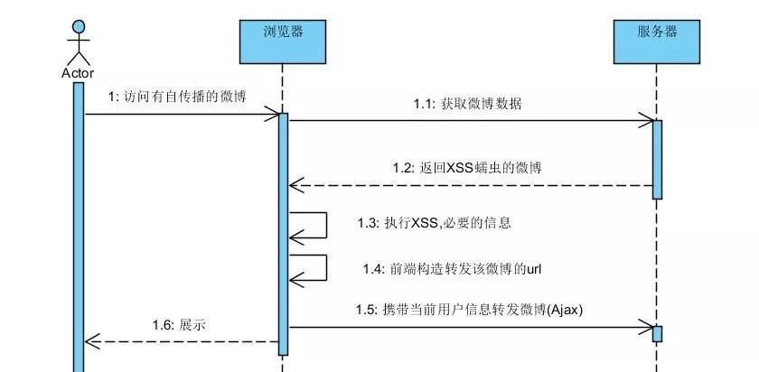

跨站脚本攻击,简称XSS(Cross Site Scripting) , 是最常见的Web应用程序安全漏洞.

<!--more-->


### XSS原理

XSS攻击是指在网页中嵌入客户端恶意代码,通常是JavaScript.当用户访问了被嵌入恶意代码的网页时,恶意代码就会在用户的浏览器上执行.所以,基本上JavaScript能做什么XSS就能做什么.

JavaScript可以用来获取用户的Cookie,动态修改网页内容,URL跳转等.那么意味着存在XSS漏洞的网站,用户的Cookie可能被盗取,页面会被篡改,或者被导航到其他网站

### XSS类型

XSS主要分为三类,分别是反射型,存储型,DOM型

1. 反射型 XSS

反射型XSS是最容易出现的一种漏洞.当用户访问一个带有XSS代码的URL时,服务器端接收到数据后,把带有XSS代码的数据发送到浏览器,浏览器渲染后,执行了该代码,最终造成XSS漏洞.


```
<%
    String name = request.getParameter("username");
    out.println(name);
    
    //username = "<script>alter('XSS漏洞')</script>"
%>
```
上述代码,如果输入的username 是一段XSS代码,那么则会执行该段XSS代码.假若有人利用此漏洞,构造一段获取用户Cookie并发送到指定网站的XSS代码.并将该链接发送给该网站的用户,用户访问了该链接后,则私密信息会被窃取.


2. 存储型XSS

当攻击者提供一段包含XSS代码的数据提交到服务器并且被存储后,用户再次访问页面时,这段XSS代码被服务器重新读出来,被浏览器执行,造成XSS跨站攻击.这就形成了存储型的XSS.


存储型的XSS无需用户主动去触发,危险性比较大.


```
<input type="text" name="username" value="" />
// username 输入" /><script>alert('XSS漏洞')</script>，提交到服务器并被保存
```

保存后如果用户名显示如下
```
欢迎,${username}

```


编辑,回限如下

```
<input type="text" name="username" value="${username}" />

```

那么此时浏览器渲染后的HTML代码是

```
<input type="text" name="username" value="" /><script>alert('XSS漏洞')</script>" />
```


不难理解,保存后.上面2段使用了username的代码均出现了XSS

3. DOM型XSS

DOM即文档对象模型,在网页的制作中经常使用JavaScript来动态操作DOM的内容,结构或者样式.顾名思义DOM型XSS是在操作过程中产生的.

```

<input type="text" name="content" value="" />
<div id="echo"></div>

<script>

$("[name=content]").change(function(){
    $("echo").html($(this).val());
});

</script>

```

上述代码是将文本框输入的内容直接回显到echo的标签里面,如果输入的是一段XSS脚本则会出现DOM型XSS

### XSS利用

1. 会话劫持

前面的文章说过,应用的会话保存依赖于浏览器的Cookie.也就是session id,如果应用存储XSS漏洞,那么攻击者便以此来获取到用户的Cookie,从而获得用户的session id,并发送到某个预先准备好的地址.那么在你登录的情况下,他就可以冒用你的身份,在你的账户上操作,比如替你发微博,转发,评论等等.

2. XSS蠕虫

XSS蠕虫具备自传播性,估计很多人当年都曾经看过朋友转发的空间说说或者微博,然后自己也莫名其妙转发了.其实原理很简单,就是应用存在XSS漏洞,而攻击者发布了带有XSS攻击的微博.只要该微博被查看,就自动执行XSS脚本,进行转发操作.此时你登录着,便已你的身份进行转发.大概流程如图:



### XSS 修复

XSS形成的原因是因为网站对用户的输入和输出没有严格的过滤.导致用户可以再你的网站上面输入并执行JavaScript等客户端语言.所以修复此类漏洞主要采用的方法是过滤或者转义一些特殊的字符.

1. 输入输出

在HTML里面 【<】【>】【"】【'】【&】这几个符号是标签和属性的组成部分,一般输入输出都会进行转义,或者过滤.

可用的如 PHP 的 htmlspecialchars ,JSTL 的 escapeXml 或者FreeMarker 的 
```
<#escape x as x?html></#escape>
```


2. HttpOnly 

Set-Cookie的时候使用HttpOnly 属性的话可以防止JavaScript操作该Cookie,从而有效防止XSS攻击者获取到用户的会话ID,但是本身并不防止XSS漏洞.只是XSS漏洞出现后防止会话劫持