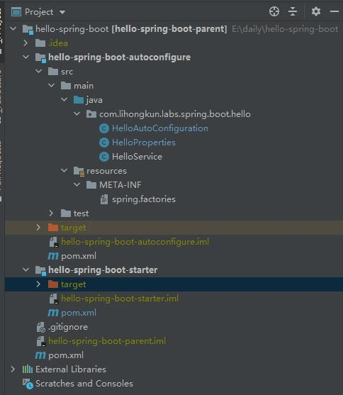

 官方提供的Spring Boot Starter涵盖面非常广，几乎所有流行的组件和方案都可以找到对应的封装。不过每个系统总会有自己的公共代码，可以自己进行Starter的封装。<!--more-->

下面以一个例子进行说明，我们需要一个HelloService的功能，但是又不想自己进行很多复杂的声明或者配置（实际应用场景中，远比HelloService的自动配置复杂得多）

```
package com.lihongkun.labs.spring.boot.hello;

public class HelloService {

    private String msg;

    public void sayHello(){
        System.out.println("hello " + msg);
    }

    public void setMsg(String msg) {
        this.msg = msg;
    }
}
```

#### 工程结构

创建一个Spring Boot Starter的工程，目录结构如下图，包含一个父工程，一个自动配置工程和Starter工程



#### 父工程

父工程只有一个pom文件，定义了Spring Boot 的版本依赖、编译的目标版本以及本项目的子模块。

```
<groupId>com.lihongkun.labs.spring.boot</groupId>
<artifactId>hello-spring-boot-parent</artifactId>
<version>0.0.1-SNAPSHOT</version>

<modules>
	<module>hello-spring-boot-autoconfigure</module>
	<module>hello-spring-boot-starter</module>
</modules>
<packaging>pom</packaging>

<dependencyManagement>
	<dependencies>
		<dependency>
			<groupId>org.springframework.boot</groupId>
			<artifactId>spring-boot-dependencies</artifactId>
			<version>2.3.2.RELEASE</version>
			<type>pom</type>
			<scope>import</scope>
		</dependency>
	</dependencies>
</dependencyManagement>

<build>
	<plugins>
		<plugin>
			<groupId>org.apache.maven.plugins</groupId>
			<artifactId>maven-compiler-plugin</artifactId>
			<version>3.8.0</version>
			<configuration>
				<release>11</release>
			</configuration>
		</plugin>
	</plugins>
</build>
```

#### 自动配置

接着创建autoconfigure工程，它会引入比较多的依赖，非必要的依赖使用optional的方式来引入。

```
<parent>
	<artifactId>hello-spring-boot-parent</artifactId>
	<groupId>com.lihongkun.labs.spring.boot</groupId>
	<version>0.0.1-SNAPSHOT</version>
</parent>
<modelVersion>4.0.0</modelVersion>

<artifactId>hello-spring-boot-autoconfigure</artifactId>

<dependencies>
	<dependency>
		<groupId>org.springframework.boot</groupId>
		<artifactId>spring-boot-autoconfigure</artifactId>
	</dependency>
	<!--
		如果是实现 autoconfiguration 功能的依赖包一定要使用<optional>true</optional>
		因为你会在本工程里面定义多个不同功能的 autoconfiguration，引入方可能只使用了一个。
		如
		<dependency>
			<groupId>x.y.z</groupId>
			<artifactId>hey</artifactId>
			<version>0.0.1-SNAPSHOT<version>
			<optional>true</optional>
		</dependency>
		<dependency>
			<groupId>x.y.z</groupId>
			<artifactId>hello</artifactId>
			<version>0.0.1-SNAPSHOT<version>
			<optional>true</optional>
		</dependency>
	 -->
</dependencies>
```

当我们的AutoConfiguration需要依赖一些外部配置的时候，比如数据库的配置或者当前的HelloService它需要一个msg，那么我们就可以创建一个Configuration的Properties对象，为其定义一个前缀。当被启用的时候，容器托管的配置即自动创建并填充到其ConfigurationProperties对象中。

```
package com.lihongkun.labs.spring.boot.hello;

import org.springframework.boot.context.properties.ConfigurationProperties;

@ConfigurationProperties(prefix = HelloProperties.HELLO_PREFIX)
public class HelloProperties {

    public static final String HELLO_PREFIX = "hello";

    private String msg;

    public String getMsg() {
        return msg;
    }

    public void setMsg(String msg) {
        this.msg = msg;
    }
}
```

不同的功能分在不同的AutoConfiguration实现，此处我们实现一个HelloAutoConfiguration，主要用来声明一个HelloService的Bean，这个Bean是条件创建的，也就是你引入后。如果觉得需要自己自定义，可以进行覆盖。HelloAutoConfiguration使用一个注解修饰`EnableConfigurationProperties`，这个注解的意思即当本类被实例化的时候则启用HelloProperties，创建一个HelloProperties的bean并填充配置值到其中。

```
package com.lihongkun.labs.spring.boot.hello;

import org.springframework.beans.factory.annotation.Autowired;
import org.springframework.boot.autoconfigure.condition.ConditionalOnMissingBean;
import org.springframework.boot.context.properties.EnableConfigurationProperties;
import org.springframework.context.annotation.Bean;
import org.springframework.context.annotation.Configuration;

@Configuration
@EnableConfigurationProperties(HelloProperties.class)
public class HelloAutoConfiguration {

    @Autowired
    private HelloProperties helloProperties;

    @Bean
    @ConditionalOnMissingBean
    public HelloService helloService() {
        HelloService helloService = new HelloService();
        helloService.setMsg(helloProperties.getMsg());
        return helloService;
    }
}
```

准备就绪后，还需要一个重要的步骤。META-INF/spring.factories把HelloAutoConfiguration配置进去。格式如下

```
org.springframework.boot.autoconfigure.EnableAutoConfiguration=com.lihongkun.labs.spring.boot.hello.HelloAutoConfiguration
```

#### 定义Starter

这是一个简单的pom工程，主要用来引入本Starter所需要的依赖，因为autoconfigure工程的optional依赖需要在这里正式引入。

```
<parent>
	<artifactId>hello-spring-boot-parent</artifactId>
	<groupId>com.lihongkun.labs.spring.boot</groupId>
	<version>0.0.1-SNAPSHOT</version>
</parent>
<modelVersion>4.0.0</modelVersion>

<artifactId>hello-spring-boot-starter</artifactId>
<packaging>pom</packaging>

<dependencies>
	<dependency>
		<artifactId>hello-spring-boot-autoconfigure</artifactId>
		<groupId>com.lihongkun.labs.spring.boot</groupId>
		<version>0.0.1-SNAPSHOT</version>
	</dependency>
	<!--
		本Starter依赖的包，在 autoconfigure 中 引入方式 optional，故此处需要再引入
		<dependency>
			<groupId>x.y.z</groupId>
			<artifactId>hello</artifactId>
		</dependency>
	-->
</dependencies>
```

#### 使用

自定义工程本地install或者deploy到仓库中就可以直接进行使用了。

```
<groupId>com.lihongkun.labs</groupId>
<artifactId>hello</artifactId>
<version>1.0-SNAPSHOT</version>

<dependencies>
	<dependency>
		<groupId>com.lihongkun.labs.spring.boot</groupId>
		<artifactId>hello-spring-boot-starter</artifactId>
		<version>0.0.1-SNAPSHOT</version>
	</dependency>
</dependencies>

<build>
	<plugins>
		<plugin>
			<groupId>org.apache.maven.plugins</groupId>
			<artifactId>maven-compiler-plugin</artifactId>
			<version>3.8.0</version>
			<configuration>
				<release>11</release>
			</configuration>
		</plugin>
	</plugins>
</build>

package com.lihongkun.labs;

// Application.java
import com.lihongkun.labs.spring.boot.hello.HelloService;
import org.springframework.boot.SpringApplication;
import org.springframework.boot.autoconfigure.SpringBootApplication;
import org.springframework.context.ApplicationContext;

@SpringBootApplication
public class Application {
    public static void main(String[] args) {
        ApplicationContext context = SpringApplication.run(Application.class,args);
        HelloService helloService = context.getBean(HelloService.class);
        helloService.sayHello();
    }
}

//application.properties
hello.msg=spring boot stater

// 运行结果
hello spring boot stater
```

#### 小结

官方推荐自定义的Starter的**命名方式**是[custom]-spring-boot-starter，把功能寓意的名字放在前面。

工程结构官方也是有推荐的方式，一般公共的功能和自动化配置均放在一个autoconfigure项目中，此项目中除了定义自动化配置的一些AutoConfiguration外，在引入对应依赖的时候均使用optional的方式。原因是这么多功能并不知道使用者需要使用哪一个。

接着定义各个功能的Starter，这类项目中没有java源代码，而是指定功能的依赖，也就是上面用optional所引入的依赖，Spring Boot 使用了很多 ConditionalOn 注解来实现条件加载。比如`ConditionalOnClass`表示你的classpath下有某个类的字节码才进行自动配置。一旦你引入了某功能的Starter则autoconfigure的AutoConfiguration自动生效。