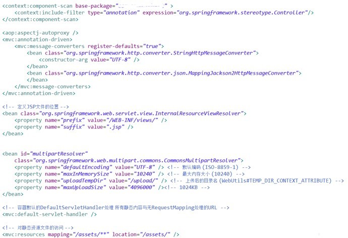

新建一个工程需要做很多的基础工作，依赖包引入，基础组件的配置。在微服务大行其道的今天，建立一个新工程是一个家常便饭的事情。其中的工作繁琐且容易出错。在Spring Boot 未出现之前，很多脚手架的项目用来解决这类通用的问题。Spring Boot出现之后，大多也都是转移到它身上了。<!--more-->

#### 裸用组件

如果裸用Spring MVC 的话，那么你面临的是一个完成的配置过程和依赖包的处理。



如上图，从上到下依次

- Controller注解的解析
- MessageConverter的定义和配置
- ViewResolver的配置
- 文件上传，MultipartResolver的定义
- DispatchServlet的定义
- 静态文件位置的定义。

除此之外，你还需要去配置pom.xml来引入spring-mvc、spring-web等等相关的依赖，极其繁琐。

#### 开箱即用

开箱即用的特点是Spring Boot 流行的最大原因。同样的功能，实现只需要声明父POM和对应的功能Starter，代码如下

```
<parent>
	<groupId>org.springframework.boot</groupId>
	<artifactId>spring-boot-starter-parent</artifactId>
	<version>2.3.1.RELEASE</version>
</parent>

<dependencies>
    <dependency>
        <groupId>org.springframework.boot</groupId>
        <artifactId>spring-boot-starter-web</artifactId>
    </dependency>
</dependencies>
```

pom.xml 编写完成后即可直接使用对应的功能。

```
@RestController
public class ExampleController {

    @RequestMapping("/")
    String home() {
        return "Hello World!";
    }
}


@SpringBootApplication
public class Application {

    public static void main(String[] args) {
        SpringApplication.run(Application.class, args);
    }

}
```

首先编写一个Spring Boot 的main 方法类，SpringApplication启动一个Spring Boot应用，而 `@SpringBootApplication`的作用是把Application作为基础的入口类，Spring Boot 将扫描入口类及其子package下的所有Spring 相关的注解，来实例化和装配Bean。

ExampleController在入口类的子包下则可以直接被实例化，因为其被@RestController注解，表示是一个Spring MVC的Controller类。

很简单的配置已经实现了一个Spring MVC的功能。

#### 启动器

Starters【启动器】是一组方便的依赖关系描述符，可以包含在应用程序中。可以通过它获得所需的所有Spring和相关技术的一站式服务，而不必搜索示例代码和复制粘贴大量依赖描述符。例如，如果您想使用Spring和JPA进行数据库访问，在项目中包含spring-boot-starter-data-jpa依赖项。

它提供了一个支撑功能的依赖和对应的自动化配置的最小集合。对于不同的功能，可以引入不同的依赖，每个依赖都有对应的配置。在微服务里面，功能相对内聚和简单，而且会建立很多服务。这种简单的配置提供了非常大的便利。秉承Spring框架的胶水代码风格，官方提供了一系列的默认实现，常用的如下

| 名称                           | 描述                                                         |
| ------------------------------ | ------------------------------------------------------------ |
| spring-boot-starter            | 核心启动器，包含了自动配置、日志、YAML配置功能。很多官方启动器依赖于它。 |
| spring-boot-starter-aop        | 提供面向切面编程的功能，包含Spring AOP和AspectJ              |
| spring-boot-starter-data-jdbc  | 提供Spring Data JDBC                                         |
| spring-boot-starter-data-jpa   | 提供 JPA功能，默认实现是Hibernate                            |
| spring-boot-starter-data-redis | 提供Spring Data Redis默认配置功能，使用了Lettuce库           |
| spring-boot-starter-freemarker | 提供 freemarker默认的模板引擎功能，用于Spring MVC            |
| spring-boot-starter-web        | 提供Spring MVC的自动配置功能，默认的容器是tomcat             |
| spring-boot-starter-webflux    | 提供Spring webflux自动配置功能，默认是netty网络库            |
| spring-boot-starter-log4j2     | 提供log4j2 自动配置功能，默认使用的logback实现，如果需要切换则直接引入此启动器。 |

启动器的好处是配置简单，引入对应的pom.xml，在启动配置文件中配置对应的属性。即可使用某一项功能。

凡事都是有两面性，虽然非常方便，但是一旦引入了对应的依赖包，即默认进行功能的启用。所有在复杂系统中经常会引入很多不必要的东西，甚至冲突。例如，一个服务需要访问两个Redis，那么在引入的默认实现中，只能配置一个Redis。那么就需要使用**自定义的配置**来覆盖对应Starter的AutoConfiguration，这种配置与Spring原生的注解配置一般无二，只是需要了解其中MissingBean注解相关机制。

另外一方面想的话，一个服务去直接访问不同的两个Redis可以认为是系统设计的缺陷。职责不够清晰。这时候就需要理清楚边界，侧面也印证了Starter机制算是比较正确的。

#### 小结

Spring Boot 为开发者提供一个更快更广泛的入门体验，**开箱即用**，容易拓展覆盖所提供的默认实现，提供一系列适用于大型项目的非功能特性（内置HTTP服务器，安全，监控和健康检查等），并且无代码生成，无需XML配置。