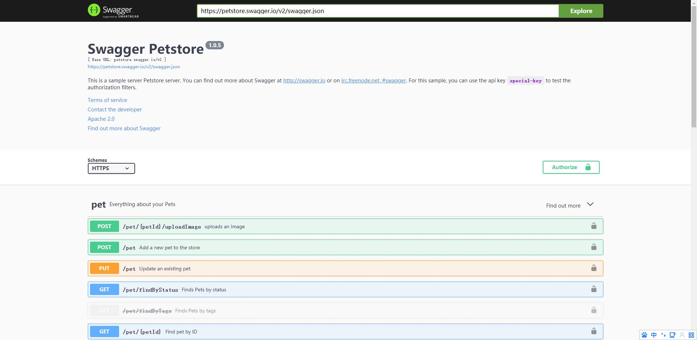
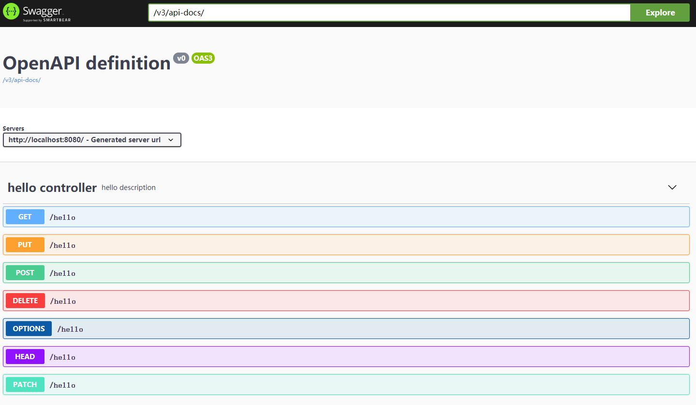
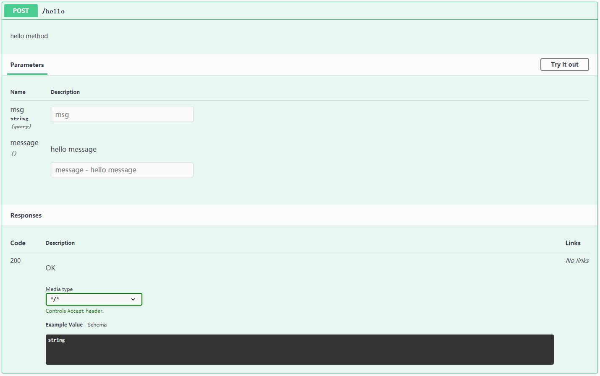
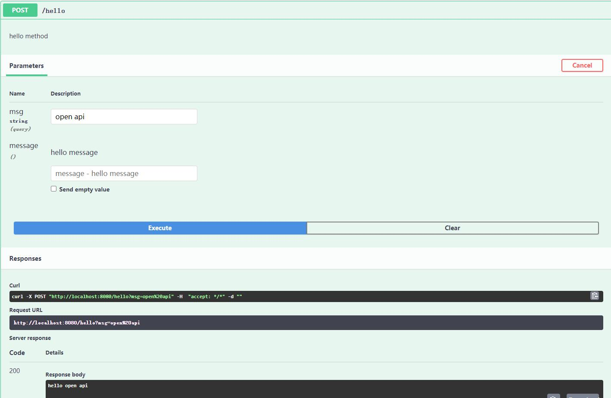

在WEB领域里面，随着前后端分离，后端的HTTP接口便需要去维护一份大而全的Rest API，一个比较靠谱的文档工具是必不可少的。 <!--more-->

迭代中的系统，随着时间的推移，以前提供出去的接口，很快就会发生变化。同时去维护代码和接口文档，意味着工作量的增加，或者种种其他原因，导致接口和文档的不同步是家常便饭的事情。

那么如果文档是由代码注释或者类似的方式生成，便可以在一定程度上避免这样的事情。常规的方案就是使用OpenAPI规范，它的前身即大名鼎鼎的Swagger。

#### 如何使用

首先引入依赖

```
<dependencies>
	<dependency>
		<groupId>org.springframework.boot</groupId>
		<artifactId>spring-boot-starter-web</artifactId>
	</dependency>
	<dependency>
		<groupId>org.springdoc</groupId>
		<artifactId>springdoc-openapi-ui</artifactId>
		<version>1.4.7</version>
	</dependency>
</dependencies>

<dependencyManagement>
	<dependencies>
		<dependency>
			<groupId>org.springframework.boot</groupId>
			<artifactId>spring-boot-dependencies</artifactId>
			<version>2.1.3.RELEASE</version>
			<type>pom</type>
			<scope>import</scope>
		</dependency>
	</dependencies>
</dependencyManagement>
```

启动后访问地址 *ip:port/swagger-ui/index.html* , 可以看到一个Swagge UI的界面，即可正常进行使用了，默认打开示例。



#### 注解

OpenAPI 是Swagger v3 ，所使用的注解跟原来的有所区别。主要的一些注解如以下表格

| OpenAPI      | swagger       | 作用                               |
| ------------ | ------------- | ---------------------------------- |
| @Tag         | @Api          | 标签，表示请求类的作用             |
| @Operation   | @ApiOperation | 描述请求方法                       |
| @Parameter   | @ApiParam     | 描述接口参数                       |
| @Schema      | @ApiModel     | 描述模型                           |
| @ApiResponse | @ApiResponse  | 描述返回的结果，包含返回码，信息等 |

#### 交互式文档

*ip:port/swagger-ui/index.html*  开启的时候使用的是默认示例。当我们给自己的接口写上加上OpenAPI的注解后，可以在Swagger界面的Explore框里面填入/v3/api-docs/点击explore按钮来查看。



点开其中一个方法，有具体的描述，方法的用处，参数和返回等上述注解中所定义的内容。



点击右上角的【try it out】按钮，则可以出现一个模拟请求的交互界面。



填入对应的参数，然后点击【Execute】按钮即可发起请求，然后在Responses看到对应的结果。同时也有Curl和Request URL给出，可以比较方便地复制到其他地方使用。

这种交互性的文档对于开发者来说比较有用，可以不用再自己去装一个postman来做模拟请求。

对于有条件的团队，有自己的文档平台，那么可以通过  *ip:port//v3/api-docs/* 来获取文档的内容，Swagger也只是提供了一个交互界面来呈现文档。

#### 结语

OpenAPI规范，定义了一套文档标准，并提供了默认实现以及方便使用的交互性文档界面。缺点是注解对应用的侵入性比较大，使用过程中亦需要关注安全问题。


