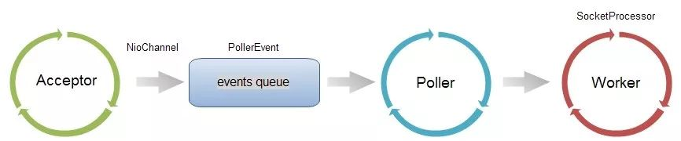
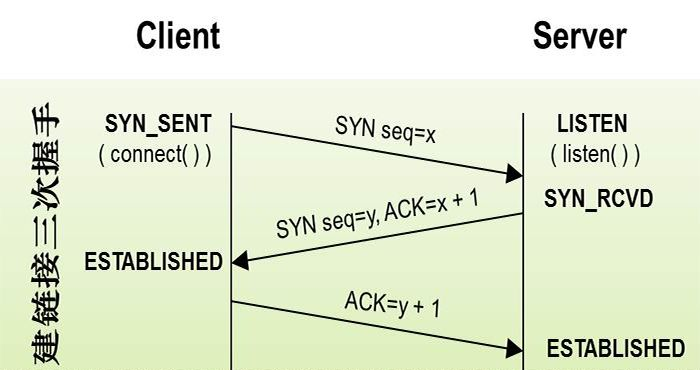

在并发不高的场景下是不需要在进行特殊的配置了,但是在并发量比较大的话springboot 对于默认的tomcat连接器参数可能会导致频频的连接拒绝现象.

<!--more-->


### 设计架构

找找独立容器的配置,我们其实很容易想到在Server.xml有个Connector的配置.在tomcat的设计架构里面,连接器就是用来接收请求的.



其中Acceptor是一个Socket连接模块,接收到连接以后放入events queue,再由 单线程的Poller 从队列中取出,交由Worker线程池去处理请求.

### 参数原理

连接器并发连接相关的配置比较重要的三个参数 acceptCount , maxConnection  , maxThread . 

- maxThread 不难理解,也就是 worker线程池的总数.它决定了容器能同时处理的请求.
- maxConnection 是连接器所能建立的连接总数,结合上述的图,他是events queue 和 worker活跃线程 之和. 

```

// NioEndPoint.java
//if we have reached max connections, wait
countUpOrAwaitConnection();

SocketChannel socket = null;
try {
	// Accept the next incoming connection from the server
	// socket
	socket = serverSock.accept();
} catch (IOException ioe) {
	// We didn't get a socket
	countDownConnection();
	if (running) {
		// Introduce delay if necessary
		errorDelay = handleExceptionWithDelay(errorDelay);
		// re-throw
		throw ioe;
	} else {
		break;
	}
}

protected void countUpOrAwaitConnection() throws InterruptedException {
	if (maxConnections==-1) return;
	LimitLatch latch = connectionLimitLatch;
	if (latch!=null) latch.countUpOrAwait();
}

```

上述代码是 Acceptor 接收socket连接的主要逻辑,在进入accept之前都会进入countUpOrAwaitConnection方法,使用LimitLatch来限制总的连接数一定不会超过maxConnection的数量.

- acceptCount ,这个配置参数是比较容易从字面上误解的.字面是接收数量.真正的意义是在 maxConnection 到达上限后,还能建立多少连接.这个需要从tcp原理上来解析.acceptCount在tomcat内部被映射成为backlog,也就是Acceptor里面的Socket参数.这个参数决定了三次握手连接中的 sync queue 和 accept queue的 总大小.



如上图所示,服务器端的 SYN_RCVD状态和ESTABLISHED状态分别维护着一个队列,这个队列的最大值就是backlog.这里操作系统接受连接后,处于ESTABLISHED状态,缓存到accept queue,还没有被应用accept的连接.那么acceptCount可以理解为在maxConnection到达后,容器还会接收到的连接数.


### 如何配置

三个参数的意义已经很明了, tomcat 默认的 配置是 maxConnection = 10000 , maxThread = 200 , backLog = 150,也就是最大能建立得而连接数是10150,在有大量连接涌入且处理很快,应用QPS非常高的情况下适当调高backLog的数值会有意想不到的效果.至于这几个参数配置成多少,一般是根据业务系统的性质和性能测试结果而来.


我们回过头来看看springboot的通用配置参数里面也只是提供了maxThread的配置.套路还是一样,需要进行定制.


```
@Bean
public TomcatEmbeddedServletContainerFactory tomcatEmbeddedServletContainerFactory() {
	TomcatEmbeddedServletContainerFactory tomcatFactory = new TomcatEmbeddedServletContainerFactory();

	tomcatFactory.setBaseDirectory(baseDirectory);
	tomcatFactory.setDocumentRoot(documentRoot);
	
	tomcatFactory.addConnectorCustomizers(new TomcatConnectorCustomizer() {
		@Override
		public void customize(Connector connector) {
			Http11NioProtocol handler = (Http11NioProtocol) connector.getProtocolHandler();
			handler.setBacklog(NumberUtils.toInt(acceptCount, 100));
			handler.setMaxThreads(NumberUtils.toInt(maxThreads, 150));
		}
	});
}
```