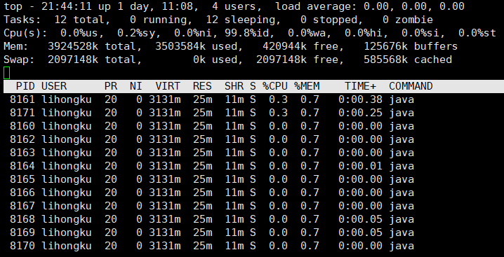
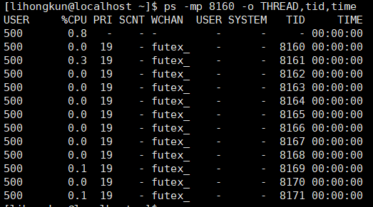

线上环境某个业务无端卡住,死锁或者CPU使用率突然飙得很高.通常情况下是某些线程下的代码作祟.如何排查到指定线程和指定代码.

<!--more-->

举个简单的例子我运行了个死循环的代码只是打印出日志.

```
public static void main(String[] args) throws Exception {
	while(true){
		System.out.println("running...");
		Thread.sleep(50);
	}
}
```

#### 操作系统命令

使用top -Hp $pid得出其中8161线程比较耗费CPU.




当然top的观测结果是一直在刷新的.我们也可以是用ps命令来看ps -mp $pid -o THREAD,tid,time 结果如下也是一致的.



找到了线程号,我们如果观测到它的线程栈呢,这就需要使用到JVM相关的工具了.


#### jstack

jstack 是一个检测线程的jvm工具.设置了环境变量后一般是可以直接执行,jstack $pid.


```
"main" #1 prio=5 os_prio=0 tid=0x00007fdc1c008800 nid=0x1fe1 waiting on condition [0x00007fdc23829000]
   java.lang.Thread.State: TIMED_WAITING (sleeping)
	at java.lang.Thread.sleep(Native Method)
	at com.lihongkun.example.StackExample.main(StackExample.java:8)

"VM Thread" os_prio=0 tid=0x00007fdc1c0f9000 nid=0x1fe4 runnable 

"GC task thread#0 (ParallelGC)" os_prio=0 tid=0x00007fdc1c01d800 nid=0x1fe2 runnable 

"GC task thread#1 (ParallelGC)" os_prio=0 tid=0x00007fdc1c01f000 nid=0x1fe3 runnable 
```

上面是使用jstack执行出来的结果,能清楚地看出各个线程的执行栈.而其中nid就是每个线程的线程号.main方法所在的线程的16进制线程号是1FE1 ,转为十进制则为8161,如此已经清楚查看出执行最占用CPU的是我们的main方法.


#### 双剑合璧

上面的方式需要2个步骤去查看占用CPU高的线程,然后再使用jstack命令来找到相应的线程和对应的代码块.是否可用合并呢?
答案是肯定的.

```
pid=$1
sfile="/tmp/java.$pid.trace"
tfile="/tmp/java.$pid.trace.tmp"
rm -f $sfile  $tfile
echo "pid $pid"

jstack $pid > $tfile
ps -mp $pid -o THREAD,tid,time|awk '{if ($2>0 && $8 != "-") print $8,$2}'|while read line;
do
        nid=$(echo "$line"|awk '{printf("0x%x",$1)}')
        cpu=$(echo "$line"|awk '{print $2}')
        echo "nid: $nid, cpu: $cpu %">>$sfile
        lines=`grep $nid -A 100 $tfile |grep -n '^$'|head -1|awk -F':' '{print $1}'`
        ((lines=$lines-1))
        if [ "$lines" = "-1" ];
        then
             grep $nid -A 100 $tfile  >>$sfile
             echo '' >>$sfile
        else
             grep $nid -A $lines $tfile  >>$sfile
        fi
done
rm -f $tfile
echo "read msg in $sfile"
###########  end  ############
```
上面的脚本是合并后的只需要一个命令搞定. 执行 sh  xxx.sh $pid结果如下


```
nid: 0x1fe1, cpu: 0.1 %
"main" #1 prio=5 os_prio=0 tid=0x00007fdc1c008800 nid=0x1fe1 waiting on condition [0x00007fdc23829000]
   java.lang.Thread.State: TIMED_WAITING (sleeping)
	at java.lang.Thread.sleep(Native Method)
	at com.lihongkun.example.StackExample.main(StackExample.java:8)

nid: 0x1feb, cpu: 0.1 %
"VM Periodic Task Thread" os_prio=0 tid=0x00007fdc1c144800 nid=0x1feb waiting on condition 

nid: 0x200f, cpu: 1.0 %
"Attach Listener" #8 daemon prio=9 os_prio=0 tid=0x00007fdbe8001000 nid=0x200f waiting on condition [0x0000000000000000]
   java.lang.Thread.State: RUNNABLE
```

一般情况下,如果遇到执行效率相关的问题,我都是直接执行上述脚本,迅速找到相关代码,然后做相应的解决.

有位朋友用了一段时间这段脚本以后,推荐的一个代码仓库.类似的原理,相关的脚本更多. https://github.com/oldratlee/useful-scripts