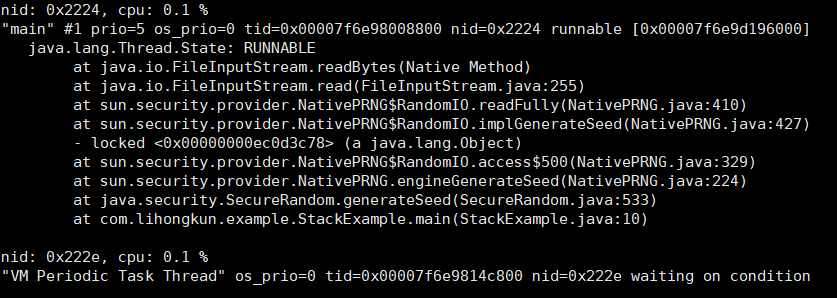
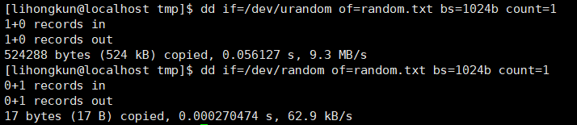

有个使用了SpringBoot的API的项目拆分了不同业务的服务,一个jar包通过不同的命令行来启动不同的10个业务进程.所以发布版本的时候基本上是重启所有的进程. 偶然的一次线上发布看业务日志,发现进程启动的时候卡在tomcat embeded初始化的时候.而且基本上重启的进程都卡住了.

<!--more-->

### 定位

找出其中一个进程,执行了工具脚本.发现Random类初始化的时候所占用的CPU时间有点异常,显然这个随机数一定还有什么不可描述的操作.


我们可以做个实验模拟下,代码如下

```
public static void main(String[] args) throws Exception {
	SecureRandom random = new SecureRandom();
	for(int i=0;i<100;i++){
		random.generateSeed(i);
		System.out.println("i = "+i+","+random.nextInt());
	}
}
```
上面的代码在linux的系统下一般情况下会阻塞.在阻塞的情况下,高CPU的线程栈如下图所示.



### 原因

linux的随机数种子所使用的两个特殊设备文件/dev/random和/dev/urandom.他们产生随机数的原理是利用当前系统的熵池来计算出固定一定数量的随机比特,然后将这些比特作为字节流返回.

熵池就是当前系统的环境噪音,熵指的是一个系统的混乱程度,系统噪音可以通过很多参数来评估,如内存的使用,文件的使用量,不同类型的进程数量等等.

**/dev/random**

在读取时,/dev/random设备会返回小于熵池噪声总数的随机字节./dev/random可生成高随机性的公钥或一次性密码本.若熵池空了,对/dev/random的读操作将会被阻塞，直到从别的设备中收集到了足够的环境噪声为止.

**/dev/urandom**

/dev/random的一个副本是/dev/urandom （"unlocked"，非阻塞的随机数发生器）,它会重复使用熵池中的数据以产生伪随机数据.这表示对/dev/urandom的读取操作不会产生阻塞,但其输出的熵可能小于/dev/random的.它可以作为生成较低强度密码的伪随机数生成器,不建议用于生成高强度长期密码.




上图的数据可以算出2个设备生产随机比特的速度差距了150倍.JDK的实现默认是使用/dev/random , 在熵不足的情况下非常容易发生阻塞,有的时候甚至是几分钟.

### 解决

默认实现容易发生阻塞,我们可以使用伪随机数发生器来避免.在程序启动的时候加上-Djava.security.egd=file:/dev/urandom 的选项来选择随机数设备.问题即可解决.