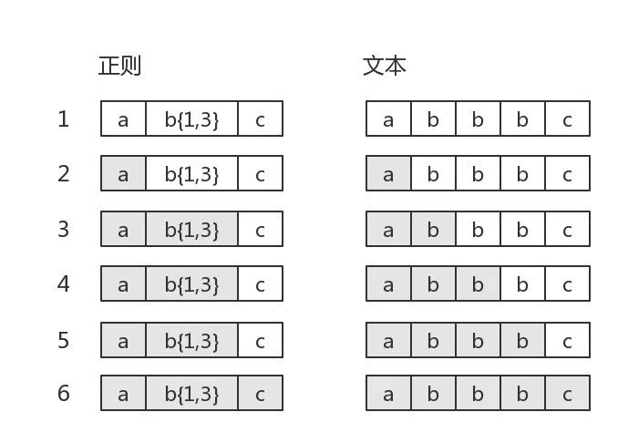
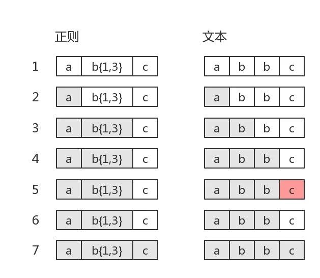
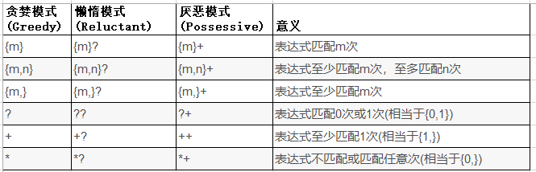

运营反馈问题,日志排查中发现线上有个任务一直没有执行.工具脚本看出基本上CPU都消耗在正则表达式上面了.无疑是进入正则表达式的回溯陷阱.  

<!--more-->

拿线上正则表达式做个执行的实验,代码如下

```
private static final Pattern URL_PATTERN = Pattern.compile("(http|ftp|https)://(?:[\\w-\\.]{0,255})(?:(?:\\/?[^\\s]{0,255}){0,255})");
	
public static void main(String[] args) {
	String testStr = "http://www.lihongkun.com/test/test/test ";
	long time = System.currentTimeMillis();
	System.out.println(URL_PATTERN.matcher(testStr).matches());
	System.out.println(System.currentTimeMillis()-time);
}
```
正则表达式URL_PATTERN主要是为了验证一个url的合法性.待校验的URL后面有一个空格导致了它不匹配./test只有一个的时候执行时间是1011ms,有两个/test执行时间是 31422ms,三个以上的话基本上很难等出结果.显然这样的表达式是有问题.


#### 回溯

正则表达式引擎分成两类,一类称为DFA（确定性有穷自动机）,另一类称为NFA（非确定性有穷自动机）.两类引擎要顺利工作,都必须有一个正则式和一个文本串. 

DFA捏着文本串去比较正则式,看到一个子正则式,就把可能的匹配串全标注出来,然后再看正则式的下一个部分,根据新的匹配结果更新标注.  

NFA是捏着正则式去比文本,吃掉一个字符,就把它跟正则式比较,匹配就记下来,然后接着往下干.一旦不匹配,就把刚吃的这个字符吐出来,一个个的吐,直到回到上一次匹配的地方.

上面的吐字符就是回溯,大部分的语言都是NFA,JAVA就是.回溯失控我们就先了解下正则表达式的回溯是怎么个回事.网上有个经典的例子 ab{1,3}c 这个表达式.

目标字符串是"abbbc"时，就没有所谓的"回溯".其匹配过程是:



目标字符串是"abbbc"，匹配过程是：




图中第5步有红颜色,表示匹配不成功.此时b{1,3}已经匹配到了2个字符"b",准备尝试第三个时,结果发现接下来的字符是"c"。那么就认为b{1,3}就已经匹配完毕.然后状态又回到之前的状态（即第6步,与第4步一样）,最后再用子表达式c，去匹配字符"c".当然,此时整个表达式匹配成功了.

图中的第6步,就是“回溯”.回想下文章开头的问题,那个回溯量其实非常大的,最后一个空格不匹配,导致它N次回溯,退到[http://]上面才能判断表达式不匹配.

#### 量词

处理灾难性回溯的办法就是要合理使用量词,它们在匹配文本不符合的时候表现出来的性能是非常差的.所以优化的时候,跑几个极端的错误测试基本上能看出来.




Greedy 模式就是我们经常使用的,遇到量词就尽量匹配.遇到不匹配的情况下就回溯,被比喻成买东西砍价.不断退回去.

Reluctant 模式是尽量少匹配,被比喻成拍卖,不合适的话就提供价格,就是增加量词的匹配数量.

Possessive模式. 默认也是尽量匹配,但是它是价也不砍,直接走人.宣告失败.本质上只有这个默认不产生回溯.


我们所要做的就是在不影响功能的情况下,避免回溯.也就是量词在某些地方修改成Possessive模式(注意,有的修改会改变原来的功能).

#### Hack

为了验证步骤,写了一个javaagent,hack了一下正则表达式的源码.对其中的主要处理类的match方法进行字节码改写.在执行中输出当前组匹配的字符位置.

执行上述没有修改过的表达式,基本上是进入循环之中.然后修改表达式继续执行.

```
(http|ftp|https)://(?:[\\w-\\.]{0,255})(?:(?:\\/?[^\\s]{0,255}){0,255}+)


// 输出结果

Pattern$Branch.match$hack ==> 0
Pattern$BranchConn.match$hack ==> 4
Pattern$GroupTail.match$hack ==> 4
Pattern$Curly.match$hack ==> 7
Pattern$GroupTail.match$hack ==> 24
Pattern$Curly.match$hack ==> 24
Pattern$Ques.match$hack ==> 24
Pattern$Curly.match$hack ==> 25
Pattern$GroupTail.match$hack ==> 29
Pattern$Ques.match$hack ==> 29
Pattern$Curly.match$hack ==> 29
Pattern$GroupTail.match$hack ==> 29
Pattern$GroupTail.match$hack ==> 29
Pattern$GroupTail.match$hack ==> 23
Pattern$Curly.match$hack ==> 23
Pattern$Ques.match$hack ==> 23
Pattern$Curly.match$hack ==> 23
Pattern$GroupTail.match$hack ==> 29
Pattern$Ques.match$hack ==> 29
Pattern$Curly.match$hack ==> 29
Pattern$GroupTail.match$hack ==> 29
Pattern$GroupTail.match$hack ==> 29
Pattern$GroupTail.match$hack ==> 22
Pattern$Curly.match$hack ==> 22
Pattern$Ques.match$hack ==> 22
Pattern$Curly.match$hack ==> 22
// 省略中间过程
Pattern$Curly.match$hack ==> 7
Pattern$GroupTail.match$hack ==> 29
```

上面的hack结果输出,表示了 0-29的字符匹配最后失败了,退回到23继续匹配还是失败,然后再退回到22,一直退回到7,匹配失败,结束.基本上回溯的过程很清晰的能看到.


```
(http|ftp|https)://(?:[\\w-\\.]{0,255}+)(?:(?:\\/?[^\\s]{0,255}){0,255}+)

Pattern$Branch.match$hack ==> 0
Pattern$BranchConn.match$hack ==> 4
Pattern$GroupTail.match$hack ==> 4
Pattern$Curly.match$hack ==> 7
Pattern$GroupTail.match$hack ==> 24
Pattern$Curly.match$hack ==> 24
Pattern$Ques.match$hack ==> 24
Pattern$Curly.match$hack ==> 25
Pattern$GroupTail.match$hack ==> 29
Pattern$Ques.match$hack ==> 29
Pattern$Curly.match$hack ==> 29
Pattern$GroupTail.match$hack ==> 29
Pattern$GroupTail.match$hack ==> 29
```

再修改一下,基本上一次就能校验出匹配失败,没有发生回溯.问题解决.


#### 参考文献

https://swtch.com/~rsc/regexp/regexp1.html

https://zhuanlan.zhihu.com/p/27417442

https://cloud.tencent.com/developer/article/1043946

https://docs.oracle.com/javase/tutorial/essential/regex/index.htm